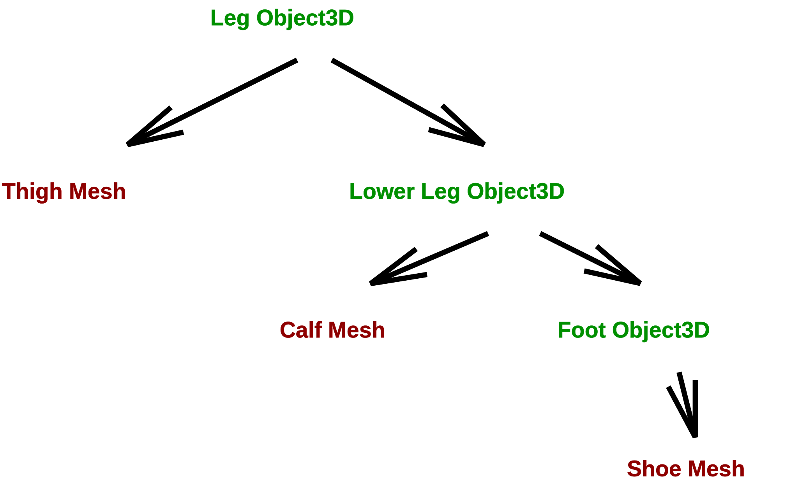

# Building Composite Objects

## Plan

  * Recap affine transformations and review exercise on "Building a Town" 
  * Composite objects in Three.js 
  * Exercise: Luxo mom and junior
  * Nested frames: Explore the cone, fence, and leg demos ([slide](Lecture7.pdf)) 
  * Exercise: Build a tree as a composite object 
  * Next time: Affine math, [TeddyBear](../demos/BasicModeling/TeddyBear.shtml) demo  

## Recap of Affine Transformations

We can use the following operations (affine transformations) to place things
in our scenes:

  * translation: 
    
        obj.position.set(px,py,pz);
        obj.position.x = px;
        obj.position.y = py;
        obj.position.z = pz;
    

  * rotation: 
    
        obj.rotation.set(rx,ry,rz);
        obj.rotation.x = Math.PI/2;
        obj.rotation.y = Math.PI/3;
        obj.rotation.z = Math.PI/4;
    

  * scale: 
    
        obj.scale.set(sx,sy,sz);
        obj.scale.x = sx;
        obj.scale.y = sy;
        obj.scale.z = sz;
    

Today, we'll learn how to use these same methods, plus some new ones, to place
objects inside other objects, nested as deeply as we want.

## Exercise: Building a Town

In this exercise, we'll work together to fill in some details to create a town
with three houses, a tree, and a snowman. The diagram and figure below show
the final layout of the objects as seen from above, and two views of the
scene. The view on the right shows the scene coordinate frame.

The final code might look like this [town-new.html](04b-exercises/town-new.html)

## Composite Objects

We can build a composite object using the `THREE.Object3D` class and `.add()`
method,

  * in its own frame (coordinate system and origin) 
  * that you can place independently of other composite objects 
  * that you can rotate around different points 

## Exercise: Luxo Mom and Junior

This exercise highlights the idea of creating an instance of the
`THREE.Object3D` class to store a set of `THREE.Mesh` objects that represent
the parts of a composite object. The `THREE.Object3D` container object can
then be placed anywhere in a scene using the affine transformations listed
above.

To begin, open a copy of the [luxo-start.html](04b-exercises/luxo-start.html)
code file in an editor. The file contains a function named `luxo()` that
creates a simple luxo lamp and adds it to a scene. A green rug is also added
to the scene.

Modify the code to do the following:

  1. Modify the `luxo()` function to 
     * create an instance of a `THREE.Object3D` to serve as a container object 
     * add all the meshes to this container object (instead of the scene) 
     * return the container object 
  2. Replace the single call to the `luxo()` function with code to create two luxo lamps, mom and junior, where 
     * mom is placed at location `(60,0,60)` in the scene's coordinate frame 
     * junior is half the size of mom, placed at scene location `(160,0,60)`, and rotated so that he is facing mom  

Your final solution should look something like this: [luxo-
family.html](04b-exercises/luxo-family.html)

## Explore the Cone Rotation Example

You looked at this for the reading. Now let's look at it carefully together.
Here's a picture:   A cone in a _frame_
inside another _frame_ , offset by a distance `positionOffset`. Initially, the
offset is zero. We can rotate the cone around the origin of _either_ frame.

Here it is in action. It demonstrates rotating around a point other than the
origin of the geometry.

[Cone Rotation](../demos/BasicModeling/ConeRotation.shtml)

## Fence Examples

The fence examples demonstrate cloning and repeated transformations. These
accumulated transformations will get represented by the product of a bunch of
matrix multiplications, one for each transformation (rotation and translation
in this case).

  * [Fence](../demos/BasicModeling/Fence.shtml)
  * [Curved Fence](../demos/BasicModeling/Fence-curved.shtml) 

## The Leg Example

The leg demo shows deeply nested frames, but each nesting is _just like the
Cone demo_. First, here are two pictures from the reading:
 The leg scene contains objects nested within
objects. The instances of `Mesh` are in brown, the instances of `Object3D` are
in green  A screenshot of the leg demo, with
the frames outlined.

The `leg` and `lowerleg` objects each contain a mesh and a sub-object. In each
case:

  * the mesh is a cylinder of some length L 
  * the mesh is placed at y = -L/2 
  * the sub-object is placed at y = -L (the far end of the mesh) 
  * the origin for the object is at the near end of the mesh 

The creation of the `foot` object is a slight variation on the above
structure.

Here's the final demo: [Leg](../demos/BasicModeling/Leg1.shtml)

## Exercise: Build a Tree as a Composite Object

Let's create a better tree (green cone with a brown cylindrical trunk) as a
composite object and place two of them in the scene.

  1. Start with this [town-forest-start.html](04b-exercises/town-forest-start.html) code file (enter 'g' to see the ground plane for the scene) 
  2. Complete the function `createTree()` to create and return an instance of a tree, which should be a `THREE.Object3D` object 
  3. The following Three.js classes will be helpful here: 
     * [Mesh (geometry, material)](http://threejs.org/docs/#api/objects/Mesh)
     * [MeshBasicMaterial ( {color: color} )](http://threejs.org/docs/#api/materials/MeshBasicMaterial)
     * [ConeGeometry (radius, height)](http://threejs.org/docs/#api/geometries/ConeGeometry)
     * [CylinderGeometry (radiusTop, radiusBottom, height)](http://threejs.org/docs/#api/geometries/CylinderGeometry)
  4. Complete the code to position two trees of different size in the scene 

Your finished scene might look like [town forest](04b-exercises/town-forest.html)

## Summary

  * Graphical items can be a _hierarchy_ (graph) of meshes and sub-items. 
  * Each sub-item can have its own local coordinate system for placing sub-parts. 
  * Affine tranformations (translate, rotate and scale) are our tools to place and arrange parts. 

### Source

This page is based on <https://cs.wellesley.edu/~cs307/lectures/05.html>. Copyright &copy; Scott D. Anderson. This work is licensed under a [Creative Commons License](http://creativecommons.org/licenses/by-nc-sa/1.0/). 
