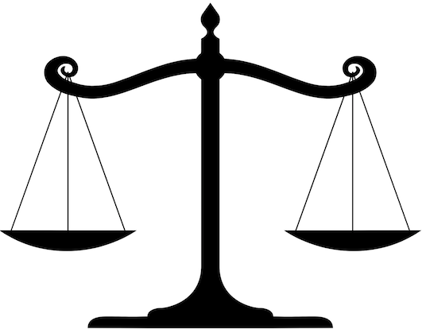
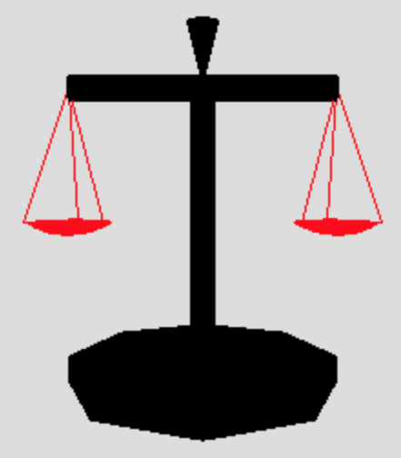

  

# Affine Math and Nested Frames

## Plan

  * Review code for the [Leg demo](../demos/BasicModeling/Leg1.shtml)
  * Representing affine transformations as matrix multiplications 
  * Nested frames: [TeddyBear](../demos/BasicModeling/TeddyBear.shtml) demo 
  * Overview of [HWK2](../assignments/hwk2-clown.html)
  * Exercise: Scale of Justice

## Affine Math

  * Translation, Rotation and Scale are kinds of _affine_ transformations. 
  * An affine transformation maps line segments onto line segments and triangles onto triangles. That's good for Computer Graphics. 
  * An affine transformation in 3D using _homogeneous coordinates_ can be represented with a 4x4 matrix. 
  * Homogeneous coordinates add a fourth component, $w$, to all vectors and points: \\( \newcommand{\vecIV}[4]{\left[\begin{array}{c} #1\\\\#2\\\\#3\\\\#4 \end{array}\right]} \\) 
    * Translation: \\[ \vecIV{x+\Delta x}{y+\Delta y}{z+\Delta z}{w} = \left[ \begin{array}{rrrr} 1 & 0 & 0 & \Delta x \\\ 0 & 1 & 0 & \Delta y \\\ 0 & 0 & 1 & \Delta z \\\ 0 & 0 & 0 & 1 \end{array} \right] \vecIV{x}{y}{z}{w} \\] 
    * Rotation (around Z in the example below): \\[ \vecIV{x'}{y'}{z}{w} = \left[ \begin{array}{rrrr} \cos\theta & -\sin\theta & 0 & 0 \\\ \sin\theta & \cos\theta & 0 & 0 \\\ 0 & 0 & 1 & 0 \\\ 0 & 0 & 0 & 1 \end{array} \right] \vecIV{x}{y}{z}{w} \\] 
    * Scaling: \\[ \vecIV{s_x x}{s_y y}{s_z z}{w} = \left[ \begin{array}{rrrr} s_x & 0 & 0 & 0 \\\ 0 & s_y & 0 & 0 \\\ 0 & 0 & s_z & 0 \\\ 0 & 0 & 0 & 1 \end{array} \right] \vecIV{x}{y}{z}{w} \\] 
  * A series of transformations is the same as multiplying by a series of matrices 

## Associativity of Matrix Multiplication

The naive way to apply multiple transformations is to perform a separate
matrix multiplication for each transformation. We'll use T, R and S to stand
for translate, rotate and scale. Here each vertex gets 7 transformations: \\[
v' = S(R_2(T_4(T_3(T_2(R_1(T_1( v))))))) \\]

The clever way is like this, precomputing the 7 transformations as one: \\[ C
= (SR_2T_4T_3T_2R_1T_1) \\\ v' = C v \\]

This is worthwhile when the number of vertices is very large.

By making all of the operations be matrix multiplications, we can represent
and store the collective effect of a set of transformations, at significant
savings in time:

  * Doing N transformations on M vertices the naive way takes 16NM multiplications 
  * Doing N transformations on M vertices the clever way takes 64N + 16M multiplications 

This can be a huge savings when M is large, which it often is. Think about the
number of vertices in the teddy bear!

Also, the graphics card only has to store one matrix (the CTM), not N, so
there's a space advantage as well.

Finally, there's the convenience of being able to save and restore the CTM
just by pushing it onto and popping it off of a stack. This is _exactly_ what
we were doing with the 2D canvas when we used `save` and `restore`.

## Teddy Bear Demo

The full [TeddyBear](../demos/BasicModeling/TeddyBear.shtml) demo uses
many nested frames.

To see how these nested frames are implemented, we'll begin with this slightly
stream-lined code for [Teddy's Head](05a-exercises/teddyHead.shtml) that just
creates a `THREE.Object3D` object for the bear's head and adds it directly to
the scene, with the origin of the head object coinciding with the origin of
the scene's coordinate system.

The creation of the Teddy Bear's body also demonstrates multiple rotations.
For example, to get a tube in the orientation we want for the teddy bear's
leg:

  * The `createLimb()` function returns an object that contains a cylinder mesh with the origin at the center of the top of the cylinder and the -Y axis running down the center of the cylinder. 
  * We use a _negative_ rotation around the X axis to lift the legs up a bit. 
  * We use a _positive_ rotation around the Z axis to spread them out.  

## Overview of HWK2

In [HWK2](../assignments/hwk2-clown.html), you'll
create a graphical rendering of a clown, using nested frames, and also
complete some more math problems.

## Exercise: Scale of Justice

Suppose we want to create a rendering of the _Scale of Justice:_

Our rendering won't be nearly as ornate, but we'd like to approach the
solution in a way that would facilitate some added embellishments.

Your starting point is this [scale-start.html](05a-exercises/scale-start.html)
code file that just creates a base and pole for the scale. This initial file
contains code for:

  * an object named `params` that contains two parameters, `size` and `angle`, that can be controlled with the GUI 
  * an array named `materials` that contains black and red materials 
  * a function `createCone()` that creates and returns a "cone object" _with its origin at the top of the cone_
  * a partial definition of a function `createScale()` that creates and returns a "scale object" -- _where is the origin of this container object?_ 

This file also contains code for the GUI controls and sets up a bounding box
that is suitable for the scene.

Your task is to:

  1. complete the `createBeam()` function that creates and returns a "beam object" that contains a cylindrical beam and two cones to portray the rest of the scale -- _what is a convenient origin for this container object?_
  2. add code to the `createScale()` function to call `createBeam()` and add the beam to the scale 

A couple tips on completing `CreateBeam()`:

  * this function has two inputs, `size` and `angle`, where `size` is the length of the beam and `angle` specifies the orientation of the beam, measured from the horizontal axis (in the GUI, this angle is initially 0) 
  * place two cone objects at the tips of the beams, taking into account the `size` and `angle` of the beam 

**_Why might it be advantageous to divide the creation of the scale into
multiple parts, with separate container objects (i.e. instances
of`THREE.Object3D`) for some parts?_**

Your final solution might look something like this:
[scale.html](05a-exercises/scale.html)  
(adjust the GUI controls to change the size and orientation of the beam)

**(Optional)**  
If you have time, add some embellishments or improvements to `createCone()` or
`createBeam()`, such as those shown in this snapshot from
[scalePlus.html](05a-exercises/scalePlus.html):

## Next Time

Next time, we'll look at the Camera API and the mathematics of _projection_ ,
which will _also_ involve matrices.

### Source

This page is based on <https://cs.wellesley.edu/~cs307/lectures/05b.html>. Copyright &copy; Scott D. Anderson. This work is licensed under a [Creative Commons License](http://creativecommons.org/licenses/by-nc-sa/1.0/). 
