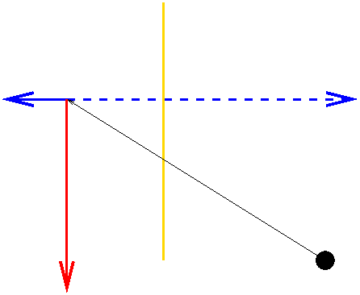

# Synthetic Cameras

<p style="display:none">
\(
\newcommand{\vecIII}[3]{\left[\begin{array}{c} #1\\#2\\#3 \end{array}\right]}
\newcommand{\vecIV}[4]{\left[\begin{array}{c} #1\\#2\\#3\\#4 \end{array}\right]}
\newcommand{\Choose}[2]{ { { #1 }\choose{ #2 } } }

\newcommand{\vecII}[2]{\left[\begin{array}{c} #1\\#2 \end{array}\right]}
\newcommand{\vecIII}[3]{\left[\begin{array}{c} #1\\#2\\#3 \end{array}\right]}
\newcommand{\vecIV}[4]{\left[\begin{array}{c} #1\\#2\\#3\\#4 \end{array}\right]}
\newcommand{\matIIxII}[4]{\left[
    \begin{array}{cc}
      #1 & #2 \\ #3 & #4 
    \end{array}\right]}

\newcommand{\matIIIxIII}[9]{\left[
    \begin{array}{ccc}
      #1 & #2 & #3 \\ #4 & #5 & #6 \\ #7 & #8 & #9
    \end{array}\right]}
\)        
</p>

## Plan

  * Review solution to [scale of justice](05-exercises/scale.html) exercise 
  * Review synthetic camera and perspective projection 
  * Exercise on perspective projection 
  * Review Three.js Camera API and [camera tutor](http://cs.wellesley.edu/~cs307/threejs/demos/Camera/camera-api.shtml) demo ([slide](Lecture10.pdf)) 
  * Exercises on setting up a camera  

## Pinhole and Synthetic Cameras

##### Pinhole camera, aka _camera obscura_




##### Pinhole camera with object and its projection


##### Pinhole camera showing similar triangles


##### Synthetic camera moves the image plane in front to eliminate negatives


## Exercise: Perspective Projection

Assume a synthetic camera with the image plane (near plane) at a distance d
from the center of projection (COP). Suppose the scene contains a tree of
height H at a distance D from the COP. What is the height of the projected
tree?

> H*(d/D)

Perspective: projections shrink with distance. This also gives us vanishing
points -- think about railroad tracks.

Example: With the standard camera (COP at the origin, looking down the -Z
axis) and the image plane at Z=-3, find the projection of (7,8,-9).



For X:

> X/x = Z/z  
>  7/x = -9/-3  
>  7/(-9/-3) = x  
>  x = 7/3

For Y:

> Y/y = Z/z  
>  8/y = -9/-3  
>  8/(-9/-3) = y  
>  y = 8/3

For the entire point, P:

> projection of P  
>  = (7/3, 8/3, -3)  
>  = (1/3) * P

and 1/3 is just 1/near, where "near" is the distance from the COP to the image
plane

## Projection Matrices

##### Orthographic Projection

\\[ \left[ \begin{array}{rrrr} 1 & 0 & 0 & 0 \\\ 0 & 1 & 0 & 0 \\\ 0 & 0 & 0 &
0 \\\ 0 & 0 & 0 & 1 \end{array} \right] \vecIV{X}{Y}{Z}{1} \\]

What does this do to a point $(X, Y, Z)$?

##### Perspective Projection

\\[ \vecIV{X}{Y}{Z}{Z/d} = \left[ \begin{array}{rrrr} 1 & 0 & 0 & 0 \\\ 0 & 1
& 0 & 0 \\\ 0 & 0 & 1 & 0 \\\ 0 & 0 & 1/d & 0 \end{array} \right]
\vecIV{X}{Y}{Z}{1} \\]

To obtain the projected image coordinates, $(x, y, z)$, we divide the result
on the left by $Z/d$ (the perspective division step), yielding the following:

\\[ \vecIV{x}{y}{z}{w} = \vecIV{X/(Z/d)}{Y/(Z/d)}{d}{1} \\]

Note that \\(d\\) is the `near` distance: the distance from the COP (center of
projection) to the image plane.

## Camera Tutor

[ Visualization of the Camera API](/~cs307/threejs/demos/Camera/camera-
api.shtml)

In this example, the camera parameters (adjusted in the GUI) are stored in an
object named `cameraParams`:

    
```javascript    
    var cameraParams = {
        near: 5,
        far: 30,
        fov: 75,                  // degrees
        aspectRatio: 400.0/300.0, // from canvas dimensions, see CSS
        atX: 0,
        atY: 0,
        atZ: 0,
        eyeX: 0,
        eyeY: 0,
        eyeZ: 25,
        upX: 0,
        upY: 1,
        upZ: 0
    };
```

The following code defines a function named `setupCamera()` that creates a
camera with the desired parameters, and then invokes the function and adds the
camera to a scene:

    
```javascript
    function setupCamera (cameraParameters) {
        // set up an abbreviation 
        var cp = cameraParameters;
        // create an initial camera with the desired shape
        var camera = new THREE.PerspectiveCamera(cp.fov,
                                                 cp.aspectRatio,
                                                 cp.near,
                                                 cp.far);
        // set the camera location and orientation
        camera.position.set(cp.eyeX, cp.eyeY, cp.eyeZ);
        camera.up.set(cp.upX, cp.upY, cp.upZ);
        camera.lookAt(new THREE.Vector3(cp.atX, cp.atY, cp.atZ));
        return camera;
    }
    var camera = setupCamera(cameraParams);
    scene.add(camera);
```

Note that you also need to do something like this at the end of your code:

    
```javascript
    function render() {
        // assume global variables scene, renderer, and camera
        renderer.render(scene,camera);
    }
    render();
```

TW's camera setup did this for us automatically. With this code, though, we
can cut the TW apron strings.

## Exercises: Creating Desired Camera Views

### Setting up a Camera

Using this [town-view-before.html](06-exercises/town-view-before.html), set up
a camera to view the snowman from above and to the right. Something like this:

> 

  * You might find it helpful to use the following [ town-view-gui.html ](06-exercises/town-view-gui.html). 
  * Define a function to set up the camera the way you want. 
  * Replace `TW.cameraSetup()` with your new camera. 

Your result might look like [town-view.html](06-exercises/town-view.html)

### Zooming vs. Dollying

Is there any difference between

  * _zooming in,_ keeping the eye point the same and reducing the FOV 
  * _dollying in,_ keeping the FOV the same and moving the camera closer 

Let's try to experience the effects of these changes to the camera setup.

To begin, add a wireframe box to the scene that fits snuggly around the head
of the snowman. Then try to set the camera parameters so that the scene
appears like this:


**Hints:** the camera is positioned 5 units in front of the center of the
snowman's head (at the same x and y coordinates as this center point) and is
_looking at_ this center point. Set the `fov` to achieve the above appearance.

Then try to set the camera parameters to reproduce each of the following
views, dollying in to create one of the views and zooming in to create the
other:

>  

_Which figure was created by zooming, and which by dollying?_

Your solutions might be like [snowman-close.html](06-exercises/snowman-
close.html) and [snowman-zoom.html](06-exercises/snowman-zoom.html).

## Vup

Most of the time, Vup is very simple: we have \\[ V_\mathrm{up} = (0, 1, 0)
\\]

The minute we want something different, though, Vup can be confusing. Try to
imagine it this way:

  * Visualize the Vup vector in 3D space, along with the image plane. 
  * _Project_ the Vup vector onto the image plane 
  * The frustum spins around the VPN (view plane normal) so that the Vup vector is _parallel to the left/right edges_. 
  * When the top of the frustum is mapped onto the canvas, the Vup vector is parallel to the left/right edge of the canvas. 

There are two important consequences of the way Vup works:

  * The Vup vector can't project to a point, which means it can't be parallel or anti-parallel to the VPN. 
  * Any change to the Vup vector that doesn't change the direction of its projection on the image plane _doesn't_ affect anything. The image is still oriented the same way. 

### Exercise: Changing Vup

Let's try to experiment with changing Vup

Try to reproduce both of the following:

>  

  * Think about what Vup might be. 
  * Set up the camera for each scene. 

Your solutions might be like [snowman-close-angled.html](06-exercises/snowman-
close-angled.html) and [snowman-close-overhead.html](06-exercises/snowman-
close-overhead.html).


### Source

This page is based on <https://cs.wellesley.edu/~cs307/lectures/06.html>. Copyright &copy; Scott D. Anderson. This work is licensed under a [Creative Commons License](http://creativecommons.org/licenses/by-nc-sa/1.0/). 

