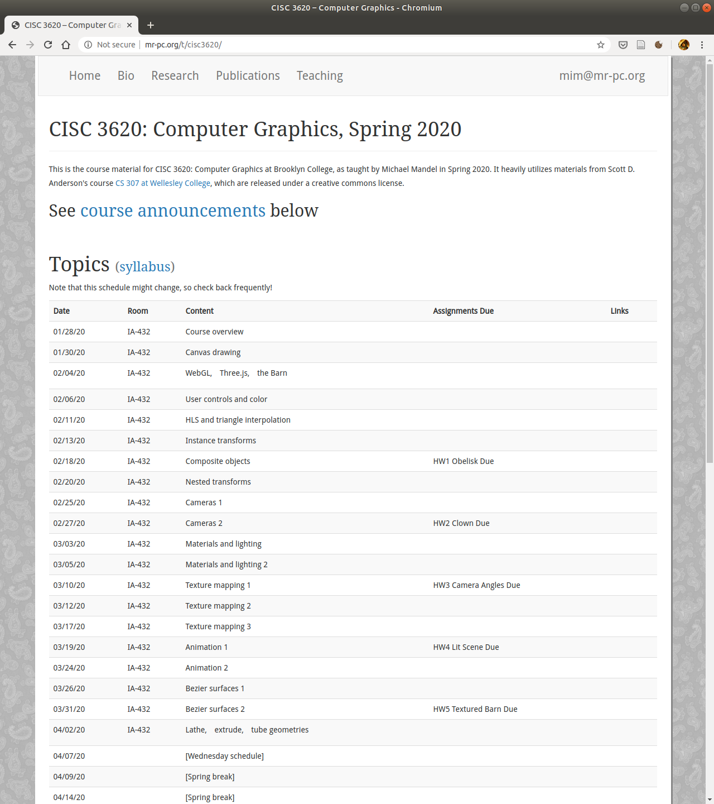
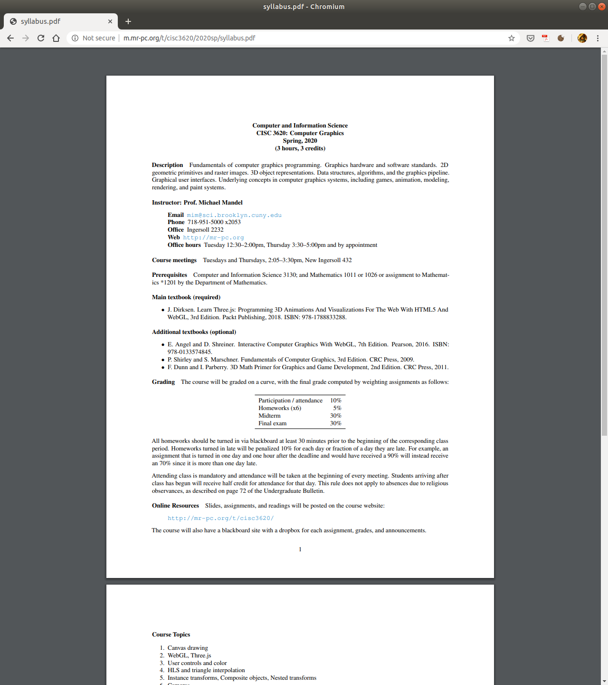
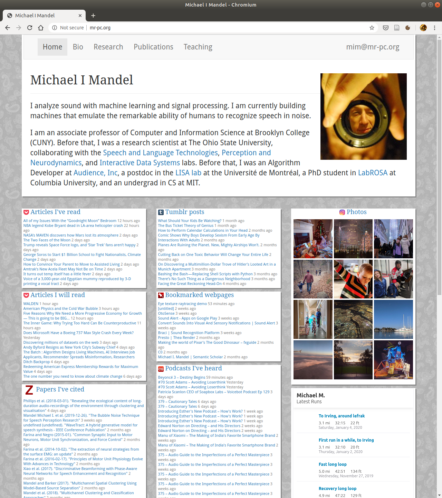
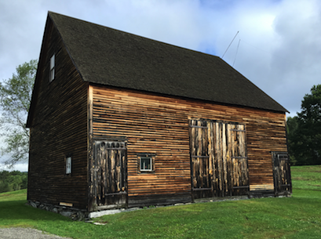

# {{ page.title }}
### {{ site.author }}

Based on [CS 307 lecture 1](https://cs.wellesley.edu/~cs307/lectures/01-intro.html) which is copyright &copy; Scott D. Anderson and licensed under a [Creative Commons License](http://creativecommons.org/licenses/by-nc-sa/1.0/). 

## What is CG?

  * it's _not_ drawing/painting with the computer
  * it's _modeling_ and _rendering_ 

What are some common applications of CG?

Let's look at some [examples...](http://m.mr-pc.org/t/cisc3620/2020sp/Lecture01.pdf)

  * _What do we need to model_ in order to render these graphical images? 

## Demos

Before we dig into the material of the course, let's look at a few demos:

  * [Many three.js examples](http://threejs.org/examples/), including:
     * [Particle sprites](https://threejs.org/examples/webgl_points_sprites.html)
     * [Orbit controls](https://threejs.org/examples/misc_controls_orbit.html)
     * [Shadowmaps](https://threejs.org/examples/webgl_shadowmap.html)
  * [Fancy eye demo](http://www.vill.ee/eye/)
  * [Highlight reel](http://davidscottlyons.com/threejs-intro/videos/webgl-demos.mp4)

## About CISC 3620

What is this course like?

  * First, this is a programming course.
  * All the assignments involve writing JavaScript code.
    * The advantage of JavaScript is that it runs in pretty much every web browser.
    * The disadvantage is that its debugging environments are still improving.

--

### About CISC 3620

  * The course is fairly mathematical
  * We will learn about the math that underlies all those pretty pictures:
    * algebra 
    * geometry 
    * trigonometry 
    * calculus 
    * some linear algebra  

--

### [Course website](http://mr-pc.org/t/cisc3620/)

--

### [Syllabus](http://m.mr-pc.org/t/cisc3620/2020sp/syllabus.pdf)

--

### [About me](http://mr-pc.org)

--

### About you

  * Name
  * Year
  * Major
  * Graphics area/application you are most interested in

## Basics

Make a simple sketch of this barn, and discuss:

  * vertices 
  * camera position 
  * camera direction 
  * image plane 

  * _projection_
  * reflection 
  * color 

--

### Basics

The purpose of sketching the barn is to raise the following concepts. These
are the **fundamental concepts of computer graphics** :

  * Object modeling 
  * Camera placement and shape of viewed region 
  * Material 

  * Lighting 
  * Texture mapping 
  * Modeling curves and surfaces 
  * Animation 

--

### The Barn

Here's the CG equivalent of the sketch we just made: the [barn](../demos/barn-tw.html).

## Some Concepts and Terminology

  * Our software "constructs" a 3D model of our object or scene
    * Out of vertices, faces, surfaces, control points
  * These are sent to the graphics card
    * Which _renders_ the scene as a raster image of pixels
  * These are written into the frame buffer
    * where they stay in order to drive the display.

--

### Graphics Computer

  * Processor 
  * Memory 
  * Output Devices: typically a monitor

  * [Frame Buffer (framebuffer)](http://en.wikipedia.org/wiki/Frame_buffer)
  * Input Devices: keyboards, mice, trackballs, video game controllers, etc. 

--

### Pixels

The above image of _Luxo Jr._ illustrates some useful terminology:

  * A [Pixel](http://en.wikipedia.org/wiki/Pixel) is a single spot of color in a rectangular grid of pixels
  * [Raster](http://en.wikipedia.org/wiki/Raster_graphics) is the rectangular grid of pixels 
  * [Color Depth](http://en.wikipedia.org/wiki/Color_depth) determines the number of representable colors
  * [RGB](http://en.wikipedia.org/wiki/Rgb): Red/Green/Blue color primaries form the basis of colors
  * [Display resolution](http://en.wikipedia.org/wiki/Display_resolution): Number of pixels in an image 
  * [Vector graphics](http://en.wikipedia.org/wiki/Vector_display) draw images as lines instead of pixels

## Course Software

  * We will be using `WebGL` and a package called `Three.js`
    * which means we will write code in JavaScript!
  * This means:
    * No installing software! 
    * You will be able to work in any modern web browser. Use this link to [test whether your browser supports WebGL](http://get.webgl.org/). 
    * Anyone using a modern web browser will be able to see your work without installing software. Show off your work to friends, family, and employers! 
    * You can share your code with others in this class by providing a link that they can load into their web browser. 

## Learning JavaScript

  * If you do not know JavaScript, now is an _excellent_ time to learn!
  * Here is a [crash course on JavaScript](../readings/01-javaScriptCrashCourse.html)
    * covers most of the essentials needed for this course
  * We will spend some class time on it, but it will help to learn the basics on your own

--

### Learning JavaScript

If you'd like to supplement this documentation, here are some good ones:

  * Mozilla's [A Re-Introduction to JavaScript](https://developer.mozilla.org/en-US/docs/Web/JavaScript/A_re-introduction_to_JavaScript)
    * written for people who already know how to program and just need to learn a new language
    * material through "Functions" is most relevant for this course
  * The Douglas Crockford book, [ JavaScript: The Good Parts](http://shop.oreilly.com/product/9780596517748.do) is delightful, but is extremely concise
  * You might prefer the [Eloquent JavaScript](http://www.eloquentjavascript.net) online book 
  * W3Schools' [JavaScript Tutorial](http://www.w3schools.com/js/default.asp)
  * Here's a [JavaScript Quick Guide](http://www.tutorialspoint.com/javascript/javascript_quick_guide.htm), just 13 intense pages

--

### Learning JavaScript

  * A lot of the hard part is event-handling and browser API
    * which we will not need to worry about.
  * We will mainly use:
    * basics: function definitions, variables, conditionals, loops 
    * OOP: how to make objects and invoke methods on them. 
    * OOP: how to define objects and their instance variables and methods. 

## How We Work

  * We'll be programming in JavaScript
  * You can use a text editor on your local machine (for example [Atom](http://atom.io))
  * You can use an online editor like [CodePen](http://codepen.io)
    * which allows you to easily create web pages with a single HTML, JS, and CSS file.
  * Assignments, labs, and demos will typically be distributed on [CodePen](http://codepen.io)
  * You can work on a Mac, Linux, or Windows machine, including your own laptop.
  * Homework code submission will involve uploading the URL of your codepen project to a dropbox on Blackboard for each assignment.

--

### Building on the Work of Others

A library of graphics objects has been created by past students in the parent of this
course at <https://cs.wellesley.edu/~cs307/threejs/contrib/>

## To Do

  * Buy the [Dirksen textbook](https://www.packtpub.com/web-development/learn-threejs-third-edition), today (2020/01/28) it is **on sale for $5**
  * Readings for next class
    * [JavaScript crash course](../readings/01-javaScriptCrashCourse.html)
    * [HTML5 Canvas drawing](../readings/02a-canvas.html)
  * If you are going to use your own laptop install a good text editor like [Atom](http://atom.io/)
