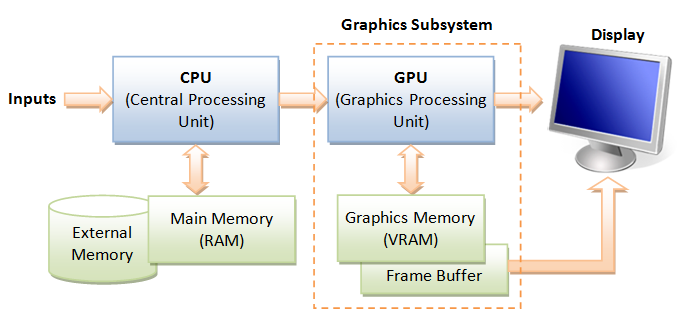
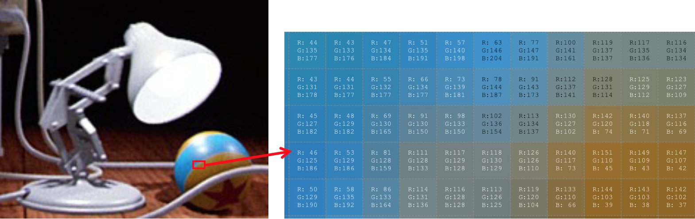

# {{ page.title }}
### {{ site.author }}

Based on [CS 307 lecture 1](https://cs.wellesley.edu/~cs307/lectures/01-intro.html) which is copyright &copy; Scott D. Anderson and licensed under a [Creative Commons License](http://creativecommons.org/licenses/by-nc-sa/1.0/). 

## What is CG?

  * it's _not_ drawing/painting with the computer 
  * it's _modeling_ and _rendering_ 

What are some common applications of CG?

Let's look at some [examples...](Lecture1.pdf)

  * _What do we need to model_ in order to render these graphical images? 

## Demos

Before we dig into the material of the course, let's look at a few demos:

  * [Three.js examples](http://threejs.org/examples/) 

## About CISC 3620

What is this course like?

First, this is a programming course. All the assignments involve writing
JavaScript code. The advantage of JavaScript is that it runs in pretty much
every web browser. The disadvantage is that its debugging environments are
still improving.

The course is fairly mathematical. We will learn about the math that underlies
all those pretty pictures:

  * algebra 
  * geometry 
  * trigonometry 
  * calculus 
  * some linear algebra  

## Basics

Make a simple sketch of this barn, and discuss:

  * vertices 
  * camera position 
  * camera direction 
  * image plane 
  * _projection_
  * reflection 
  * color 

## Basics

The purpose of sketching the barn is to raise the following concepts. These
are the **fundamental concepts of computer graphics** :

  * Object modeling 
  * Camera placement and shape of viewed region 
  * Material 
  * Lighting 
  * Texture mapping 
  * Modeling curves and surfaces 
  * Animation 

## The Barn

Here's the CG equivalent of the sketch we just made: the [barn](../demos/barn-tw.html).

## Some Concepts and Terminology

Graphics Computer:

https://www.ntu.edu.sg/home/ehchua/programming/opengl/images/Graphics3D_Hardware.png

  * Processor 
  * Memory 
  * [Frame Buffer (framebuffer)](http://en.wikipedia.org/wiki/Frame_buffer)
  * Output Devices: typically a monitor, such as a CRT or LCD screen 
  * Input Devices: keyboards, mice, trackballs, video game controllers, etc. 

Our software is going to "construct" a 3D model of our object or scene,
typically as a collection of vertices, faces, surfaces, control points, and
the like. These will be sent to the graphics card, which will _render_ the
scene as a raster image of pixels. These are written into the frame buffer,
where they stay in order to drive the display.

The above image of _Luxo Jr._ illustrates some useful terminology:

  * A [Pixel](http://en.wikipedia.org/wiki/Pixel) is a single spot of color in a image defined by a rectangular grid of pixels. 
  * [Raster and rasterization (AKA scan conversion)](http://en.wikipedia.org/wiki/Raster_graphics) is the rectangular grid of pixels. The frame buffer holds the raster image. 
  * [Color Depth or Bit Depth](http://en.wikipedia.org/wiki/Color_depth) has to do with the number of different colors that can appear at any pixel. 
  * [RGB](http://en.wikipedia.org/wiki/Rgb): Red/Green/Blue color primaries are how the color is defined for each pixel. 
  * [Display resolution](http://en.wikipedia.org/wiki/Display_resolution). The greater the number of pixels, the more fine detail can be displayed, as well as reducing the inevitable jagginess of lines and curves that don't match the raster. 
  * [Vector displays](http://en.wikipedia.org/wiki/Vector_display) are images that are drawn in a continuous way, by a pen, electron beam, or other device. 

The main idea is that raster graphics has won over vector graphics, and now
all graphics is done as a rectangular grid of pixels, each a single spot of
pure color.

## Course Software

We will be using `WebGL` and a package called `Three.js` which means we will
write code in JavaScript! This means:

  * No installing software! 
  * You will be able to work in any modern web browser. Use this link to [test whether your browser supports WebGL](http://get.webgl.org/). 
  * Anyone using a modern web browser will be able to see your work without installing software. Show off your work to friends, family, and employers! 
  * You can share your code with others in this class by providing a link that they can load into their web browser. 

Over the past three years, Scott Anderson has revised all of the class demos
and lectures to use the above software. Most of the errors have been fixed but
please point out any errors if you find them. `Three.js` is still evolving, so
further revisions may be needed. Using rapidly evolving software has
advantages, but also disadvantages!

## Learning JavaScript

If you do not know JavaScript, now is an _excellent_ time to learn!

Scott wrote a [crash course on JavaScript](../readings/JavaScript-crash-
course.html) that covers most of the essentials of JavaScript needed for this
course. We will spend some class time on the OOP parts, but I will expect you
to learn the basics without much class time.

If you'd like to supplement Scott's documentation, a Google search will show
you many JavaScript tutorials. Here are some examples:

  * Mozilla's [A Re-Introduction to JavaScript](https://developer.mozilla.org/en-US/docs/Web/JavaScript/A_re-introduction_to_JavaScript) is written for people who already know how to program and just need to learn a new language. It's very good. The material through "Functions" is most relevant for this course. 
  * The Douglas Crockford book, [ JavaScript: The Good Parts](http://shop.oreilly.com/product/9780596517748.do) is delightful, but is extremely concise and gets into some deep theoretical issues. It's not an easy read. (I haven't viewed the Crockford videos, but would expect them to be good.) 
  * The [Eloquent JavaScript](http://www.eloquentjavascript.net) online book may be the way to go if you decide that Crockford is not for you. 
  * David Sawyer MacFarland's [ JavaScript and jQuery: The Missing Manual](http://shop.oreilly.com/product/0636920032663.do), 2nd edition, is also good. You will not need the jQuery part for this course. 
  * [JavaScript Tutorial](http://www.w3schools.com/js/default.asp). 
  * Here's a [JavaScript Quick Guide](http://www.tutorialspoint.com/javascript/javascript_quick_guide.htm), just 13 intense pages, in a printer-friendly format. 

In general, a lot of what makes JavaScript hard is the event-handling and
browser API, which we will not need to worry about. We will mainly draw upon
the following aspects of JavaScript:

  * basics: function definitions, variables, conditionals, loops 
  * OOP: how to make objects and invoke methods on them. 
  * OOP: how to define objects and their instance variables and methods. 

## How We Work

We'll be programming in JavaScript in a text editor on your local machine
(for example [Atom](http://atom.io)), using
the JavaScript interface to the WebGL system calls. WebGL is a subset of the
full OpenGL specification.

You can work on a Mac, Linux, or Windows machine, including your own laptop.

We will also be working online in [CodePen](http://codepen.io), which allows you to easily create web pages with a single HTML, JS, and CSS file.

Homework code submission will involve uploading the URL of your codepen project to a dropbox on Blackboard for each assignment.

## Building on the Work of Others

A library of graphics objects has been created by past students in this
course. I hope each of you will also make a contribution to our library, which
is at <https://cs.wellesley.edu/~cs307/threejs/contrib/>.

## To Do

  * Reading for Tuesday
  * If you are going to use your own laptop for the coding in this course, you should make sure you have installed a decent text editor.  [Atom](http://atom.io/), runs on all three major OS platforms, but you're welcome to use a different editor if you like.
