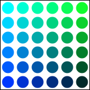

# {{ page.title }}
#### {{ site.author }}

Based on [CS 307 lecture 2a](https://cs.wellesley.edu/~cs307/lectures/02a.html) which is copyright &copy; Scott D. Anderson and licensed under a [Creative Commons BY-NC-SA License](http://creativecommons.org/licenses/by-nc-sa/1.0/). 


## Plan

  * Covered last time
    * The HTML5 `<canvas>` element
    * Drawing rectangles
    * Drawing paths
  * Drawing arcs in paths
  * Setting properties of path segments
  * Transformations and saving and restoring state
  * Exercises
    * draw a tree
    * draw a house
    * draw a village

## The HTML5 `<canvas>` element

  * Provides a canvas on which JavaScript can draw
```html
    <canvas id="tutorial" width="150" height="150"></canvas>
```

  * We will use the 2D drawing "context" for now
  * Also used by WebGL and Three.js behind the scenes for 3D
  * To access the 2D context from JavaScript:
```javascript
var canvas = document.getElementById('tutorial');
var ctx = canvas.getContext('2d');
```

  * (This section is based on the [MDN Canvas Tutorial](https://developer.mozilla.org/en-US/docs/Web/API/Canvas_API/Tutorial))

### A simple example ([codepen](https://codepen.io/asterix77/pen/VwYJaML))

```html
<!DOCTYPE html>
<html>
 <head>
  <meta charset="utf-8"/>
  <script type="application/javascript">
    function draw() {
      var canvas = document.getElementById('canvas');
      if (canvas.getContext) {
        var ctx = canvas.getContext('2d');
        ctx.fillStyle = 'rgb(200, 0, 0)';
        ctx.fillRect(10, 10, 50, 50);
        ctx.fillStyle = 'rgba(0, 0, 200, 0.5)';
        ctx.fillRect(30, 30, 50, 50);
      }
    }
  </script>
 </head>
 <body onload="draw();">
   <canvas id="canvas" width="150" height="150"></canvas>
 </body>
</html>
```

### The grid


  * By default, the origin is in the top left
  * Increasing `y` values go down the page (opposite of 8th grade math)
  * Specify points/coordinates as `(x,y)` pairs

## Drawing rectangles

  * Canvas only supports two primitive shapes: rectangles and paths
  * To draw rectangles:
    * `fillRect(x, y, width, height)`: Draws a filled rectangle
    * `strokeRect(x, y, width, height)`: Draws a rectangular outline
    * `clearRect(x, y, width, height)`: Clears the specified rectangular area, making it fully transparent
  * `(x,y)` in this case specifies the top left corner

### You try: Drawing rectangles

  * Start from [this codepen](https://codepen.io/asterix77/pen/PowrNep)
  * Try to draw this picture using the above rectangle functions


### Answer: Drawing rectangles

```javascript
function draw() {
  var canvas = document.getElementById('canvas');
  if (canvas.getContext) {
    var ctx = canvas.getContext('2d');
    ctx.fillRect(25, 25, 100, 100);
    ctx.clearRect(45, 45, 60, 60);
    ctx.strokeRect(50, 50, 50, 50);
  }
}
```

## Drawing paths

  * A path is a list of points, connected by segments of lines
  * Segments can be different shapes, curved, straight, different colors
  * To make shapes using paths
    1. Create the path using `beginPath()`
    1. Use `moveto(x,y)` to go to the start point
    1. Add segments to the path
    1. Draw it using either `fill()` (solid shape) or `stroke()` (just outline)

### Path example: Drawing a triangle ([codepen](https://codepen.io/asterix77/pen/rNaEegg))


```javascript
function draw() {
  var canvas = document.getElementById('canvas');
  if (canvas.getContext) {
    var ctx = canvas.getContext('2d');
    ctx.beginPath();
    ctx.moveTo(75, 50);
    ctx.lineTo(100, 75);
    ctx.lineTo(100, 25);
    ctx.fill();
  }
}
```

### You try: Drawing two triangles

  * Start from [this codepen](https://codepen.io/asterix77/pen/ZEYdWgZ)
  * Try to draw this picture using the above path functions


### Answer: Drawing two triangles

```javascript
function draw() {
  var canvas = document.getElementById('canvas');
  if (canvas.getContext) {
    var ctx = canvas.getContext('2d');
    // Filled triangle
    ctx.beginPath();
    ctx.moveTo(25, 25);
    ctx.lineTo(105, 25);
    ctx.lineTo(25, 105);
    ctx.fill();
    // Stroked triangle
    ctx.beginPath();
    ctx.moveTo(125, 125);
    ctx.lineTo(125, 45);
    ctx.lineTo(45, 125);
    ctx.closePath();
    ctx.stroke();
  }
}
```

## Drawing arcs in paths

  * There are two path functions to add arcs (portions of circles)
  * `arc(x, y, radius, startAngle, endAngle, anticlockwise)` draws an arc
    * centered at `(x, y)`
    * with radius `r`
    * starting at `startAngle` (in radians with 0 to the right)
    * ending at `endAngle`
    * going in the given direction indicated by anticlockwise (defaulting to clockwise)
  * `arcTo(x1, y1, x2, y2, radius)` draws an arc
    * starting at current point
    * going to `(x1, y1)` and then `(x2, y2)`
    * for a circle with radius `radius`
  * Angles in radians can be computed with `radians = (Math.PI/180)*degrees`

### You try: complete the smiley face

  * Start from this [codepen](https://codepen.io/asterix77/pen/dyPBXYO)
  * Complete the smiley face to match this picture (don't worry about the orange lines):


### Answer: complete the smiley face

```javascript
function draw() {
  var canvas = document.getElementById('canvas');
  if (canvas.getContext) {
     var ctx = canvas.getContext('2d');
     ctx.beginPath();
     ctx.arc(75, 75, 50, 0, Math.PI * 2, true); // Outer circle
     ctx.moveTo(110, 75);
     ctx.arc(75, 75, 35, 0, Math.PI, false);  // Mouth (clockwise)
     ctx.moveTo(65, 65);
     ctx.arc(60, 65, 5, 0, Math.PI * 2, true);  // Left eye
     ctx.moveTo(95, 65);
     ctx.arc(90, 65, 5, 0, Math.PI * 2, true);  // Right eye
     ctx.stroke();
  }
}
```


## Coloring shapes

  * Setting the context's `fillStyle` property affects all future shapes
    * until the property is set again
    * Same for `strokeStyle`
  * Can use any CSS color specification
```javascript
ctx.fillStyle = 'orange';
ctx.fillStyle = '#FFA500';
ctx.fillStyle = 'rgb(255, 165, 0)';
ctx.fillStyle = 'rgba(255, 165, 0, 1)';
```

### Example: coloring circles ([codepen](https://codepen.io/asterix77/pen/jOEjrwJ))

```javascript
  function draw() {
    var ctx = document.getElementById('canvas').getContext('2d');
    for (var i = 0; i < 6; i++) {
      for (var j = 0; j < 6; j++) {
        ctx.fillStyle = 'rgb(0, ' + Math.floor(255 - 42.5 * i) + ', ' + 
                         Math.floor(255 - 42.5 * j) + ')';
        ctx.beginPath();
        ctx.arc(12.5 + j * 25, 12.5 + i * 25, 10, 0, Math.PI * 2, true);
        ctx.fill();
      }
    }
  }
```



### You try: rectangle grid

  * Start from this [codepen](https://codepen.io/asterix77/pen/WNbqxXP)
  * Try to match this picture


### Answer: rectangle grid

```javascript
function draw() {
  var ctx = document.getElementById('canvas').getContext('2d');
  for (var i = 0; i < 6; i++) {
    for (var j = 0; j < 6; j++) {
      ctx.fillStyle = 'rgb(' + Math.floor(255 - 42.5 * i) + ', ' +
                       Math.floor(255 - 42.5 * j) + ', 0)';
      ctx.fillRect(j * 25, i * 25, 25, 25);
    }
  }
}
```


## Saving and restoring state

  * There are two canvas methods that can make your life much easier
    * `save()` save the entire state of the canvas to a stack
    * `restore()` restore the state from the top of the stack
  * The state that is saved is transforms (more soon), `strokeStyle`, `fillStyle`, etc.
  * If you use them in pairs, your code will be much more modular
  

### Example: nested squares

```javascript
function draw() {
  var ctx = document.getElementById('canvas').getContext('2d');

  ctx.fillRect(0, 0, 150, 150);
  ctx.save();                  
 
  ctx.fillStyle = '#09F';      
  ctx.fillRect(15, 15, 120, 120); 

  ctx.save();                  
  ctx.fillStyle = '#FFF';      
  ctx.globalAlpha = 0.5; 
  ctx.fillRect(30, 30, 90, 90);

  ctx.restore();               
  ctx.fillRect(45, 45, 60, 60);

  ctx.restore();               
  ctx.fillRect(60, 60, 30, 30);
}
```


### Example: nested squares

```javascript
function draw() {
  var ctx = document.getElementById('canvas').getContext('2d');

  ctx.fillRect(0, 0, 150, 150);   // Draw a rectangle with default settings
  ctx.save();                     // Save the default state
 
  ctx.fillStyle = '#09F';         // Make changes to the settings
  ctx.fillRect(15, 15, 120, 120); // Draw a rectangle with new settings

  ctx.save();                     // Save the current state
  ctx.fillStyle = '#FFF';         // Make changes to the settings
  ctx.globalAlpha = 0.5; 
  ctx.fillRect(30, 30, 90, 90);   // Draw a rectangle with new settings

  ctx.restore();                  // Restore previous state
  ctx.fillRect(45, 45, 60, 60);   // Draw a rectangle with restored settings

  ctx.restore();                  // Restore original state
  ctx.fillRect(60, 60, 30, 30);   // Draw a rectangle with restored settings
}
```

### Example nested squares

[Codepen](https://codepen.io/asterix77/pen/zYGOwrP?editors=1010)


## Transformations: Translating

  * Canvas transformations move the canvas and origin around
  * Translate moves the canvas and its origin to a different point 
    * `translate(x,y)`


  * `save()` the canvas state before calling, `restore()` after

### Example: translation

```javascript
function draw() {
  var ctx = document.getElementById('canvas').getContext('2d');
  for (var i = 0; i < 3; i++) {
    for (var j = 0; j < 3; j++) {
      ctx.save();
      ctx.fillStyle = 'rgb(' + (51 * i) + ', ' + (255 - 51 * i) + ', 255)';
      ctx.translate(10 + j * 50, 10 + i * 50);
      ctx.fillRect(0, 0, 25, 25);
      ctx.restore();
    }
  }
}
```


### Example: translation [codepen](https://codepen.io/asterix77/pen/xxGKdqz?editors=1010)

```javascript
function draw() {
  var ctx = document.getElementById('canvas').getContext('2d');
  for (var i = 0; i < 3; i++) {
    for (var j = 0; j < 3; j++) {
      ctx.save();
      ctx.fillStyle = 'rgb(' + (51 * i) + ', ' + (255 - 51 * i) + ', 255)';
      ctx.translate(10 + j * 50, 10 + i * 50);
      ctx.fillRect(0, 0, 25, 25);
      ctx.restore();
    }
  }
}
```


### Other transformations

  * We will discuss this much more when we talk about instance transformations in 3D
  * But other transformations like this are rotation and scaling
    * `rotate(angle)`
    * `scale(xScale, yScale)`


## Exercise 1: Drawing a tree

  * Start from this [codepen](https://codepen.io/asterix77/pen/jOPNBpO)
    * Note that there is a function `flipY()` that changes the coordinate so the positive y direction is up
  * Write the function `drawTreeAt(ctx,x,y,height,width,radius)`
    * `drawTreeAt(ctx,200,50,90,20,30);` should draw

  <div id="canvas1parent"></div>

## Exercise 2: Scene 2, A Projected House

  * Click on the tiny `fork` button on the bottom right to make a copy of your codepen
  * Add a function `drawHouseAt(ctx, x, y, width, height, dx, dy)`
  * `drawHouseAt(ctx,200,50,30,40,10,6);` should draw

  <div id="canvas2parent"></div>

  * See if you can use a `translate(x,y)` transformation
    * Write a function `drawHouse(ctx, width, height, dx, dy)` that draws a house at the origin
    * Make `drawHouseAt()` save the state, translate, call `drawHouse()`, and then restore

## Exercise 3: Scene 3, Houses in a Forest

  * Click on the tiny `fork` button on the bottom right to make a copy of your codepen
  * Use the `drawTreeAt()` and `drawHouseAt()` functions to draw many houses any trees scattered about, like this

  <div id="canvas3parent"></div>

## Summary

  * Drawing in a 2D coordinate system isn't so bad. 
  * Achieve effects using methods on a _context_ object. 
  * Code using functions to achieve higher-level effects. 
  * Parameterize the functions, e.g. a function to draw a tree with a given width and height. 
  * Make the functions be _generic_ , e.g. a house with its origin at the lower left. 
  * Use transformations to translate the generic objects.  
