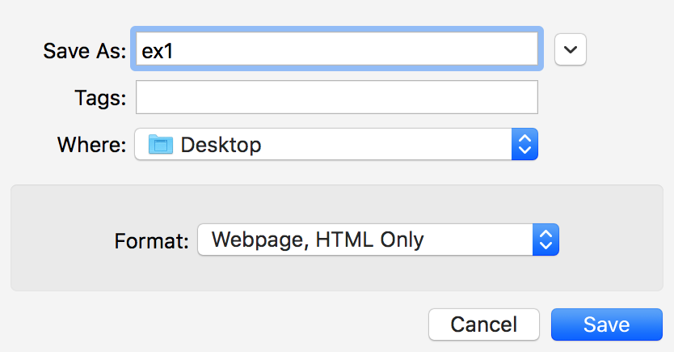

# Introduction to Canvas Drawing

## Plan

  * Recap the canvas, using this [reference](../readings/02a-canvas.html#canvas_reference) & [slide](Lecture2.pdf)
  * Questions from the quiz 
  * Draw three pictures and scenes, about 15-20 minutes each 

## Editing and Running JavaScript Code

Download and open the following examples.
On a laptop, the Atom editor can be installed from
[atom.io](http://atom.io) in a couple minutes. Atom has some nice JavaScript
language sensitivity. 

For code examples in class, we will just edit a starting code file, save it,
and run it (e.g. load an associated webpage into a browser).

## Exercise 1: First Canvas

  1. Visit the following link and save the page to your Desktop: 

> [blank-canvas.html](02a-exercises/blank-canvas.html)

(select `Save Page As...` from the `File` menu, complete the dialog box as
shown below, and click on `Save`):

  2. Open your code file in Atom and add some JavaScript code to draw a "tree" that looks like a green lollipop with a brown stick near the center of the canvas. Follow the link below to see a sample picture, but please do not look at the code. In your solution, add code to define the `drawTreeAt()` function, possibly with separate helper functions, and add a call to this function inside `redrawCanvas1()`. You can view your modified code in a new tab, with `Open File...` from the `File` menu. 

> [ex1-tree.shtml](02a-exercises/ex1-tree.shtml)

## Code Discussion

Once everyone has had a good shot at the picture above, we'll discuss possible
solutions, including mine.

## Exercise 2: Scene 2, A Projected House

  1. Save your file under a new name, and then adapt the new code file to do this exercise. 
  2. Building on your previous solution and maybe taking some of my code, write a function to draw a stick house like the example below, and add a call to this function inside `redrawCanvas1()`. 

> [ex2-house.shtml](02a-exercises/ex2-house.shtml)

## Exercise 3: Scene 3, Houses in a Forest

  1. Save your file under a new name, and then adapt the new code file to do this exercise. 
  2. Building on your previous solution, make lots of houses and trees, scattered about, as shown in the example below. If you have good "draw instance" functions, this should be pretty easy. 

> [ex3-town-forest.shtml](02a-exercises/ex3-town-forest.shtml)

## Summary

  * Drawing in a 2D coordinate system isn't so bad. 
  * Achieve effects using methods on a _context_ object. 
  * Code using functions to achieve higher-level effects. 
  * Parameterize the functions, e.g. a function to draw a tree with a given width and height. 
  * Make the functions be _generic_ , e.g. a tree with its origin at the lower left. 
  * Use transformations to translate the generic objects.  

### Source

This page is based on <https://cs.wellesley.edu/~cs307/lectures/02a.html>. Copyright &copy; Scott D. Anderson. This work is licensed under a [Creative Commons License](http://creativecommons.org/licenses/by-nc-sa/1.0/). 
