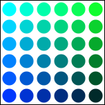

# {{ page.title }}
#### {{ site.author }}

Based on [CS 307 JS Crash course](https://cs.wellesley.edu/~cs307/readings/JavaScript-crash-course.html) and [CS 307 canvas tutorial](https://cs.wellesley.edu/~cs307/readings/canvas.html) which are copyright &copy; Scott D. Anderson and licensed under a [Creative Commons License](http://creativecommons.org/licenses/by-nc-sa/1.0/). 


## Plan

  * Go over basics of JavaScript
    * Variables, functions, conditionals, loops, data structures
    * Object-oriented concepts: using objects, classes, methods
  * Start going over HTML5 Canvas 2D drawing
  * Do some coding examples


## About JavaScript

  * Dynamic language widely supported by modern web browsers
  * Similar syntactically to Java
  * But semantically resembles Lisp and Python
    * weakly typed, has anonymous functions and closures
  * No connection to Java besides name

## Put JavaScript in html using the SCRIPT tag

  * Switch from HTML to JavaScript (JS) using the `script` tag
  * `src` attribute loads JS code  from another file or URL
  * if no `src` then JS code is between start and end `script` tags

Bare-bones skeleton of a web page using JS:
    
```html
<html>
  <head>
    ...
    <script src="yourcode.js"></script>
    ...
  </head>
  <body>
    <script>
       var num = 27;
       ...
    </script>
  </body>
</html>
```

## JavaScript syntax

  * `if` statements and `for` and `while` loops look just like Java
  * The following nested loops with conditionals print the prime numbers from 2 to `max`.
    
```javascript    
    var max = 50;
    var i,j;
    for ( i = 2 ; i < max ; i++ ) {
        // loop over possible factors up to sqrt of i
        j = 2;
        var prime = true;
        while ( prime && j*j <= i ) {
           if ( (i % j) == 0 ) {
               // console.log(j + " evenly divides " + i);
               prime = false;
           }
           j++;
       }
       if ( prime ) {
           console.log("prime: " + i);
       }                        
    }
```

### JavaScript syntax

  * Statements look like Java, ending in semi-colons.
    * They are technically optional, but that leads to lots of bugs
  * Both `// comment` and `/* comment */` work as comments.
    
```javascript    
    /* omit this dumb code
      var x = 3;  // magic number is 3
      var y = 7;  // another mystical number
    */
```
   
## Debugging

  * Built-in functions
    * `alert`: halts the program and pops up a window that must be acknowledged
    * `console.log`: writes its argument to a hidden window (JavaScript console)
  * To open the JavaScript console
    * In Google Chrome: `Command+Option+J` (Mac) or `Control+Shift+J` (Windows, Linux)
    * In Firefox: `Command+Shift+J` (Mac) or `Control+Shift+J` (Windows, Linux)

### Debugging: JavaScript Console

  * Open your JavaScript console
  * Copy the following code and paste it into the console
```javascript
    var x = 3;
    var y = 4;
    var sum = x + y;
    console.log("the values are " + x + " and " + y);
    alert("the sum is " + sum);
    console.log("they add up to " + sum);
```

  * Notice the difference between `alert()` and `console.log()`.
  * Note also that `alert()` stops the browser
    * rhe second call to `console.log()` doesn't happen until you click `OK` in the alert

## Datatypes

  * JavaScript has a few scalar datatypes:
    * strings (delimited by either single or double quotes) 
    * numbers, notated in the usual way 
    * booleans, notated by the bare words `true` and `false`.
  * The string concatenation operator is `+` (the plus sign)
    * but if both operands are numbers, adds them
    * not known until run-time due to dynamic typing
  * This illustrates an easy mistake to make:
```javascript
    var x = 3;
    var y = 4;
    alert("the sum is " + x + y);
```

### Compound Datatypes: Arrays

  * JavaScript has arrays, also called _lists_
```javascript
    // an array of some primes
    var primes = [2, 3, 5, 7, 11, 13];
    console.log("we currently have " + primes.length + " primes.");
    primes[6] = 17;   // add another
    primes.push(19);  // and another
    console.log(primes);
```

  * Arrays are zero-based and indexed by integers.
  * They support a number of [useful array methods](http://www.w3schools.com/js/js_array_methods.asp) as well.

### Compound Datatypes: Objects

  * In JavaScript, an "object" is a data structure of name-value pairs
  * Other languages call hashtables (Lisp, Java), associative arrays (PHP), dictionaries
(Smalltalk, Python), hashes (Perl), etc.
```javascript
    // an object representing a movie
    var movie1 = { title: "Dr. Zhivago",
                   director: "David Lean",
                   starring: ["Omar Sharif", "Julie Christie", "Geraldine Chaplin"],
                   release: 1965 }
    movie1.running_time = 197; // in minutes
    console.log("The title is " + movie1.title);
```

  * Note that values can be scalar or compound
    * e.g., an array literal of strings for the stars of the movie

### JSON

  * You can convert a JavaScript data structure into a string (for printing or sending/receiving over the web) using `JSON.stringify()`.
  * You can convert such a string back into the data structure using `JSON.parse()`.
```javascript    
    var movie1 = { title: "Dr. Zhivago",
                   director: "David Lean"};
    var movie_string = JSON.stringify(movie1);
    var movie_copy = JSON.parse(movie_string);
    if( movie1 != movie_copy ) {
        console.log("The copy is a different object from the original");
    }
    if( movie1.title == movie_copy.title && movie1.director == movie_copy.director ) {
        console.log("But they have the same title and director");
    }
```

  * This is called [_Serialization_](http://en.wikipedia.org/wiki/Serialization).
  * It's so nice and compact that it is now a common representations of web data, called [JSON](http://json.org) or JavaScript Object Notation.

## Variables and Scope

  * In JS, variables don't have types; data does.
  * So a variable can store any type of data, and you don't have to declare the datatype.
  * This is allowed:
```javascript
    var x = "five"; // a string
    x = 5;     // a number
    x = true;  // a boolean
    x = [2,3]; // an array
    x = {a: 2, b: 3};  // an object
```

  * But really it's a bad idea
    * Anyone reading your code will not know what kind of data is stored in `x`


### Naming ([one of two hard things in computer science](https://twitter.com/secretGeek/status/7269997868?ref_src=twsrc%5Etfw%7Ctwcamp%5Etweetembed%7Ctwterm%5E7269997868&ref_url=https%3A%2F%2Fmartinfowler.com%2Fbliki%2FTwoHardThings.html))

  * What is this variable for?
```javascript    
    var students;
```

  * Could be
```javascript
    students = 3;   // maybe numStudents is better?
    students = ["alice", "bob", "charlie" ];  // maybe studentList?
    students = "alice, bob, and charlie";
```

  * Since the datatype isn't there, use better names: `numStudents`, `studentNameList`, `formattedStudentNames`
    * See [Google JavaScript Style Guide](https://google.github.io/styleguide/javascriptguide.xml)
  * When creating a variable, you can declare it using `var`
    * Optional, but you should do it
  * Do _not_ use `var` if you are re-assigning to an existing variable.

## Functions

  * Functions have a simple syntax:
```javascript    
    function add5(x) {
        return x + 5;
    }
    console.log("the result is " + add5(2));  
```

  * In general:
```javascript    
    function nameOfFunction(arg1, arg2, arg3, arg4) {
        // body
        return ans;   // optional
    }
```

  * JavaScript does not check that a function is invoked with the right number of
arguments
    * Common cause of errors


### Local Variables

  * Variables declared inside of functions will mask global variables of the same name
```javascript    
    var x = 5;  // global named x
    function addToGlobalx(y) {
        x++;           // increments global x
        return y + x;  // refers to global x
    }
    function addToLocalx(y) {
        var x = 2;     // new local named x
        x++;           // increments local x
        return y + x;  // refers to local X
    }
    // global x keeps increasing
    console.log(addToGlobalx(3));  // 9
    console.log(addToGlobalx(3));  // 10
    // but local x is always 2
    console.log(addToLocalx(3));   // 6
    console.log(addToLocalx(3));   // 6
```

  * (There are other scopes, such as closures, but we will not use them much)


### Anonymous Functions

  * You can also have an _anonymous_ function
  * You can store it in a variable, so it acts like a regular function
```javascript    
    var add4 = function (x) { return x + 4; };
    console.log("the result is " + add4(3));  
```

  * Nearly the same as
```javascript    
    function add5(x) {
        return x + 5;
    }
```

  * The [TW](../libs/tw.js) library uses anonymous functions
    * but you probably won't need to write your own for this class


### Functions as First Class Objects

  * In Javascript, functions are _First-class objects_, meaning they
    * can be stored in a variable. (We saw that with `add4`.) 
    * can be passed as an argument to a function or method. 
    * can later be invoked, when desired.
  * For example
```javascript
    var five = function () { return 5; };
    var next = function (curr) { return 1 + curr(); };
    var ans = next(five);
    alert("the answer is " + ans);
```

  * To call the function, use parens: `five()`
  * To refer to the function, don't: `five`


### Functions with Keyword Arguments

  * Functions with lots of arguments can be inconvenient:
```javascript
    glFrustum(-2,2,1,-1,1,10);
```

  * JavaScript doesn't have named arguments, but it fakes it using objects:
```javascript
    /* returns the volume of a box with the given dimensions, 'width,'
       'height,' and 'depth.' */
    
    function boxVolume(dims) {
        return dims.width * dims.height * dims.depth;
    }
    
    console.log(boxVolume( {width: 2, height: 10, depth: 3} ));
```

  * Note the curly braces around the object literal
    * and the whole literal is the `dims` parameter of the function


## Using Objects

  * JavaScript doesn't really have _classes_ the way that Java and C++ do 
    * But it can be implemented and often is, e.g., by Three.js
  * To create an instance of an object, use the `new` keyword
```javascript    
      var box = new THREE.BoxGeometry(w,h,d);
```
  * To invoke a method on an object, use the `.` operator
```javascript    
    objvar.method(arg1,arg2,...);
```
    
### Investigating objects

  * How can you find out what methods an object supports?
  * Reading the documentation
  * Use the JavaScript debugger
    * Type the variable name and then `.` and a menu of possibilities will appear
  * What methods do these objects support?
```javascript    
    var a_string = "JavaScript is fun";
    var a_list = ["and", "also", "useful"];
    var a_date = new Date();
```

## The HTML5 `<canvas>` element

  * Provides a canvas on which JavaScript can draw
```html
    <canvas id="tutorial" width="150" height="150"></canvas>
```

  * We will use the 2D drawing "context" for now
  * Also used by WebGL and Three.js behind the scenes for 3D
  * To access the 2D context from JavaScript:
```javascript
var canvas = document.getElementById('tutorial');
var ctx = canvas.getContext('2d');
```

  * (This section is based on the [MDN Canvas Tutorial](https://developer.mozilla.org/en-US/docs/Web/API/Canvas_API/Tutorial))

### A simple example ([codepen](https://codepen.io/asterix77/pen/VwYJaML))

```html
<!DOCTYPE html>
<html>
 <head>
  <meta charset="utf-8"/>
  <script type="application/javascript">
    function draw() {
      var canvas = document.getElementById('canvas');
      if (canvas.getContext) {
        var ctx = canvas.getContext('2d');
        ctx.fillStyle = 'rgb(200, 0, 0)';
        ctx.fillRect(10, 10, 50, 50);
        ctx.fillStyle = 'rgba(0, 0, 200, 0.5)';
        ctx.fillRect(30, 30, 50, 50);
      }
    }
  </script>
 </head>
 <body onload="draw();">
   <canvas id="canvas" width="150" height="150"></canvas>
 </body>
</html>
```

### The grid


  * By default, the origin is in the top left
  * Increasing `y` values go down the page (opposite of 8th grade math)
  * Specify points/coordinates as `(x,y)` pairs

## Drawing rectangles

  * Canvas only supports two primitive shapes: rectangles and paths
  * To draw rectangles:
    * `fillRect(x, y, width, height)`: Draws a filled rectangle
    * `strokeRect(x, y, width, height)`: Draws a rectangular outline
    * `clearRect(x, y, width, height)`: Clears the specified rectangular area, making it fully transparent
  * `(x,y)` in this case specifies the top left corner

### You try: Drawing rectangles

  * Start from [this codepen](https://codepen.io/asterix77/pen/PowrNep)
  * Try to draw this picture using the above rectangle functions


### Answer: Drawing rectangles

```javascript
function draw() {
  var canvas = document.getElementById('canvas');
  if (canvas.getContext) {
    var ctx = canvas.getContext('2d');
    ctx.fillRect(25, 25, 100, 100);
    ctx.clearRect(45, 45, 60, 60);
    ctx.strokeRect(50, 50, 50, 50);
  }
}
```

## Drawing paths

  * A path is a list of points, connected by segments of lines
  * Segments can be different shapes, curved, straight, different colors
  * To make shapes using paths
    1. Create the path using `beginPath()`
    1. Use `moveto(x,y)` to go to the start point
    1. Add segments to the path
    1. Draw it using either `fill()` (solid shape) or `stroke()` (just outline)

### Path example: Drawing a triangle ([codepen](https://codepen.io/asterix77/pen/rNaEegg))


```javascript
function draw() {
  var canvas = document.getElementById('canvas');
  if (canvas.getContext) {
    var ctx = canvas.getContext('2d');
    ctx.beginPath();
    ctx.moveTo(75, 50);
    ctx.lineTo(100, 75);
    ctx.lineTo(100, 25);
    ctx.fill();
  }
}
```

### You try: Drawing two triangles

  * Start from [this codepen](https://codepen.io/asterix77/pen/ZEYdWgZ)
  * Try to draw this picture using the above path functions


### Answer: Drawing two triangles

```javascript
function draw() {
  var canvas = document.getElementById('canvas');
  if (canvas.getContext) {
    var ctx = canvas.getContext('2d');
    // Filled triangle
    ctx.beginPath();
    ctx.moveTo(25, 25);
    ctx.lineTo(105, 25);
    ctx.lineTo(25, 105);
    ctx.fill();
    // Stroked triangle
    ctx.beginPath();
    ctx.moveTo(125, 125);
    ctx.lineTo(125, 45);
    ctx.lineTo(45, 125);
    ctx.closePath();
    ctx.stroke();
  }
}
```

## Drawing arcs in paths

  * There are two path functions to add arcs (portions of circles)
  * `arc(x, y, radius, startAngle, endAngle, anticlockwise)` draws an arc
    * centered at `(x, y)`
    * with radius `r`
    * starting at `startAngle` (in radians with 0 to the right)
    * ending at `endAngle`
    * going in the given direction indicated by anticlockwise (defaulting to clockwise)
  * `arcTo(x1, y1, x2, y2, radius)` draws an arc
    * starting at current point
    * going to `(x1, y1)` and then `(x2, y2)`
    * for a circle with radius `radius`
  * Angles in radians can be computed with `radians = (Math.PI/180)*degrees`

### You try: complete the smiley face

  * Start from this [codepen](https://codepen.io/asterix77/pen/dyPBXYO)
  * Complete the smiley face to match this picture (don't worry about the orange lines):


### Answer: complete the smiley face

```javascript
function draw() {
  var canvas = document.getElementById('canvas');
  if (canvas.getContext) {
     var ctx = canvas.getContext('2d');
     ctx.beginPath();
     ctx.arc(75, 75, 50, 0, Math.PI * 2, true); // Outer circle
     ctx.moveTo(110, 75);
     ctx.arc(75, 75, 35, 0, Math.PI, false);  // Mouth (clockwise)
     ctx.moveTo(65, 65);
     ctx.arc(60, 65, 5, 0, Math.PI * 2, true);  // Left eye
     ctx.moveTo(95, 65);
     ctx.arc(90, 65, 5, 0, Math.PI * 2, true);  // Right eye
     ctx.stroke();
  }
}
```


## Coloring shapes

  * Setting the context's `fillStyle` property affects all future shapes
    * until the property is set again
    * Same for `strokeStyle`
  * Can use any CSS color specification
```javascript
ctx.fillStyle = 'orange';
ctx.fillStyle = '#FFA500';
ctx.fillStyle = 'rgb(255, 165, 0)';
ctx.fillStyle = 'rgba(255, 165, 0, 1)';
```

### Example: coloring circles ([codepen](https://codepen.io/asterix77/pen/jOEjrwJ))

```javascript
  function draw() {
    var ctx = document.getElementById('canvas').getContext('2d');
    for (var i = 0; i < 6; i++) {
      for (var j = 0; j < 6; j++) {
        ctx.fillStyle = 'rgb(0, ' + Math.floor(255 - 42.5 * i) + ', ' + 
                         Math.floor(255 - 42.5 * j) + ')';
        ctx.beginPath();
        ctx.arc(12.5 + j * 25, 12.5 + i * 25, 10, 0, Math.PI * 2, true);
        ctx.fill();
      }
    }
  }
```



### You try: rectangle grid

  * Start from this [codepen](https://codepen.io/asterix77/pen/WNbqxXP)
  * Try to match this picture


### Answer: rectangle grid

```javascript
function draw() {
  var ctx = document.getElementById('canvas').getContext('2d');
  for (var i = 0; i < 6; i++) {
    for (var j = 0; j < 6; j++) {
      ctx.fillStyle = 'rgb(' + Math.floor(255 - 42.5 * i) + ', ' +
                       Math.floor(255 - 42.5 * j) + ', 0)';
      ctx.fillRect(j * 25, i * 25, 25, 25);
    }
  }
}
```


## Summary

  * JavaScript syntax looks a lot like Java
  * The console is your friend, use it
  * Data has a type, variables do not
  * Functions are first-class objects
  * Objects look like Java objects
  * We can use the `<canvas>` element to draw many shapes
