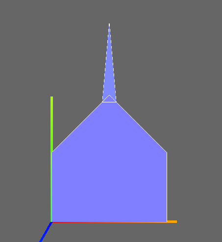
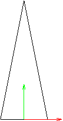
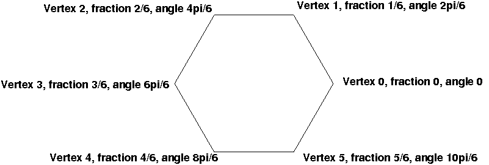

# {{ page.title }}
### {{ site.author }}

Based on [CS 307 lecture 2b](https://cs.wellesley.edu/~cs307/lectures/02.html) which is copyright &copy; Scott D. Anderson and licensed under a [Creative Commons BY-NC-SA License](http://creativecommons.org/licenses/by-nc-sa/1.0/). 

## Plan

  * Brief recap of reading ([slides](http://m.mr-pc.org/t/cisc3620/2020sp/Lecture3.pptx) and [barn demo with code](../demos/Early/barn-tw-documented.shtml)) 
  * Save and run a copy of the Barn demo 
  * Exercise: Local library files 
  * Exercise: Changing width 
  * Exercise: Two barns 
  * Exercise: A church 
  * Exercise: A hexagon (optional, to complete on your own) 

## Summary

  * We will use three APIs: 
    * WebGL, a subset of OpenGL (we won't actually _see_ much of it) 
    * Three.js, a JavaScript library built on top of WebGL 
    * TW, a home-grown set of conveniences and short-cuts created by Scott Anderson 
  * Three.js automatically adds a canvas to your page 
  * You need to create 
    * a scene object 
    * a camera object 
    * a renderer object 
    * stuff to look at, added to the scene object 
  * The stuff are _meshes_ consisting of _geometry_ and _material_
  * Geometry is comprised of _vertices_ and _faces_ (usually triangles) 
  * Triangle vertices are specified in counterclockwise order from the _front_
  * OpenGL/WebGL is a [_pipeline_](https://www.opengl.org/wiki/Rendering_Pipeline_Overview). Vertices, faces, and material go in one end, and pixels come out the other end 
    * OpenGL hangs onto some information (we'll refer to this as _state_ ) ... 
    * ... but other information slips through the pipeline, with only pixels to show for it 
    * Modern OpenGL usage emphasizes _vertex buffers_ that hold data in the graphics card, avoiding a bottleneck of constantly re-transmitting data from main memory down to the card 
    * The pipeline is _programmable_ , but we'll let Three.js do that  

## Set up our Stuff

  * Visit [the barn](../demos/Early/barn-ex.html) and save the page to your Desktop as `barn.html`. You can do this by selecting the `File>Save Page As...` menu item and specifying the file name as `barn` and Format as "Webpage, HTML Only". 
  * In a new tab, visit the local file from your browser: 
    * `File>Open File...`
    * Navigate to Desktop 
    * Choose `barn.html` 

The URL will be something like `file:///Users/youraccount/Desktop/barn.html`

## Using the Orbiting Camera Interface

The Three.js Orbiting Camera, which the TW camera creates, makes it easy to
view your model.

  * Clicking and dragging with the mouse left/right moves the camera around the model ( _orbits it_ ), keeping a constant distance from the center. You can also drag up/down but that stops at the "poles". 
  * The arrow keys can be used to shift the camera to the left, right, up, or down -- this also changes the center of the scene, so that dragging with the mouse then rotates the model around a different point. 
  * Using the scroll wheel lets you dolly in/out. 

## Keyboard Commands

TW also defines some keyboard commands:

  * A "?" prints a list of single-letter commands to the terminal window 
  * The letter "a" toggles an "axis helper" that shows you the orientation of the model (where the X, Y and Z axes are). The axes emanate from the origin. 
  * The letter "b" toggles a visualization of the scene bounding box. This is the bounding box you used to set up the camera, not the true bounding box of the scene. 
  * The lowercase axis letters view the model from that direction: "x" "y" "z" 
  * The letter "o" (for "oblique") views the model from an oblique direction.  

## Working without a Network

View the source of the file you downloaded to your Desktop. You'll notice that
it starts by loading three JavaScript files from the web, all from
[cisc3620/libs](../libs).

  * `three.min.js`, the minified version 80 of the Three.js code (the minified version is half the size of the non-minified code) 
  * `OrbitControls.js`, which is the extra code for the orbiting camera 
  * `tw.js`, which is the Fall 2016 version of our TW code. This file contains the `TW.createBarn()` function. 

What if you have a laptop, hiking in the White Mountains on a glorious fall
day, far from any internet connection, and you have a sudden inspiration to do
some graphics coding? What do you do then?

First, try sitting down to view the beauty of nature, waiting for the feeling
to pass, and reminding yourself that there is more to life than work, and that
you should stop and smell the roses.

If that doesn't work, you can hope that you had the foresight to have a a
_local_ copy of those files. If they're on your laptop, you can make the
appropriate changes to your program file, and load the local copies instead.

### Exercise: Using Local Library Files

You can "manually" download the necessary library files to your local machine
and modify the source code to use the local files, but here we'll use a
shortcut. Again save the code for the barn using the `File>Save Page As...`
menu item, but this time save it as "Webpage, Complete" and use a different
name, like `barnComplete`. You'll see both an HTML file and a folder
(`barnComplete_files`) on your Desktop. Load the new HTML file into your
browser and view the source. What changed in the code statements that load the
library files?

## Warm-up Exercise

### Exercise: Changing Width

This will be a relatively quick exercise, just to get us warmed up.

  1. Copy `barn.html` to another file, say `wide-barn.html`. 
  2. Edit the new file to change the width of the barn (`barnWidth`), say to 50. 
  3. View the changed `wide-barn.html` file in your browser. Is this what you expected? 
  4. Edit the file again. This time, mispell `barnWidth` somewhere, just to see what errors look like. In your browser, open the JavaScript console ( _option-command-j_ in Chrome). Re-load the buggy file and view the error message(s) in the JS console. 
    * Note: If you suspect that your modified file is not being loaded, try clicking _shift-reload_. 
  5. Edit the file to fix the spelling error. Change the width of the barn again, but this time, put numeric constants in place of the variable references. Use a larger value for the width of the barn in the call to `TW.createBarn()` versus the `maxx` used in the _bounding box_ supplied in the call to `TW.cameraSetup()`. 
  6. What do you notice about the wide barn in this case? 
    * You might have something like this [wide-barn.html](02b-exercises/wide-barn.html). In this sample solution, the barn is wide (50) but `maxx` for the camera is only 20, so the camera setup is off. The original code allowed us to change the width of the barn in just one place and the camera setup changed automatically. _This is a good reason to use variables instead of numeric constants!_
  7. Change the numeric constants back to the variable `barnWidth`. The bounding box for the original barn truncates some of the roof of the barn from view. Modify the value for `maxy` in the bounding box, so that the entire roof is visible. ( **Hint:** In the [ `createBarn()`](../demos/Early/barn-tw-documented.shtml) function, how is the y coordinate of the roof of the barn defined?) 
    * You might have something like this [full-barn.html](02b-exercises/full-barn.html).  

## Remodularizing the Barn Building

Suppose we re-write the function that builds the barn, separating the creation
of the list of vertices from the creation of the faces:

    
    
    // My "classic" barn, converted to THREE.js by Jos Dirksen, with my thanks.
    
    function createBarnVertices(w, h, len) {
        var barnGeometry = new THREE.Geometry();
        // add the front
        barnGeometry.vertices.push(new THREE.Vector3(0, 0, 0));
        barnGeometry.vertices.push(new THREE.Vector3(w, 0, 0));
        barnGeometry.vertices.push(new THREE.Vector3(w, h, 0));
        barnGeometry.vertices.push(new THREE.Vector3(0, h, 0));
        barnGeometry.vertices.push(new THREE.Vector3(0.5 * w, h + 0.5 * w, 0));
    
        // just add the back also manually
        barnGeometry.vertices.push(new THREE.Vector3(0, 0, -len));
        barnGeometry.vertices.push(new THREE.Vector3(w, 0, -len));
        barnGeometry.vertices.push(new THREE.Vector3(w, h, -len));
        barnGeometry.vertices.push(new THREE.Vector3(0, h, -len));
        barnGeometry.vertices.push(new THREE.Vector3(0.5 * w, h + 0.5 * w, -len));
    
        return barnGeometry;
    }
    
    function createBarnFaces(barnGeometry) {
        // now that we've got the vertices we need to define the faces.
        // front faces
        barnGeometry.faces.push(new THREE.Face3(0, 1, 2));
        barnGeometry.faces.push(new THREE.Face3(0, 2, 3));
        barnGeometry.faces.push(new THREE.Face3(3, 2, 4));
    
        // back faces
        barnGeometry.faces.push(new THREE.Face3(5, 7, 6));
        barnGeometry.faces.push(new THREE.Face3(5, 8, 7));
        barnGeometry.faces.push(new THREE.Face3(7, 8, 9));
    
        // roof faces.
        barnGeometry.faces.push(new THREE.Face3(3, 4, 8));
        barnGeometry.faces.push(new THREE.Face3(4, 9, 8));
        barnGeometry.faces.push(new THREE.Face3(2, 7, 9));
        barnGeometry.faces.push(new THREE.Face3(4, 2, 9));
    
        // side faces
        barnGeometry.faces.push(new THREE.Face3(6, 2, 1));
        barnGeometry.faces.push(new THREE.Face3(7, 2, 6));
        barnGeometry.faces.push(new THREE.Face3(0, 3, 5));
        barnGeometry.faces.push(new THREE.Face3(3, 8, 5));
    
        // floor faces
        barnGeometry.faces.push(new THREE.Face3(0, 5, 1));
        barnGeometry.faces.push(new THREE.Face3(5, 6, 1));
    
        // calculate the normals for shading
        barnGeometry.computeFaceNormals();
        barnGeometry.computeVertexNormals(true);
    
        return barnGeometry;
    }
    

This would give us the opportunity to modify the vertices before building the
faces. Something like this:

    
    
    var barnGeom = createBarnVertices(30,40,50);
    modifyVertices(barnGeom.vertices);
    createBarnFaces(barnGeom);
    ...
    var barnMesh = TW.createMesh( barnGeom );
    scene.add(barnMesh);
    

How could we modify a vertex? The `THREE.Vector3` object has many methods, but
three important properties: x, y, and z. In a JavaScript console in one of
your windows, try the following (enter the code statements one at a time):

    
    
    var p = new THREE.Vector3(1,2,3);
    p.length();
    p.x;
    p.x = 10;
    p.length();
    

What does the `length()` method appear to do?

## Translation Exercise

With a partner, examine the following JavaScript function - what does the
function do?

    
    
    function translateX(vertices,deltax) {
        var len = vertices.length;
        for( var i = 0; i < len ; i++ ) {
             vertices[i].x += deltax;
        }
    }                        
      

### Exercise: Two Barns

  1. Save [two-barns-start.html](02b-exercises/two-barns-start.html) as `two-barns.html` (with Format "Webpage, HTML Only"). This file contains the definition of the `translateX()` function, and creates a geometry and mesh for a single barn that is added to the scene (`barn1geom` and `barn1mesh`). 
  2. Modify the code to add a _second barn_ that is 
    1. _half the size_ of the first barn 
    2. _shifted to the left_ of the first barn, leaving a gap between the two barns 
  3. Adjust the bounding box so that you can see the two barns in their entirety. Your result might look something like this [two-barns-after.html](02b-exercises/two-barns-after.html) 

Moving a barn this way is a bit painful. Next week, we'll learn about the
_instance transform_ , which will make it very easy to place instances of an
object around our scene.

For now, we'll learn that in Three.js, an instance of `Mesh` (actually, an
instance of `Object3D`, which is the parent class of `Mesh`) has a property
called `position` that is a `Vector3`, which has a method `set(x,y,z)` that
can be used to set the components of the vector. Thus, we can position our
barn using the following code:

    
    
    barn2mesh.position.set(-30,0,0);
    

This also avoids having to factor the `createBarn()` function the way we did,
and having to create the `translateX` function. So, if we use this technique,
the code might look like this [two-barns-after-pos.html](02b-exercises/two-
barns-after-pos.html). Look at the code; it's _much simpler_.

## Object Origins

The code that we just saw to set the position of the barn is simpler, but it
relies on a few concepts. One is the notion of the "position" of the barn,
which is just the location of the barn's "origin" (in this case, the lower
left front corner). We'll see more about this later.

## Adding a Steeple

Now, let's discuss adding a steeple to our barn to convert it into a church.
The result will look like this:

   

The pictures above were based on the following:

  * The barn has width 50, height 30, and depth 40 
  * The steeple is right in the middle of the ridge 
  * The steeple's base is a square, 6 units on a side 
  * The steeple is 36 units high, from base to tip 

Here's now the steeple might look in "wireframe" from the front and from
above:

 

### Exercise: A Church, Part 1

  1. With a partner, figure out some reasonable coordinates for a steeple of roughly the dimensions described above, and with the coordinate frame as indicated by the colored axes in the above pictures. Your coordinates need not be exact! Next week, we'll talk about how to use linear interpolation to get the coordinates exactly right (if we want to). 
  2. Draft some code to draw the steeple.  

We'll discuss these as a class before proceeding with the coding.

Once we've collectively determined the vertices and the method, here's how we
might code the solution:

    
    
    /* Returns a geometry object for a steeple, which is just a square pyramid
     * or tetrahedron.  The origin is in the center of the base, so the base
     * vertices are at y=0 and x and z at plus or minus half the width, and
     * the top is at (0,height,0) */
    
    function createSteeple(width, height) {
        var geom = new THREE.Geometry();
        var w2 = 0.5*width;
        // add the base
        geom.vertices.push(new THREE.Vector3(+w2, 0, +w2));
        geom.vertices.push(new THREE.Vector3(+w2, 0, -w2));
        geom.vertices.push(new THREE.Vector3(-w2, 0, -w2));
        geom.vertices.push(new THREE.Vector3(-w2, 0, +w2));
        geom.vertices.push(new THREE.Vector3(0, height, 0));
    
        // now that we've got the vertices we need to define the faces.
        // base
        geom.faces.push(new THREE.Face3(0, 2, 1));
        geom.faces.push(new THREE.Face3(0, 3, 2));
    
        // side faces
        geom.faces.push(new THREE.Face3(0, 1, 4));
        geom.faces.push(new THREE.Face3(1, 2, 4));
        geom.faces.push(new THREE.Face3(2, 3, 4));
        geom.faces.push(new THREE.Face3(3, 0, 4));
    
        // calculate the normals for shading
        geom.computeFaceNormals();
    
        return geom;
    }
    
    

Then, we just add the steeple to the scene, properly positioned.

### Exercise: A Church, Part 2

Using [barn-steeple-start.html](02b-exercises/barn-steeple-start.html) as a
starting point, modify the code to do the following:

  * Create variables to store the dimensions of the steeple 
  * Invoke the `createSteeple()` function to create the geometry 
  * Make a mesh using `TW.createMesh()`
  * Add the steeple to the scene, positioning it using `position.set()`
  * Adjust the bounding box in the call to `TW.cameraSetup()` so that you can see the entire church 

Your finished code should work roughly like [barn-and-
steeple.html](02b-exercises/barn-and-steeple.html).

## A Hexagon (Optional)

Barns in Pennsylvania Dutch country often have [hex
signs](http://en.wikipedia.org/wiki/Hex_sign) on them. They aren't hexagons,
but ours will be.

How would we draw a hexagon? More generally, how would we draw an N-gon?

First, note that a hexagon is _flat_ , so let's assume that we are drawing in
the Z=k plane, so our Z coordinate is always "k" and we only have to worry
about X and Y.

Here's a strategy: Let's iterate from 0 to the number of vertices. For each
vertex:

  * Compute the fraction of a full 2π circle that corresponds to this vertex. The first (zeroth) vertex will always be at 0 degrees. The second vertex of a hexagon will be 1/6th of the way around the circle, so (1/6)*(2π), and so on. 
  * Compute the angle for the vertex. The second vertex of a hexagon will be at 2π/6 or, 360/6=60 degrees. 
  * Compute the X and Y coordinates corresponding to that angle. We'll need the radius, too, to do this. 
  * This has the coordinates centered around the origin. 
  * Create a `THREE.Vector3()` object to record those coordinates. Do this for two different values for Z, and you can create a hexagonal cylinder! 

Here's an example:

Later, we'll learn how to use _extrusions_ to turn a 2D thing like this
hexagon into a hexagonal cylinder.

### Exercise: A Hexagon

Working with a partner, draft some JavaScript to do the computations to make a
hexagon, or more-generally, a regular polygon.

    
    
    // Creates a regular polygon in a plane of constant z
    
    function createRegularPolygon(numVertices, radius, zCoordinate) {
        var geom = new THREE.Geometry();
        var i;
        for( i = 0; i < numVertices; ++i ) {
            var fraction = i / numVertices;
            var angle = 2 * Math.PI * fraction;  // in radians
            var x = radius * Math.cos(angle);
            var y = radius * Math.sin(angle);
            geom.vertices.push( new THREE.Vector3(x,y,zCoordinate) );
        }
        // compute faces ...
        return geom;
    }
    
    

## Coding Advice

  * Build and test your code _incrementally_. Save often! 
  * Save versions by saving the file to a different filename (`ex1.html`, `ex2.html`, ...) It will be easier (emotionally) to experiment with things if you know you can go back to an earlier version. 
  * Be willing to create a simple "test" program to see how something works without all the complexity of your larger program. 
  * Be modular, and document as you go. It'll be easier to understand and debug your own code. 
