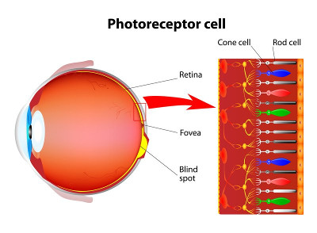
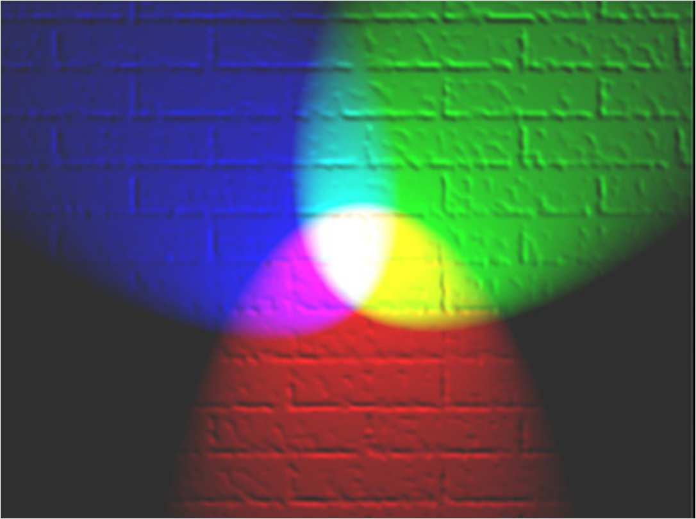
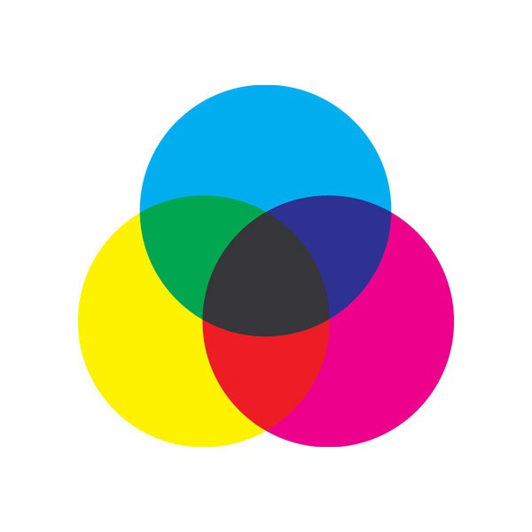

# {{ page.title }}
#### {{ site.author }}

Based on [this CS 307 reading](https://cs.wellesley.edu/~cs307/readings/03a-color.html) which is copyright &copy; Scott D. Anderson and licensed under a [Creative Commons BY-NC-SA License](http://creativecommons.org/licenses/by-nc-sa/1.0/). 


## Plan

  * Discuss color models like RGB
  * Combine a geometry with a material that is a single color using `THREE.MeshBasicMaterial`
  * Combine a geometry with a material where each face gets its own color
  * Do example of coloring the church

## Color Models

  * Several color models are common in computer graphics
  * RGB: Red, Green, Blue. This is what OpenGL uses; other color models are translated into it. 
  * CMYK: Cyan, Magenta, Yellow, Black. Subtractive color for printing and paint
  * HSV: Hue, Saturation, Value. Closer to perception
  * HSL: Hue, Saturation, Lightness. Similar to HSV, but used by Three.js

## Color Vision

| [](https://www.webrn-maculardegeneration.com/rods-and-cones.html) | [](https://en.wikipedia.org/wiki/Trichromacy#/media/File:Cones_SMJ2_E.svg) |

  * The retina is the light-sensitive sheet of cells at the back of the eye
  * It has rod-shaped cells that are sensitive to all light
  * and cone-shaped cells that come in three kinds: red-sensitive, green-sensitive, and blue-sensitive.
  * All visible colors are seen by exciting these three types of cone cells in various degrees.
  * The consequence is that almost any color can be mimicked by combining some amount of red, green, and blue light

### Color vision

  * Color monitors, TVs, screens, etc use RGB to display all their colors
  * If the amount of a primary color (Red, Green, or Blue) is measured by a number from 0 to 255 inclusive,
we can represent a color by a triple of numbers, such as (255,0,0)
    * which is pure Red, and so forth.
  * Here are some more interesting examples:
    * <FONT COLOR="#6495ED">Cornflower = 100 149 237</FONT>
    * <FONT COLOR="#FFD700">Gold = 255 215 0</FONT>
    * <FONT COLOR="#1E90FF">DodgerBlue1 = 30, 144, 255</FONT>

### Mixing paints works differently from mixing light

| Additive color (light) | Subtractive color (paint) |
|  |  |

## Demo: RGB Color Cube<a name="colorCube"></a>

The RGB color system is three-dimensional. That is, you can think of it as a
cube with three perpendicular axes: Red, Green, and Blue. 

<iframe height="512" style="width: 100%;" scrolling="no" title="Color cube" src="https://codepen.io/asterix77/embed/PoqzEqV?height=512&theme-id=default&default-tab=html,result" frameborder="no" allowtransparency="true" allowfullscreen="true">
  See the Pen <a href='https://codepen.io/asterix77/pen/PoqzEqV'>Color cube</a> by Michael Mandel
  (<a href='https://codepen.io/asterix77'>@asterix77</a>) on <a href='https://codepen.io'>CodePen</a>.
</iframe>

See the [TW.createColorCube() function](../libs/tw.js)

### Color cube

  * The red vertex is is color (1,0,0)
    * 1 on the red axis and zeros elsewhere.
  * The green vertex is color (0,1,0)
  * and the blue vertex is color (0,0,1).
  * These are the _primary_ colors.
  * Often, we **normalize** the RGB coordinates to [0-1]. You can think of it as a fraction of the maximum
intensity.
  * In the demo, red is the x-axis, green is the y-axis, and blue is the z-axis


### Color cube interior

Others of the millions of colors correspond to points in the interior of the
cube. For example, Cornflower might be represented as:

> R = 100/255 = 0.39  
>  G = 149/255 = 0.58  
>  B = 237/255 = 0.93  
>


### Color cube questions

  * What are the colors of the corners of the cube?
  * What are their coordinates?
  * How do we make navy blue? 
  * How do we make pink? 


### Some answers

  * How do we make navy blue?
    * If we were mixing paints, we might mix some black with the blue to darken it.
    * Since we're working with light, we can just turn down the blue.
    * Since blue is (0,0,1), navy might be (0,0,0.5). 
  * How do we make pink?
    * If we were mixing paints, we'd mix red and white.
    * A similar idea works with RGB color. Red = (1,0,0) and White = (1,1,1).
    * If we compute the color that is halfway between these two, we'd get (1,0.5,0.5).
    * If that's not light enough, we can add some more white and go to, say (1,0.75,0.75). This might not be quite right, but it's a good starting point. 

## Specifying RGB Colors in Three.js

Three.js has a [Color](http://threejs.org/docs/#api/math/Color) class that
allows you to enter colors in a variety of ways:

    
```javascript
// hexadecimal number, one byte per primary
var red1 = new THREE.Color( 0xff0000 );  

// color cube: 0-1 for each of 3 dimensions
var red2 = new THREE.Color( 1, 0, 0 );   

// CSS string, 0-255 for each of 3 dimensions
var red3 = new THREE.Color( "rgb(255,0,0)" );  

// CSS color name 
var red4 = new THREE.Color( "red" );     

// Three.js keyword
var red5 = new THREE.Color( THREE.ColorKeywords.red ); 

// those are all the same:
alert(red1.equals(red2) && red2.equals(red3)
      && red3.equals(red4) && red4.equals(red5));

// conversions
alert("red5 Numeric value: " + red5.getHex())
alert("red5 Hex String: " + red5.getHexString());
```

The
[THREE.ColorKeywords](https://github.com/mrdoob/three.js/blob/master/src/math/Color.js)
object is a huge table of named color values (142).

## Demo: Red Barn

We can use any of these color specifications to make a [red barn](https://codepen.io/asterix77/pen/eYNzyRv), for example.

<iframe height="511" style="width: 100%;" scrolling="no" title="Red barn" src="https://codepen.io/asterix77/embed/eYNzyRv?height=511&theme-id=default&default-tab=js,result" frameborder="no" allowtransparency="true" allowfullscreen="true">
  See the Pen <a href='https://codepen.io/asterix77/pen/eYNzyRv'>Red barn</a> by Michael Mandel
  (<a href='https://codepen.io/asterix77'>@asterix77</a>) on <a href='https://codepen.io'>CodePen</a>.
</iframe>

### `THREE.MeshBasicMaterial`

  * We know a _Geometry_ is combined with a _Material_ to yield a _Mesh_
    * that can then be added to the Scene object to be rendered.
  * The code for the [original barn](../demos/Early/barn-tw-documented.html) used the `TW.createMesh()` function to construct a Mesh
    * with differently colored materials for the faces of the barn
  * For the red barn `TW.createMesh()` is replaced with:
    
```javascript
function createBarnMesh (barnGeometry, barnColor) {
    var barnMaterial = new THREE.MeshBasicMaterial( {color: barnColor} );
    // create and return a Mesh using the barnGeometry and barnMaterial
    return new THREE.Mesh( barnGeometry, barnMaterial );
}

var barnMesh = createBarnMesh( barnGeometry, THREE.ColorKeywords.red );
```    

### `THREE.MeshBasicMaterial`

  * In the new `createBarnMesh()` function, a new `THREE.MeshBasicMaterial` is created for the particular input color.
  * Note the syntax of the input to this constructor: an object that specifies the color as a property.
  * The `Geometry` and `Material` objects for the barn are then used to create a `THREE.Mesh` object that is returned.
  * In the call to the `createBarnMesh()`, the color red is specified using `THREE.ColorKeywords`
    * but any of the following forms of the color input also work:
    
```javascript
var barnMesh = createBarnMesh( barnGeometry, new THREE.Color( 0xff0000 ) );
var barnMesh = createBarnMesh( barnGeometry, new THREE.Color( 1, 0, 0 ) );
var barnMesh = createBarnMesh( barnGeometry, new THREE.Color( "rgb(255, 0, 0)" ) );
var barnMesh = createBarnMesh( barnGeometry, new THREE.Color( "red" ) );
```    

### Shading

  * You'll notice that the red barn lacks "depth cues" because there's no shading.
  * Later, we'll learn about materials that interact with light to produce nice shading.

## Demo: Multi-Color Barn

  * In principle, each _face_ (triangle) of a Three.js Geometry object can have a different color.
  * Setting it up is a bit more complicated than what we have so far
    * because we need to specify a color for each face.
  * There are essentially two parts to the change:
    * We supply an _array (list) of colors_ for the object. 
    * Each _face_ of our geometry object has an instance variable that is an _index_ into the array of Materials, specifying which color applies to this face.


### Demo: Multi-Color Barn

<iframe height="515" style="width: 100%;" scrolling="no" title="Multi-color barn" src="https://codepen.io/asterix77/embed/oNXLpqP?height=515&theme-id=default&default-tab=js,result" frameborder="no" allowtransparency="true" allowfullscreen="true">
  See the Pen <a href='https://codepen.io/asterix77/pen/oNXLpqP'>Multi-color barn</a> by Michael Mandel
  (<a href='https://codepen.io/asterix77'>@asterix77</a>) on <a href='https://codepen.io'>CodePen</a>.
</iframe>


### `THREE.MeshFaceMaterial`

  * The _array (list) of colors_ is used to create an instance of `THREE.MeshFaceMaterial`
  * Actually, each color is used to create a `THREE.MeshBasicMaterial`
    * and the _array of Materials_ is supplied to `THREE.MeshFaceMaterial`.


### `materialIndex`

  * Each _face_ of our geometry object has an instance variable that is an _index_ into the array of Materials
  * specifying which color applies to this face.
  * This index is called the `materialIndex`, and is a property of the `THREE.Face3` object.
  * It can be specified when you create a `Face3` object, or you can set it after the fact, for example: 

```javascript
    barnGeometry.faces[0].materialIndex = 1;
```

### `createBarnMesh()`

Here is the new definition of the `createBarnMesh()` function:
    
```javascript
function createBarnMesh (barnGeometry) {
  // create four colors for the faces of the barn
  var endColor = THREE.ColorKeywords.blue;
  var sideColor = THREE.ColorKeywords.red;
  var roofColor = THREE.ColorKeywords.orange;
  var floorColor = THREE.ColorKeywords.gray;
  //
  // construct THREE.MeshFaceMaterial from array of THREE.MeshBasicMaterial 
  // instances created from the four colors
  var barnMaterials = new THREE.MeshFaceMaterial (
    [ new THREE.MeshBasicMaterial( {color: endColor} ),
      new THREE.MeshBasicMaterial( {color: sideColor} ),
      new THREE.MeshBasicMaterial( {color: roofColor} ),
      new THREE.MeshBasicMaterial( {color: floorColor} )
    ]);
  //
  // set the material index for each of the 16 triangular faces
  var endIndex = 0, sideIndex = 1, roofIndex = 2, floorIndex = 3;
  TW.setMaterialForFaces(barnGeometry, endIndex, 0, 1, 2, 3, 4, 5); // ends
  TW.setMaterialForFaces(barnGeometry, roofIndex, 6, 7, 8, 9); // roof
  TW.setMaterialForFaces(barnGeometry, sideIndex, 10, 11, 12, 13); // sides
  TW.setMaterialForFaces(barnGeometry, floorIndex, 14, 15); // floor
  //
  // create and return a Mesh using the barnGeometry and barnMaterials
  return new THREE.Mesh(barnGeometry, barnMaterials);
}
//
var barnMesh = createBarnMesh( barnGeometry );
```    

Note the square brackets around the four `THREE.MeshBasicMaterial` objects
that form the input to the `THREE.MeshFaceMaterial` constructor, placing them
in an array.


### `TW.setMaterialForFaces()`

  * The code also uses a TW function `TW.setMaterialForFaces()`
    * to set the material index of several faces at once.
  * For example, if faces 0-5 are all material `m`, our code would be a tedious repetition of assignment statements like this:
    
```javascript
barnGeometry.faces[0].materialIndex = m;
barnGeometry.faces[1].materialIndex = m;
barnGeometry.faces[2].materialIndex = m;
barnGeometry.faces[3].materialIndex = m;
barnGeometry.faces[4].materialIndex = m;
barnGeometry.faces[5].materialIndex = m;
```

  * Instead, we can say this:

```javascript
TW.setMaterialForFaces(barnGeometry, m, 0, 1, 2, 3, 4, 5);
```    

You may want to look back at the definition of [`TW.createBarn()`](../demos/Early/barn-tw-documented.html) to see how
the faces were set up


### Face colors

  * If pretty much every face has a different color (material index)
  * you might just decide to have the array of materials be the same length as the array of faces (possibly with some repetitions)
    * and match them up one-to-one
  * If you decide to do this, you can use the `TW.setMaterialForFaces11()` function, which does the following:

```javascript
function(geom) {
    // Sets all face material indexes to the corresponding material, 1:1
    var i, len = geom.faces.length;
    for( i = 0; i < len; ++i ) {
        geom.faces[i].materialIndex = i;
    }
}
```
    
    

## Coding Colors

  * One thing to consider is coding technique and how to name your variables.
  * Why not use a variable like `cornflower` above to hold an instance of `THREE.Color()` with the values for cornflower, and then use that variable
whenever you want something that color?
    * Suppose that later, you want to make the sky a bit darker.
    * Then you need to find all the places in your program where you use the `cornflower` variable
and replace it with a variable name for a different color
    * _or_ you could adjust the values in the variable. But then `cornflower` doesn't mean cornflower any more

### Coding colors

  * An alternative is to name the variable by what its _purpose_ or _use_ is. Such as:
  
```javascript
var skyColor = new THREE.Color( 0.39, 0.58, 0.93 ); // use cornflower for the sky
```    

  * Later, if you decide to change the color of the sky, you can change the definition of `skyColor`
    * and everything adjusts correctly. This is a powerful idea.
  * You can even combine these approaches, by defining some of the colors you will use
    * and then assigning them to various uses:
```javascript
var cornflower = new THREE.Color( 0.39, 0.58, 0.93 );
var skyColor = cornflower;  // use cornflower for the sky
...
```

## Smooth and Flat Shading


  * There is special software for the graphics card for computing the color of a "fragment" (such as a triangle).
    * This software is called the _shader_
  * Modern OpenGL allows you to write code for the shader
    * Fortunately, the Three.js software writes these shaders for us.
  * When shading a fragment where the vertices are different colors, the shader has two choices:
    * _flat_ shading: only one color is used, the color of one of the vertices. All the pixels get the same color. 
    * _smooth_ shading: interpolate the color between vertices.


### Smooth and Flat Shading

  * Note that only triangles are reliable for smooth shading
  * quads (four-sided facets) can be broken into triangles in different ways
    * leading to ambiguity in smooth shading
    * which is another reason why Three.js uses triangles for all its geometry
    

## Exercise: Coloring the Church<a name="colorChurch"></a>

  * Starting with this [church start](https://codepen.io/asterix77/pen/OJVXQPM?editors=1010) pen
  * Modify the code to create a
    * **white church**
    * with a **brown roof**
    * and a **yellow steeple**
  * As shown in this [church color](https://codepen.io/asterix77/pen/NWqryqd?editors=1010) pen
    * rotate the camera with your mouse to see the brown roof

### Coloring the Church, tips:

  * the starting code provides comments about the steps to complete 
  * this [simple color demo](https://codepen.io/asterix77/pen/jOPrZWw?editors=1010)
    * illustrates how to create a mesh with one color (e.g. for the church steeple)
    * and how to set up multiple materials with different colors (e.g. for the barn that is the base of the church) 
  * you can specify one color for multiple faces all at once using the `TW.setMaterialForFaces()` function.
    * The following example assigns a `materialIndex` of 2 (i.e. the material color at index 2 of the array of materials) to the faces 6, 8, and 9: 

```javascript
        TW.setMaterialForFaces(geom, 2, 6, 8, 9);
```

  * the barn has 16 faces (indices 0 to 15 in the array of faces), and the roof faces are stored at indices 6, 7, 8, and 9 

## Summary

  * Color in computer graphics is almost always done in RGB. Other systems convert to RGB. 
  * It's straightforward in Three.js to combine a geometry with a material that is a single color, namely `THREE.MeshBasicMaterial`
  * It's a bit trickier, but you can also use Three.js to combine a geometry with a material where each face gets its own color, indexing into an array (list) of colors in the `THREE.MeshFaceMaterial`. 
  * Colors can be _interpolated_ across faces, if vertices have different colors. 


<script>
window.addEventListener("load", function(event) {
  addScriptElements();
  addExecuteButtons();    // has to be done before pretty-printing
  handle_code_jsfunction(); // also before pretty-printing
  handle_codefrom();
  handle_codeurl();
  // ready for pretty-printing
  checkPreElements();
  trimPreElements();
  addPrettyPrintClass();
  addPreExamples();
  prettyPrint();
  hideFromStudent();
  // do we still want this?
  // sh_highlightDocument();
});
</script>
