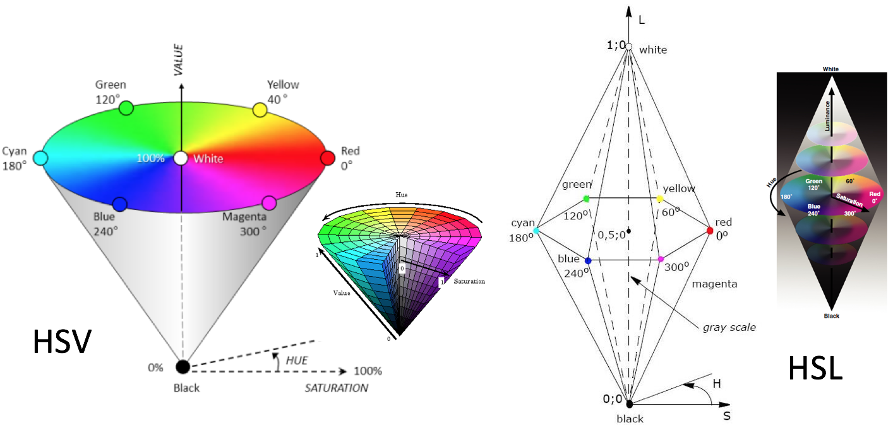

# HSL Coloring

## Plan

  * Recap and quiz questions: Setting face colors in Three.js ([slides](Lecture5.pdf)) 
  * Exercise from last time: [Coloring the church](03a-controls.html#colorChurch)
  * Recap and quiz questions: [Parametric equations and interpolation](03a-controls.html#parametric)
  * RGB model and [color cube demo](../demos/Color/colorcube.html)
  * HSL and HSV color models 
  * Parametric triangles and color interpolation 
  * Exercise: Colorful stars  

## HSL and HSV Color Models

  * HSV and HSL are common, useful color models. Hue and Saturation are the same for both models. Value and Lightness are similar. For humans, these models are more intuitive than RGB. 

  * Three.js provides support for HSL and there are many online tools for [ selecting HSL colors](http://hslpicker.com/). 

In the example below, the `setHSL()` method is used to specify hue,
saturation, and lightness values for a color. Note that each of these values
must be converted to a range from 0.0 to 1.0.

    
    var myColor = new THREE.Color();
    myColor.setHSL(0.6, 0.9, 0.8);
    alert("myColor is " + myColor.getHexString());
    

This text is displayed with `myColor` as background.

  * The CMYK model is good to know about, but won't be used in this course. 

## Parametric Triangles and Color Interpolation

The _Parametric equation of a triangle_ defines an area that is created from a
vertex and a line segment, using a parametric equation between the vertex and
a point on the line segment, where the point on the line segment is itself
defined by a parametric equation.    Two parametric lines, one of
which is an endpoint of the other, create a parametric triangle

The equation Q(s,t) can also be expressed as:

> \\[ Q(s,t) = A(1-t)s+Bts + C(1-s) \\]

We can think of this as a weighted sum of the coordinates of the three
vertices:

    
    Q = A * wa + B * wb + C * wc
    wa + wb + wc == 1
    0 ≤ wa, wb, wc, ≤ 1
    

There are three key elements for doing color interpolation over triangles in
Three.js:

  * the `vertexColors` property of the geometry is an _array_ of colors. 
  * each `THREE.Face3` object has an array of three colors, one for each vertex in the face. 
  * in the `THREE.MeshBasicMaterial` object, we set the `vertexColors` property to the magic constant `THREE.VertexColors`

Note that vertices that have different properties but happen to have the same
spatial coordinates are _different objects_.  

Let's explore these ideas with this demo:  [triangle
interpolation](../demos/Color/triangleInterpolation2.shtml).

### Exercise: Colorful Stars

This [stars-start.html](03b-exercises/stars-start.html) code file contains a
function named `starGeometry()` that creates and returns a `Three.Geometry`
object for a three-pointed star.

Let's take a minute to understand that geometry.

Modify this code to create a star that uses _color interpolation_ of the
triangular faces, and adds it to the scene. Your result might look like this:
[stars1.html](03b-exercises/stars1.html)

Some tips:

  * The starting code includes an array of `THREE.Color` objects named `colors`. Feel free to change the colors to whatever you want! 
  * When creating the material for the star using `THREE.MeshBasicMaterial`, add a second property to the input object (in addition to the `vertexColors` property) that tells Three.js to render both sides of the triangular faces: 

    `side: THREE.DoubleSide` 

**(Optional)** Add six additional stars to the scene that each have a uniform
color, and which are placed around the central star, something like this:
[stars.html](03b-exercises/stars.html).

Some tips for this part:

  * Think about how this can be done with a loop 
  * Use the same array of colors that you used for the central star 
  * Recall that `position.set()` can be used to place a mesh at a desired location 
  * Remember to adjust the bounding box supplied to `TW.cameraSetup()` to see the additional stars 

## Next Time

We'll turn to the Instance Transformation to start putting together scenes out
of bigger building blocks. However, we'll always know how to build objects out
of raw geometry if we ever find that the bigger building blocks are too
limiting.

### Source

This page is based on <https://cs.wellesley.edu/~cs307/lectures/03b.html>. Copyright &copy; Scott D. Anderson. This work is licensed under a [Creative Commons License](http://creativecommons.org/licenses/by-nc-sa/1.0/). 
