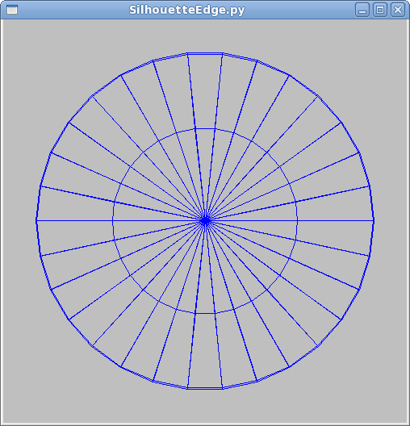
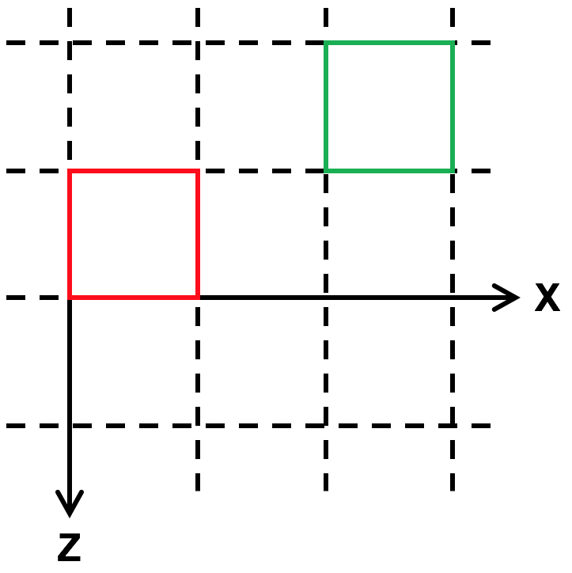
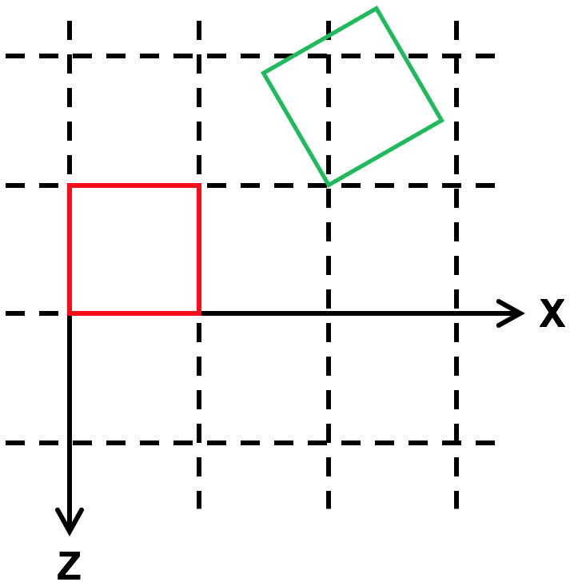
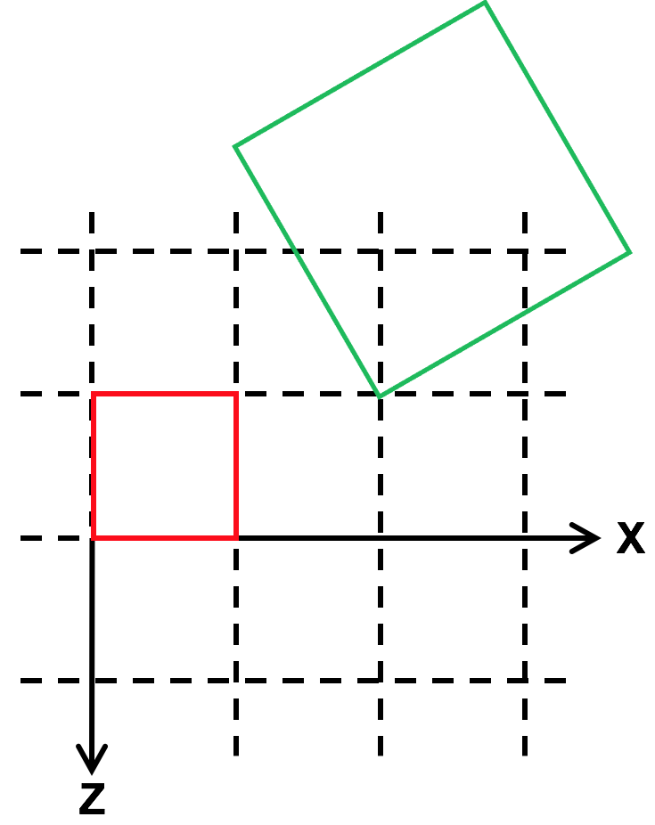

# {{ page.title }}
#### {{ site.author }}

Based on [this CS 307 reading](https://cs.wellesley.edu/~cs307/readings/04-instance-transform.html) which is copyright &copy; Scott D. Anderson and licensed under a [Creative Commons BY-NC-SA License](http://creativecommons.org/licenses/by-nc-sa/1.0/). 


## Plan

  * Three.js built-in objects are convenient, use them when possible
    * But use enough polygons to approximate smooth curves
  * Every object has a reference point: its origin
  * There are three instance transformations:
    * scaling, rotation, translation
  * These transformations change the object's coordinates relative to the global coordinates
  * There are relative versions of instance transformations as well

## The Instance Transform

  * So far, we've been building objects out of vertices and triangles.
    * Effective, but slow and painful. 
  * Today we'll learn about the instance transform, which will make it much easier to work with higher-level objects, from teapots to teddy bears.

## Built-in Three.js Objects

  * Three.js has many classes to create different kinds of Geometry objects.
  * See the geometry section of the [documentation](http://threejs.org/docs)
  * We'll be working a lot with:
    * [BoxGeometry](http://threejs.org/docs/#api/geometries/BoxGeometry)
    * [SphereGeometry](http://threejs.org/docs/#api/geometries/SphereGeometry)
    * [PlaneGeometry](http://threejs.org/docs/#api/geometries/PlaneGeometry)
    * [CylinderGeometry](http://threejs.org/docs/#api/geometries/CylinderGeometry)
    * [ConeGeometry](http://threejs.org/docs/#api/geometries/ConeGeometry) 

### Demo: Plane, Box, and Sphere

  * Here is an example of a [scene using a plane, a box, and a sphere](../demos/BasicModeling/PlaneBoxSphere.html).

```javascript
var scene = new THREE.Scene();

var box = TW.createMesh( new THREE.BoxGeometry(4,6,1) );
scene.add(box);

var plane = TW.createMesh( new THREE.PlaneGeometry(6,4) );
scene.add(plane);

var sphere = TW.createMesh( new THREE.SphereGeometry(1) );
scene.add(sphere);

var renderer = new THREE.WebGLRenderer();
TW.mainInit(renderer,scene,{parentID: 'scenePlaneBoxSphereDiv'});
TW.cameraSetup(renderer,
               scene,
               {minx: -3, maxx: 3,
                miny: -3, maxy: 3,
                minz: -3, maxz: 3});
```

### Demo: Plane, Box, and Sphere

  * The arguments to `THREE.BoxGeometry()` are width, height and depth.
  * The arguments to `THREE.PlaneGeometry()` are the width and height
  * The argument to `THREE.SphereGeometry()` is the radius
  * Where is the origin and how are the axes arranged?

## Demo: Polygonal Approximation

  * Spheres have two more arguments (and then some) called `widthSegments` and
`heightSegments`
  * We need them because these curved surfaces are rendered with **polygonal approximations**.
  * Consider a circle. How would you approximate a circle with a 360-sided polygon? 36-sided? 4-sided?

### Demo: Polygonal Approximation

You can play with the two arguments to the sphere constructor using the [polygonal sphere](../demos/BasicModeling/polygonalSphere.html) demo.

```javascript
var scene = new THREE.Scene();

var sphere;

var parameters = {
    widthSegments: 8,
    heightSegments: 3
};

function addSphere() {
    w = parameters.widthSegments;
    h = parameters.heightSegments;
    sphere = TW.createMesh( new THREE.SphereGeometry(2,w,h) );
    scene.add(sphere);
}
addSphere();

var renderer = new THREE.WebGLRenderer();

TW.mainInit(renderer,scene,{parentID: 'polygonalSphere'});
TW.cameraSetup(renderer,
               scene,
               {minx: -2, maxx: 2,
                miny: -2, maxy: 2,
                minz: -2, maxz: 2});

var render = TW.lastClickTarget.TW_state.render; // save the render function.

function redraw() {
    scene.remove(sphere);
    addSphere();
    render();
}

var gui = new dat.GUI({autoPlace: false});
gui.add(parameters,'widthSegments',0,30).step(1).onChange(redraw);
gui.add(parameters,'heightSegments',0,30).step(1).onChange(redraw);
```

### Demo: Polygonal Approximation

  * The demo starts with 8 `widthSegments`, i.e., segments around the poles, like _longitude_
  * It has 3 `heightSegments`, like _latitude_
  * Polygonal approximations work pretty well, especially for interiors
    * less well for silhouettes

|  |  |


## Bounding Boxes, Reference Points: Scene

We learned this earlier, but just to re-cap:

  * The `TW.cameraSetup()` function tells TW the information it needs to set up a camera.
  * Its third argument is an object with six properties:
    * the minimum and maximum x, y and z coordinates, for the _entire scene_:
    
```javascript    
var scene_bounding_box = { minx: -50, maxx: +100,
                           miny: 0, maxy: 50,
                           minz: -25, maxz: 100 };

TW.cameraSetup(renderer, scene, scene_bounding_box);
```
  * TW sets up the camera so the whole bounding box is visible
  * Press the "b" key to show the bounding box in our demos

### Reference Points: Objects

  * Where is each of these objects, exactly?
  * An object occupies a collection of points
    * but we want to have a **single point** as the location of the object.
  * We will call that the **reference point** of the object
    * or the object's **origin**.
  * For example, the origin for the barn is its lower left front corner
    * For the `THREE.BoxGeometry` object, the handle is the center of the box

### Bounding Boxes: Objects

  * How big is each object, exactly?
    * if you want to stack two on top of each other, or place them next to each other
  * We can use bounding boxes for objects too (not just scenes)
  * Defined the same as the scene bounding box, but used for different _purposes_


### Bounding Boxes: Objects

Let's look again at our example of how to use a Three.js box:

```javascript
    var scene = new THREE.Scene();
    var box = TW.createMesh( new THREE.BoxGeometry(6,4,2) );
    scene.add(box);
    var renderer = new THREE.WebGLRenderer();
    TW.mainInit(renderer,scene,{parentID: 'sceneOneBoxDiv'});
    TW.cameraSetup(renderer,
                   scene,
                   {minx: -3, maxx: 3,
                    miny: -2, maxy: 2,
                    minz: -1, maxz: 1});
    TW.toggleAxes("show");
    TW.viewFromAboveFrontSide();
```

Where is the cube? What is its bounding box? Use the "a" and "b" keys to figure it out


## Placing Instances: Barn instance transforms

[barn instance transform](../demos/BasicModeling/barn-instance-transform-dat.html)


### Barn instance transforms

The barn instance has three kinds of state:

  * _Position_ : `THREE.Vector3` object with x, y, and z components
    * Place the _origin_ of the barn at that location in the scene. 
  * _Rotation_ : `THREE.Euler` object
    * first rotates the object by some angle about _its_ X axis,
    * then by some angle about _its_ Y axis,
    * then by some angle about _its_ Z axis.
    * (You can also change the order of the rotations if you wish; I've rarely found that necessary.) 
  * _Scale_ : `THREE.Vector3` object that indicates the scaling of the barn along its X, Y, and Z axes. 

### Order of operations

  * Let's think about the _order_ of these operations
  * Does the scaling happen in the object's local coordinates or the global scene coordinates?
    * The rotation?
    * The positioning?
  * How can we figure this out?
    * What would be different if we scaled and then positioned vs positioned and then scaled?
    * What would be different for scaling and rotation?
    * What would be different for rotation and positioning?
  * What order do we want them to happen in?

## Demo: Positioning/Translation

  * Positioning an instance as drawing it in a coordinate system where the _origin_ has moved
    * relative to the scene origin.
  * None of the vertices needs to be changed, they are just _transformed_.
  * We'll look more at the mathematics of this in a future lecture



### Demo: Positioning/Translation

  * In this demo we have two barns and position one of them
  * We view the scene from above (along the y-axis)

```javascript
var scene = new THREE.Scene();
var redbarn = TW.createBarnSolidColor(1,1,1,"red");
var greenbarn = TW.createBarnSolidColor(1,1,1,"green");
greenbarn.position.set(2,0,-1);
scene.add(redbarn);
scene.add(greenbarn);
var renderer = new THREE.WebGLRenderer();
TW.mainInit(renderer,scene,{parentID: 'sceneTwoBarnsDiv'});
TW.cameraSetup(renderer,
               scene,
               {minx: 0, maxx: 2,
                miny: 0, maxy: 1,
                minz: -1, maxz: 1});
TW.toggleAxes("show");
```

### Demo: Positioning/Translation

  * The red barn is drawn at the origin;
    * its origin coincides with the scene origin
  * The green barn is drawn such that its origin (its front left corner) is at the specified position.

## Demo: Rotation

  * Rotation works similarly to positioning
    * except that you set the three angles that you want to rotate the object by.
  * In this demo, the green barn is drawn in a coordinate system that is
rotated by 30 degrees around the Y axis of the barn
  * The result, in wireframe from above, looks like




### Demo: Rotation

Here is a demo

```javascript
var scene = new THREE.Scene();
var redbarn = TW.createBarnSolidColor(1,1,1,"red");
var greenbarn = TW.createBarnSolidColor(1,1,1,"green");
greenbarn.position.set(2,0,-1);
greenbarn.rotation.set(0,Math.PI/6,0);   // pi/6 = 30 degrees rotation
scene.add(redbarn);
scene.add(greenbarn);
var renderer = new THREE.WebGLRenderer();
TW.mainInit(renderer,scene,{parentID: 'sceneTwoBarnsRotatedDiv'});
TW.cameraSetup(renderer,
               scene,
               {minx: 0, maxx: 2,
                miny: 0, maxy: 1,
                minz: -1, maxz: 1});
TW.toggleAxes("show");
```

### Rotation details

  * Note that the rotations are in _radians_.
  * So, if you want to rotate something by a quarter turn around the x axis, use one of the following:
    * `obj.rotation.x = Math.PI/2`
    * `obj.rotation.x = THREE.Math.degToRad(90)`
    * `obj.rotation.x = TW.degrees2radians(90)` 
  * Also, the direction of rotations is crucial, use the right hand rule again
    * If your right thumb points along the axis of rotation
    * Positive angles go in the direction of your fingers
    * Which way is a positive angle for rotation about the (positive) z-axis? x-axis?
    

## Demo: Scaling

  * Finally, we can scale the geometry system
  * Typically, this is just a positive multiple
    * but by multiplying by a negative value, you can flip an object around
  * Here, we translate, rotate, and then double the size of the green barn:




### Demo: Scaling

```javascript
var scene = new THREE.Scene();
var redbarn = TW.createBarnSolidColor(1,1,1,"red");
var greenbarn = TW.createBarnSolidColor(1,1,1,"green");
greenbarn.position.set(2,0,-1);
greenbarn.rotation.set(0,Math.PI/6,0);   // pi/6 = 30 degrees rotation
greenbarn.scale.set(2,2,2);
scene.add(redbarn);
scene.add(greenbarn);
var renderer = new THREE.WebGLRenderer();
TW.mainInit(renderer,scene,{parentID: 'sceneTwoBarnsRotatedScaledDiv'});
TW.cameraSetup(renderer,
               scene,
               {minx: 0, maxx: 2,
                miny: 0, maxy: 1,
                minz: -1, maxz: 1});
TW.toggleAxes("show");
```
    

## Demo: Blocks

```javascript
var scene = new THREE.Scene();

var box1 = TW.wireCube("white");
scene.add(box1);

var box2 = TW.wireCube("red");
box2.position.set(2,3,4);
scene.add(box2);

var box3 = TW.wireCube("purple");
box3.position.set(4,0,5);
box3.scale.set(2,2,2);
scene.add(box3);

// compensating in the translation
var box4 = TW.wireCube("blue");
box4.position.set(8,1,1);
box4.scale.set(2,2,2);
scene.add(box4);

// stacking some rotated blocks
var box5 = TW.wireCube("yellow");
box5.position.set(1,1,8);
box5.scale.set(2,2,2);
scene.add(box5);

var box6 = TW.wireCube("orange");
box6.position.set(1,3,8); // 2 units higher than box5
box6.rotation.set(0, TW.degrees2radians(30), 0);  // degrees around Y
box6.scale.set(2,2,2);
scene.add(box6);

var box7 = TW.wireCube("brown");
box7.position.set(1,5,8); // 2 more units higher
box7.rotation.set(0, TW.degrees2radians(60), 0);
box7.scale.set(2,2,2);
scene.add(box7);

// non-uniform scaling
var box8 = TW.wireCube("cyan");
box8.position.set(8,0,8);
box8.rotation.set(0, TW.degrees2radians(45), 0);
box8.scale.set(1,5,1);
scene.add(box8);

var renderer = new THREE.WebGLRenderer();
TW.mainInit(renderer,scene,{parentID: 'sceneManyBlocksDiv'});
TW.cameraSetup(renderer,
               scene,
               {minx: 0, maxx: 10,
                miny: 0, maxy: 5,
                minz: 0, maxz: 10});
TW.toggleGroundPlane("show");
```    
    

## Absolute versus Relative

  * The three properties we've been looking at so far are "absolute"
    * We specify the value we want, regardless of the current value
  * Suppose we wanted to "modify" the current value.
    * For example, to move a block over by a bit, we could do the following:
```javascript
      box.position.x += 2;
```
  * The `position` property is a `THREE.Vector3`, which has properties x, y, and z
    * that we can look at and modify
  * There are convenience methods to do this for us:
```javascript
      box.translateX(2);
```


### Relative translation

  * There is an even more general method: 
```javascript
    var dir = new THREE.Vector3(3,4,5);
    dir.normalize();
    box.translateOnAxis(dir,dist);
```
  * This moves the box by some distance in the specified direction.
    * This can be very useful when animating a scene.

### Rotation about an arbitrary axis

  * Similarly, you can change the rotation of an object:
```javascript
    var axis = new THREE.Vector3(3,4,5);
    axis.normalize();
    box.rotateOnAxis(axis,radians);
```
  * This rotates the object around the given axis by some number of radians.
  * Again, this can be very useful for animations
    * where you want to rotate the box by some amount every frame
    * say because it's tumbling as it falls.


## Coordinate Systems

  * Remember: the initial coordinate system has the z-axis coming out of the screen
    * You can modify this by setting the position, rotation, and scaling of the `Scene` object.
  * When you translate, rotate, or scale an object
    * You change the coordinate system for all subsequent operations within that object
    * E.g., the vertex (2,3,4) means something different as a result.
  * We haven't looked at _nested_ objects yet, but will soon. Keep this in mind.

### Coordinate Systems

  * _However,_ translation, rotation and scale are **affine** transformations
  * Which means that lines stay lines and planes stay planes.
  * Therefore, to transform a line, you transform the endpoints and draw the line between the transformed endpoints.
  * Which means that you can define your object in a coordinate system that is _convenient,_ then use
affine transformations to place it in the scene.
  * In simple cases, we can usually place the object we want by setting the
`position`, `rotation` and `scale`.

## Summary

  * Three.js built-in objects are convenient, use them when possible
    * But use enough polygons to approximate smooth curves
  * Every object has a reference point: its origin
  * There are three instance transformations:
    * scaling, rotation, translation
  * These transformations change the object's coordinates relative to the global coordinates
  * There are relative versions of instance transformations as well


<script>
addScriptElements();
addExecuteButtons();    // has to be done before pretty-printing
handle_code_jsfunction(); // also before pretty-printing
handle_codefrom();
handle_codeurl();
// ready for pretty-printing
checkPreElements();
trimPreElements();
addPrettyPrintClass();
addPreExamples();
prettyPrint();
hideFromStudent();
// do we still want this?
// sh_highlightDocument();
</script>
