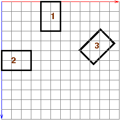
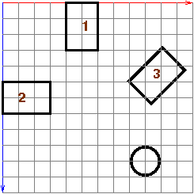
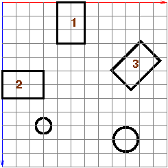

# Building a Town

## Plan

  * Parametric triangles and [color interpolation in Three.js](03b-color.html#interp) ([slides](Lecture5.pdf)) 
  * Exercise: [Colorful stars](03b-color.html#stars)
  * Example: Intersecting 3D line segments with parametric equations 
  * Recap & quiz questions on the Instance Transform ([barn transform demo](../demos/BasicModeling/barn-instance-transform-dat.html)) 
    * Built-in Three.js geometries ([slide](Lecture6.pdf))
  * Exercises: Building a town with houses, trees, and maybe a snowman 
  * (optional, build on next time) Exercise: Luxo lamp 

## Recap of the Instance Transform

  * Built-in objects (e.g. boxes, spheres, cylinders) are very useful
  * They use polygonal approximations to smooth shapes (e.g. spheres)
  * There's only one material (without going to great lengths), hence one color, until we learn about material and lighting 
  * Place objects with 
    * position (translation) along major axes: 
      * `_obj_.position.set(a,b,c)`
      * `_obj_.position.x = d`
    * rotation around major axes: 
      * `_obj_.rotation.set(alpha,beta,gamma)`
      * `_obj_.rotation.y = theta`
    * scale along major axes: 
      * `_obj_.scale.set(i,j,k)`
      * `_obj_.scale.z = m`
  * These settings are applied to the object _and all its descendants_ (more on this next time), which is a very powerful idea 

Let's explore these ideas with the [barn instance transform
demo](../demos/BasicModeling/barn-instance-transform-dat.html)

## Building a Town

Build a "town" consisting of just three houses. Here's the layout of the town:

> 

Here's an initial [town0.html](04a-exercises/town0.html) to get you started

  1. Figure out your scene's bounding box 
  2. Place the first house. Remember the following functions used in the [barn example](../demos/Early/barn-ex.html): 
    * `TW.createBarn(w,h,d)`
    * `TW.createMesh(geom)`
  3. Place two more houses 

Your finished town might look like [town1.html](04a-exercises/town1.html)

### Town with tree

Add a tree to the scene. A tree can just be a green cone coming up from the
ground.

> 

You can use the
[`THREE.ConeGeometry`](https://threejs.org/docs/#api/geometries/ConeGeometry)
to create a cone. The trick with this is to get the dimensions and positioning
right.

Also recall that [`THREE.Mesh`](https://threejs.org/docs/#api/objects/Mesh)
and
[`THREE.MeshBasicMaterial`](https://threejs.org/docs/#api/materials/MeshBasicMaterial)
can be used to set up the color of the tree.

Your finished town might look like [town2.html](04a-exercises/town2.html)

### Town with tree and snowman

Add a snowman to the scene. A snowman is just a stack of three spheres.

> 

The trick with this is to get the distances right.

  * What radii do you want to use for the snowman? 
  * What, then, are the locations of the spheres? 

Your finished town might look like [town3.html](04a-exercises/town3.html)

### Building Our Own Luxo Lamp

Starting with [luxo-start.html](04a-exercises/luxo-start.html), add code to
create a basic Luxo lamp using the built-in Three.js geometries and the
instance transform. The starting code creates an array of
`THREE.MeshBasicMaterial` objects to use for the colors of the lamp.

Your result might look something like this
[luxo.html](04a-exercises/luxo.html). Rotate the camera to see the light bulb
inside the lamp.

A couple tips:

  * Check the Three.js documentation for the [THREE.ConeGeometry](http://threejs.org/docs/#api/geometries/ConeGeometry) class to see how you can render the cone for the lamp so that its base is "open" 
  * Choose a convenient "origin" for the object in the scene coordinate frame. It's ok to estimate the size and position of subparts of the lamp, and use numbers in your code (it may take some trial-and-error to get things right!) 

## Next Time

Note how difficult the position-setting was for the components of the snowman
and Luxo lamp. Next time, we'll learn how to build _composite_ objects  --
objects with constituent parts such as this -- which will facilitate the
positioning of the object parts and placement of a composite object anywhere
in the scene.

### Source

This page is based on <https://cs.wellesley.edu/~cs307/lectures/04.html>. Copyright &copy; Scott D. Anderson. This work is licensed under a [Creative Commons License](http://creativecommons.org/licenses/by-nc-sa/1.0/). 
