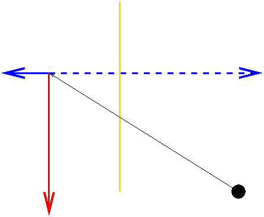

# {{ page.title }}
#### {{ site.author }}

Based on [this CS 307 reading](https://cs.wellesley.edu/~cs307/readings/06-camera.html) and [this CS 307 lecture](https://cs.wellesley.edu/~cs307/lectures/06.html) which are copyright &copy; Scott D. Anderson and licensed under a [Creative Commons BY-NC-SA License](http://creativecommons.org/licenses/by-nc-sa/1.0/). 

<p style="display:none">
\(
\newcommand{\vecIII}[3]{\left[\begin{array}{c} #1\\#2\\#3 \end{array}\right]}
\newcommand{\vecIV}[4]{\left[\begin{array}{c} #1\\#2\\#3\\#4 \end{array}\right]}
\newcommand{\Choose}[2]{ { { #1 }\choose{ #2 } } }
\newcommand{\vecII}[2]{\left[\begin{array}{c} #1\\#2 \end{array}\right]}
\newcommand{\vecIII}[3]{\left[\begin{array}{c} #1\\#2\\#3 \end{array}\right]}
\newcommand{\vecIV}[4]{\left[\begin{array}{c} #1\\#2\\#3\\#4 \end{array}\right]}
\newcommand{\matIIxII}[4]{\left[
    \begin{array}{cc}
      #1 & #2 \\ #3 & #4 
    \end{array}\right]}
\newcommand{\matIIIxIII}[9]{\left[
    \begin{array}{ccc}
      #1 & #2 & #3 \\ #4 & #5 & #6 \\ #7 & #8 & #9
    \end{array}\right]}
\)        
</p>


## Plan

There are two aspects to the camera API: the placement of the camera, and the
_shape_ of the camera. To understand the latter, we need to understand how
cameras work.

## The pinhole camera



### The camera obscura



### The pinhole camera model

  * Pinhole camera: box with tiny hole in front
  * Origin at the pinhole ("focal point")
  * Axes and dimensions as shown



### Similar triangles

  * Rays of light from outside go through the hole and land on the back
    * Creating a sharp (but not very bright) image
  * E.g., the ray from the top of the tree lands as shown
  * Only a single ray can land at each spot on the back



### Points to notice:

  * The **projection** of an image (such as the tree) can be computed using similar triangles
  * Images are upside-down
  * How does moving an object farther affect its image?
  * What happens to parallel lines?

## Computing Projection by Similar Triangles

  * Suppose we want to compute the projection of the top of the tree. 
  * Let the coordinates of the top of the tree be \\((X,Y,Z)\\). 
  * We want to know the coordinates of the projection, \\((x,y,z)\\). 
  * We can do this by similar triangles, using the two yellow triangles:




### Computing projection by similar triangles

  * The height and base of the big triangle are \\(Y\\) and \\(Z\\). 
  * The height and base of the little triangle are \\(y\\) and \\(z\\). 
  * The base of the little triangle is **known**, it is \\(d\\)
    * it's determined by the shape and size of our pinhole camera. 
  * By similar triangles, we know: \\[ y/d = Y/Z \\\ y = d \cdot Y/Z \\\ y = Y/(Z/d) \\]



### Computing projection

\\[ y = Y/(Z/d) \\]

  * Everything on the right hand side is known
  * So we can compute the projection of any point 
    * from the depth of our pinhole camera 
    * and the location of the point
  * The weird-looking notation of dividing by \\(Z/d\\) 
    * is because of the way we will use this in our projection matrix.
  * Projecting the \\(X\\) coordinate works the same way.

## The Synthetic Camera

  * There are some hassles with signs in the pinhole camera
    * Should the \\(z\\) value for the tree be negative?
  * Also, the image ends up being upside down. 
  * In CG, since we're really only interested in the mathematics of projection, we use a **synthetic** camera, 
    * in which the image plane is placed on the same side of the origin as the scene.



### The synthetic camera

  * In CG, we can put the image plane _in front_ of the focal point. This means the image is right side up. 
  * Mathematically, we'll make the origin be the focal point, with the camera pointing down the negative z axis.



### The view frustum

  * The image plane is the top of a **frustum** (a truncated pyramid).
  * The frustum is also our **view volume**. Anything outside the view volume is "clipped" away and not visible in the rendered image. 
  * Note that this also means that the CG system can't see infinitely far. That's because it needs to calculate relative depth, and it can't make infinitely fine distinctions. 



### Demo: Synthetic camera view volume: Frustum

<iframe height="600" style="width: 100%;" scrolling="no" title="Frustum demo" src="https://codepen.io/asterix77/embed/xxGpBzw?height=600&theme-id=default&default-tab=js,result" frameborder="no" allowtransparency="true" allowfullscreen="true">
  See the Pen <a href='https://codepen.io/asterix77/pen/xxGpBzw'>Frustum demo</a> by Michael Mandel
  (<a href='https://codepen.io/asterix77'>@asterix77</a>) on <a href='https://codepen.io'>CodePen</a>.
</iframe>


### Demo: Camera with helper

<iframe height="599" style="width: 100%;" scrolling="no" title="Camera helper demo" src="https://codepen.io/asterix77/embed/dyoJrxR?height=599&theme-id=default&default-tab=js,result" frameborder="no" allowtransparency="true" allowfullscreen="true">
  See the Pen <a href='https://codepen.io/asterix77/pen/dyoJrxR'>Camera helper demo</a> by Michael Mandel
  (<a href='https://codepen.io/asterix77'>@asterix77</a>) on <a href='https://codepen.io'>CodePen</a>.
</iframe>

## Perspective Matrices and Perspective Division

  * We want to perform projection using matrix multiplication
    * For the same reason that we want to perform all of our affine transformations using matrix multiplication
  * There are two kinds of projection available in OpenGL and Three.js: orthographic and perspective



### Orthographic vs perspective projection






### Orthographic (parallel) projection

  * For orthographic projection, the view volume is a rectangular box
  * We project by squeezing out one dimension.
  * Useful for architectural drawings and situations where there really isn't any perspective.
  * If we align the direction of projection (DOP) with the Z axis, this kind of projection amounts to setting the Z coordinate of all points to zero.

### Orthographic projection math

  * If we again let the scene coordinates be \\((X,Y,Z)\\) and projected coordinates be \\((x,y,z)\\)
  * Orthographic projection can be expressed as multiplication by a projection matrix: \\[ \vecIV{x}{y}{z}{1} = \left[ \begin{array}{rrrr} 1  & 0 & 0 & 0 \\\ 0 & 1 & 0 & 0 \\\ 0 & 0 & 0 & 0 \\\ 0 & 0 & 0 & 1 \end{array} \right] \vecIV{X}{Y}{Z}{1} \\] 

  * In this case, \\(x=X\\), \\(y=Y\\), and the \\(z\\) coordinate is \\(0\\) for all points.

### Perspective projection

  * Vision and (normal) photography obey perspective projection
  * If the origin is the center of projection (COP) and the image plane is parallel to the \\(Z=0\\) plane (the XY plane)
  * We can compute the projection of each point using the similar triangles calculation, dividing each \\(Y\\) and \\(X\\) coordinate by \\(Z/d\\). 
  * The matrix for perspective projection isn't obvious.
    * It involves using homogeneous coordinates and leaving part of the calculation undone.

### Perspective projection

  * The calculation left undone is called **perspective division**.
  * The idea is to define the homogeneous coordinate \\((x, y, z, w)\\) as equivalent to \\((x/w, y/w, z/w, 1)\\)
    * Then we can divide by \\(w\\) to get the "canonical" version
  * If \\(w=1\\), this doesn't change our ordinary vertices.
  * If, however, \\(w\\) has the value \\(Z/d\\), this perspective division accomplishes what we did earlier in our similar triangles: \\[ y = Y/(Z/d) \\]

### Perspective matrix

  * Therefore the perspective matrix is a matrix that accomplishes setting \\(w=Z/d\\) and leaves the other coordinates unchanged.

### Perspective matrix

  * Therefore the perspective matrix is a matrix that accomplishes setting \\(w=Z/d\\) and leaves the other coordinates unchanged.
  * Since the last row of the matrix computes \\(w\\)
    * all we need to do is put \\(1/d\\) in the Z column of the last row.
  * The perspective projection matrix, then, is just the following matrix: \\[
\left[ \begin{array}{rrrr} 1 & 0 & 0 & 0 \\\ 0 & 1 & 0 & 0 \\\ 0 & 0 & 1 & 0
\\\ 0 & 0 & 1/d & 0 \end{array} \right] \\]

### Perspective matrix application

  * Let's consider how this matrix transforms an arbitrary point, \\((X,Y,Z)\\): \\[
\vecIV{x}{y}{z}{w} = \left[ \begin{array}{rrrr} 1 & 0 & 0 & 0 \\\ 0 & 1 & 0 &
0 \\\ 0 & 0 & 1 & 0 \\\ 0 & 0 & 1/d & 0 \end{array} \right] \vecIV{X}{Y}{Z}{1}
\\]

  * In this case, \\(x=X\\), \\(y=Y\\), \\(z=Z\\), and \\(w=Z/d\\).

### Perspective matrix application

  * To transform the result into a vector with \\( w=1 \\)
    * we do the perspective division step
    * i.e., we divide all the components by \\( Z/d \\), yielding: \\[
\vecIV{x/(Z/d)}{y/(Z/d)}{z/(Z/d)}{1} = \frac{1}{Z/d} \vecIV{x}{y}{z}{Z/d} \\]

  * This is exactly the point we want, namely the projection of the original point onto an image plane at a distance of \\( d \\).


## Perspective Cameras in Three.js

  * In Three.js, we set up a perspective camera like this:
    
```javascript
      var camera = new THREE.PerspectiveCamera(fov, aspect_ratio, near, far);
```

  * We'll think of this API as setting up the camera _shape_ (the geometry of the frustum).



### Perspective cameras in three.js

  * The perspective and orthographic projections work when the axis is aligned with the Z axis.
    * This is the same as the initial coordinate system in WebGL.
    * But what if we don't want our scene/camera set up this way?
  * The earlier demos showed how we can _locate_ and _point_ the camera.
  * The frustum demo, for example, included the following `setupCamera()` function:
    
```javascript
    function setupCamera() {
        var cp = cameraParams;      // just a shorthand for this function
        frustumCamera = new THREE.PerspectiveCamera(cp.fov,
                                                    cp.aspectRatio,
                                                    cp.near,
                                                    cp.far);
        // set location
        frustumCamera.position.set(cp.eyeX, cp.eyeY, cp.eyeZ);
        // Cameras inherit an "up" vector from Object3D.
        frustumCamera.up.set(cp.upX, cp.upY, cp.upZ);
        // The lookAt method computes the camera direction and orientation
        // from its position and up parameters, and the input arguments
        // specifying the location of the 'at' point
        frustumCamera.lookAt(cp.atX, cp.atY, cp.atZ);
    }
```

### Perspective cameras in three.js

This function sets up three additional components of the camera projection geometry:

  * The "eye" point is the location of the focal point (also known as the "center of projection" or COP)
  * The "at" point is the location of some point in the direction we want the camera to face.
    * This point projects to the center of the picture. 
  * The "up" vector indicates which direction, projected onto the image plane, is the same as the vertical direction on the monitor.
    * Note that it is a **vector,** not a point.
    * It captures, for example, landscape versus portrait.

### Three.js camera summary:

  * the camera is positioned at a point called _eye_, `(eyeX,eyeY,eyeZ)`,
  * facing a point called _at_, `(atX,atY,atZ)`,
  * and oriented in a direction defined by the _up_ vector, `(upX,upY,upZ)`

### Let's look at the camera helper demo again

<iframe height="599" style="width: 100%;" scrolling="no" title="Camera helper demo" src="https://codepen.io/asterix77/embed/dyoJrxR?height=599&theme-id=default&default-tab=js,result" frameborder="no" allowtransparency="true" allowfullscreen="true">
  See the Pen <a href='https://codepen.io/asterix77/pen/dyoJrxR'>Camera helper demo</a> by Michael Mandel
  (<a href='https://codepen.io/asterix77'>@asterix77</a>) on <a href='https://codepen.io'>CodePen</a>.
</iframe>


### A camera is also an Object3D

  * So you can set its position using `position.set()`
    * or with other means of positioning objects
  * And it can be rotated as well.
  * All instances of `Object3D()` also have an `up` attribute like cameras
  * They also have a method `lookAt()`
    * Which points an object to face a particular point
    * You should use this method _last_ , after setting the location and up vector for the camera.

### Camera motion terminology

  * pan: rotating a fixed camera around a vertical axis 
  * tilt: rotating a fixed camera around a horizontal axis 
  * zoom: adjusting the lens to zoom in or out (this adjusts the frustum)




## Rendering

  * We will always need a `THREE.Renderer` object.
  * This object has a method, called `render()`, that takes a scene and a camera and renders the scene using
the camera.
  * Any time you adjust your scene or your camera, you'll want to reinvoke this function.
  * If you have globals holding your camera and your scene, you might just define a simpler wrapper function to do the rendering:
    
```javascript
    function render() {
            renderer.render( scene, camera );
    }
```

### TW makes this a little easier

Here's how this happens without TW

You can see the whole code in action in this demo of a Simple Camera Without TW:

<iframe height="599" style="width: 100%;" scrolling="no" title="Simple camera not using TW" src="https://codepen.io/asterix77/embed/WNvdWGB?height=599&theme-id=default&default-tab=js,result" frameborder="no" allowtransparency="true" allowfullscreen="true">
  See the Pen <a href='https://codepen.io/asterix77/pen/WNvdWGB'>Simple camera not using TW</a> by Michael Mandel
  (<a href='https://codepen.io/asterix77'>@asterix77</a>) on <a href='https://codepen.io'>CodePen</a>.
</iframe>

### TW makes this a little easier

Here's how this happens with TW

<iframe height="598" style="width: 100%;" scrolling="no" title="Simple camera using TW" src="https://codepen.io/asterix77/embed/xxGpeVg?height=598&theme-id=default&default-tab=js,result" frameborder="no" allowtransparency="true" allowfullscreen="true">
  See the Pen <a href='https://codepen.io/asterix77/pen/xxGpeVg'>Simple camera using TW</a> by Michael Mandel
  (<a href='https://codepen.io/asterix77'>@asterix77</a>) on <a href='https://codepen.io'>CodePen</a>.
</iframe>


## Exercise: Perspective Projection

  * Assume a synthetic camera with the image plane (near plane) at a distance d from the center of projection (COP).
  * Suppose the scene contains a tree of height H at a distance D from the COP.
  * What is the height of the projected tree?

### Solution

> H*(d/D)

### Vanishing points

  * Perspective: projections shrink with distance.
  * This also gives us vanishing points



### Exercise: Vanishing point

  * With the standard camera (COP at the origin, looking down the -Z axis)
  * and the image plane at Z=-3
  * find the projection of (7,8,-9).



### Solution

For X: \\[
X/x = Z/z  \\\
7/x = -9/-3  \\\
x = 7/(-9/-3)   \\\
x = 7/3
\\]

For Y: \\[
Y/y = Z/z  \\\
8/y = -9/-3  \\\
y = 8/(-9/-3)  \\\
y = 8/3
\\]

### Solution (continued)

For the entire point, P: projection of P \\[
= (7/3, 8/3, -3)  \\\
= (1/3) \cdot P
\\]

  * and 1/3 is just 1/near
  * where "near" is the distance from the COP to the image plane

## Exercise: Play with camera helper demo

<iframe height="599" style="width: 100%;" scrolling="no" title="Camera helper demo" src="https://codepen.io/asterix77/embed/dyoJrxR?height=599&theme-id=default&default-tab=js,result" frameborder="no" allowtransparency="true" allowfullscreen="true">
  See the Pen <a href='https://codepen.io/asterix77/pen/dyoJrxR'>Camera helper demo</a> by Michael Mandel
  (<a href='https://codepen.io/asterix77'>@asterix77</a>) on <a href='https://codepen.io'>CodePen</a>.
</iframe>


## Exercises: Setting up a Camera

  * Using this [town-view-before](https://codepen.io/asterix77/pen/RwPxzjp)
  * Set up a camera to view the snowman from above and to the right.
  * You might find it helpful to use the following [town-view-gui](https://codepen.io/asterix77/pen/ExjoBox?editors=1010). 
  * Define a function to set up the camera the way you want. 
  * Replace `TW.cameraSetup()` with your new camera. 
  * Your result might look like [town-view](https://codepen.io/asterix77/pen/gOpoNvG?editors=1010)



## Exercise: Zooming vs. Dollying

  * Is there any difference between
    * _zooming in,_ keeping the eye point the same and reducing the FOV 
    * _dollying in,_ keeping the FOV the same and moving the camera closer 
  * Let's try to experience the effects of these changes to the camera setup.

### Zooming vs Dollying

  * Add a wireframe box to the scene that fits snuggly around the head of the snowman.
  * Then try to set the camera parameters so that the scene appears like this:



### Zooming vs Dollying hints

  * **Hints:** the camera is positioned 5 units in front of the center of the snowman's head (at the same x and y coordinates as this center point)
  * and is _looking at_ this center point.
  * Set the `fov` to achieve the above appearance.

### Zooming vs Dollying: Setting 1

  * Try to set the camera parameters to reproduce each of the following views
  * One requires dollying, the other zooming




### Zooming vs Dollying: Setting 2

  * Try to set the camera parameters to reproduce each of the following views
  * One requires dollying, the other zooming



### Zooming vs Dollying solution

  * _Which figure was created by zooming, and which by dollying?_
  * Your solutions might be like [snowman-dolly](https://codepen.io/asterix77/pen/YzXYojZ?editors=1010) and [snowman-zoom](https://codepen.io/asterix77/pen/MWwrMBR?editors=1010).

## Vup

  * Most of the time, Vup is very simple: we have \\[ V_\mathrm{up} = (0, 1, 0)
\\]

  * If we want something different, though, Vup can be confusing.
  * Try to imagine it this way:
    * Visualize the Vup vector in 3D space, along with the image plane. 
    * _Project_ the Vup vector onto the image plane 
    * The frustum spins around the VPN (view plane normal) so that the Vup vector is _parallel to the left/right edges_. 
    * When the top of the frustum is mapped onto the canvas, the Vup vector is parallel to the left/right edge of the canvas. 

### Vup

  * There are two important consequences of the way Vup works:
    * The Vup vector can't project to a point, which means it can't be parallel or anti-parallel to the VPN. 
    * Any change to the Vup vector that doesn't change the direction of its projection on the image plane _doesn't_ affect anything. The image is still oriented the same way. 

### Exercise: Changing Vup

  * Let's try to experiment with changing Vup
  * Try to reproduce the below view
    * Think about what Vup might be. 
    * Set up the camera for each scene. 
  * Your solutions might be like [snowman-close-angled](https://codepen.io/asterix77/pen/qBdpzQN?editors=1010)




### Exercise: Changing Vup 2

  * Let's try to experiment with changing Vup
  * Try to reproduce the below view
    * Think about what Vup might be. 
    * Set up the camera for each scene. 
  * Your solutions might be like [snowman-close-overhead](https://codepen.io/asterix77/pen/KKpZjbE?editors=1010)


