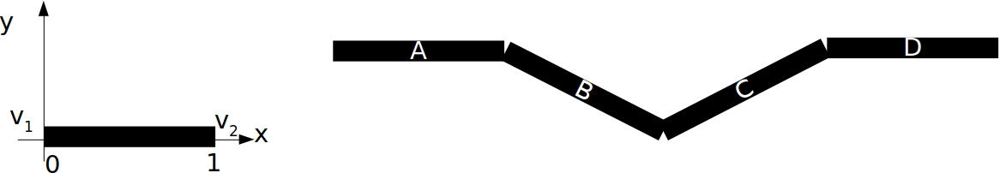

# {{ page.title }}
#### {{ site.author }}

\(
\newcommand{\Choose}[2]{ { { #1 }\choose{ #2 } } }
\newcommand{\vecII}[2]{\left[\begin{array}{c} #1\\#2 \end{array}\right]}
\newcommand{\vecIII}[3]{\left[\begin{array}{c} #1\\#2\\#3 \end{array}\right]}
\newcommand{\vecIV}[4]{\left[\begin{array}{c} #1\\#2\\#3\\#4 \end{array}\right]}
\newcommand{\matIIxII}[4]{\left[
    \begin{array}{cc}
      #1 & #2 \\ #3 & #4 
    \end{array}\right]}
\newcommand{\matIIIxIII}[9]{\left[
    \begin{array}{ccc}
      #1 & #2 & #3 \\ #4 & #5 & #6 \\ #7 & #8 & #9
    \end{array}\right]}
\)        

## Plan

  * Midterm instructions
  * High-level overview of what we have covered so far
  * Example problems
  * Less high-level overview of what we have covered so far

## Midterm instructions

  * This is an open-book, open-note exam
  * You may not consult with any other person during the exam
  * The exam will take place on Blackboard
  * You have 125 minutes to finish
  * The exam will be graded out of 100 points, but there are 110 points available, thus there are 10 available bonus points.
  * It is highly recommended that you provide some answer for every question so you can receive partial credit. Unanswered questions will receive 0 points.

### Original midterm instructions

  * This is a closed-book, closed-note exam, except for one 8.5x11" sheets of notes.
  * You may not consult with any other person during the exam.
  * You may not use any communication device or computer during the exam.
  * You have 125 minutes to finish.
  * Write all work on the exam paper. Use reverse side if needed (but clearly indicate this if you do)
  * The exam will be graded out of 100 points, but there are 110 points available, thus there are 10 available bonus points.
  * It is highly recommended that you provide some answer for every question so you can receive partial credit. Unanswered questions will receive 0 points.

## Very high-level course overview

  * [JavaScript and canvas drawing](02a-canvas.html)
  * [WebGL Three.js and the Barn](02b-openGlBarn.html)
  * [User controls](03a-controls.html)
  * [Color models](03a-color.html)
  * [Instance transforms](04a-instanceTransform.html)
  * [Nested transforms](04b-nestedTransforms.html)
  * [Geometry and transformations](http://m.mr-pc.org/t/cisc3620/2020sp/lectureGeometry.pdf)
  * [Parametric lines and triangle interpolation](05b-parametric.html)
  * [Cameras](06-camera.html)

## Example problems

### Convexity

Which of the following objects are convex? Baseball, coffee mug, donut, axel, shoe box, fork, iPhone, football

### Parametric equation of a line

Parametric equations allow us to generalize geometry such as line segments and
triangles to 3D. Of course, they also work in 2D. 

  * Find a parametric equation for the line \\(y = 3x + 5\\). This line goes through the points (1,8) and (2,11). Use these points for your parametric equation.
  * What is the vector associated with the line? How does this vector relate to the \\(y = mx + b\\) equation?

### Color mixing

Consider two points: A is yellow, B is cyan.

  * Using a scale of 0-1 for each color, write the RGB color triplets for A and B.
  * Consider the point P in the interior of a line segment AB where P is a distance of 1 from A and a distance of 4 from B. Write the RGB color triplet for P.
  * How would you describe this color?

### Vector math. 

Consider the following three points in homogeneous coordinates: \\[
p_1 = \vecIV{-4}{2}{4}{1} \\quad p_2 = \vecIV{-1}{2}{0}{1} \\quad p_3 = \vecIV{2}{2}{-4}{1} \\]

  * What is the vector from \\(p_2\\) to \\(p_1\\)? Call this vector \\(v_{21}\\)
  * What is the vector from \\(p_2\\) to \\(p_3\\)? Call this vector \\(v_{23}\\)
  * What is the length of \\(v_{21}\\)? Of \\(v_{23}\\)?
  * What is the dot product between \\(v_{21}\\) and \\(v_{23}\\)? The angle?
  * What can we say about the points \\(p_1\\), \\(p_2\\), \\(p_3\\) based on this angle?

### Transformation matrices.

  * Write the 4x4 transformation matrix for a translation of 1 in the x direction, 2 in the y direction, and 3 in the z direction. Call this matrix \\(T(1, 2, 3)\\).
  * Write the 4x4 transformation matrix for a scaling of 3 in the x direction, 2 in the y direction, and 1 in the z-direction. Call this matrix \\(S(3, 2, 1)\\).
  * Compute the 4x4 transformation matrix \\(S(3, 2, 1) T(1, 2, 3)\\). Call this matrix \\(Q\\).
  * Consider the 4x4 transformation matrix of the form \\(T(x, y, z) S(3, 2, 1)\\). What values of x, y, and z are necessary for this product to be equal to \\(Q\\)? Hint: You might want to compute \\(T(1, 2, 3) S(3, 2, 1)\\) to help you find the solution.

### Nested transforms

Consider a model of a snake made out of four line segments.  Each segment has length 1 and segments are connected at their ends to each other.  Each segment can rotate relative to its parent in the x-y plane (around the z-axis).  The root node of the hierarchy is A.

  * Draw a tree representing this hierarchy where the nodes are the line segments  and the edges represent direct parental relationships between line segments.

### Nestest transforms (continued)

  * If B is not rotated relative to A and A is in its original position, what is the transformation matrix that should be applied to B's vertices to draw them in global coordinates?  Call this transformation T.
  * If B is rotated by 45 degrees relative to A, and A is in its original position, then what is the transformation matrix that should be applied to B's vertices to draw them in global coordinates? Note that \\(\\sin(45^\\circ) = \\cos(45^\\circ) = \frac{1}{\sqrt{2}} \approx 0.707\\)

### Nestest transforms (continued again)

  * If A and B are kept in the same configuration and C is rotated by 45 degrees relative to B, then what is the transformation matrix that should be applied to C’s vertices to draw them in global coordinates?
  * If instead all segments except A are rotated by the rotation matrix R relative to their parent, then what is the transformation matrix in terms of T and R that should be applied to D’s vertices to draw them in global coordinates?

### Projection

Suppose you have the camera placed at the origin, facing down the negative Z axis,
and the image plane at Z = -2. 

  * Is this a synthetic camera or a pinhole camera?  
  * What are the projections of each of the following points: \\[
  A = \vecIII{-4}{2}{-8} \\quad  B = \vecIII{4}{-2}{-8} \\quad C = \vecIII{0}{6}{-6} \\]

### Field of view

Suppose you have the camera placed at the origin, facing down the negative Z axis,
and the image plane at Z = -2. 

  * Suppose the frustum is two units high, extending from top = +1 to bottom = -1. What is the field of view in the Y direction (FOVY)?
  * Suppose the frustum extends from left = -1.5 to right = 1.5. What is the aspect ratio of the top of the frustum?

## Less high-level course overview

  * [JavaScript and canvas drawing](02a-canvas.html)
  * [WebGL Three.js and the Barn](02b-openGlBarn.html)
  * [User controls](03a-controls.html)
  * [Color models](03a-color.html)
  * [Instance transforms](04a-instanceTransform.html)
  * [Nested transforms](04b-nestedTransforms.html)
  * [Geometry and transformations](http://m.mr-pc.org/t/cisc3620/2020sp/lectureGeometry.pdf)
  * [Parametric lines and triangle interpolation](05b-parametric.html)
  * [Cameras](06-camera.html)

### [JavaScript and canvas drawing](02a-canvas.html)

  * Intro topics
    * The HTML5 `<canvas>` element
    * Drawing rectangles
    * Drawing paths
  * Drawing arcs in paths
  * Setting properties of path segments
  * Transformations and saving and restoring state
  * Exercises
    * draw a tree
    * draw a house
    * draw a village
  * [All pens](https://codepen.io/collection/DbYWer)

### [WebGL Three.js and the Barn](02b-openGlBarn.html)

  * What an API is, and the three APIs we'll use in this class: OpenGL/WebGL, Three.js, and TW 
  * How information is stored and processed in OpenGL 
  * Some geometrical objects that we'll want to be able to draw, and how they're defined in OpenGL and Three.js 
  * How to create a simple scene using Three.js and TW  
  * [All pens](https://codepen.io/collection/XerRzQ)

### [User controls](03a-controls.html)

  * [Two-barns](../labs/02b-introToThreejs.html#/4/1) example and `position.set()`
  * Exercise: [Adding a steeple](../labs/02b-introToThreejs.html#/5) to make a church 
  * Keyboard controls
  * GUI controls
  * Exercises: Adjusting steeple height with keyboard and GUI controls 
  * [All pens](https://codepen.io/collection/nrYQeo)

### [Color models](03a-color.html)

  * Discuss color models like RGB
  * Combine a geometry with a material that is a single color using `THREE.MeshBasicMaterial`
  * Combine a geometry with a material where each face gets its own color
  * Do example of coloring the church
  * [All pens](https://codepen.io/collection/nmqEJQ)

### [Instance transforms](04a-instanceTransform.html)

  * The Instance Transform
  * Built-in Three.js Objects, Polygonal Approximation
  * Bounding Boxes, Reference Points: Scene
  * Placing Instances: Barn instance transforms
  * Demo: Positioning/Translation, Rotation, Scaling
  * Absolute versus Relative
  * Coordinate Systems
  * Exercises: Building a Town, With tree, With snowman, 
  * Exercise: Building Our Own Luxo Lamp
  * [All pens](https://codepen.io/collection/XvWdYM)

### [Nested transforms](04b-nestedTransforms.html)

  * Composite objects
  * Snow-person example
  * Ringing a cone as a bell
  * Multiple segments, jointed leg
  * Sequences of transformations, picket fence
  * Scene graphs, teddybear example
  * Exercises: Luxo family, composite tree
  * [All pens](https://codepen.io/collection/DpdQOK)

### [Geometry and transformations](http://m.mr-pc.org/t/cisc3620/2020sp/lectureGeometry.pdf)

  * Cartesian coordinates
  * Algebraic and geometric vectors, points, vector operations
  * Linear and affine transformations: scaling, rotation, translation
  * Cross-product

### [Parametric lines and triangle interpolation](05b-parametric.html)

  * Parametric equation for a line
  * Parametric line metaphors
  * Exercises with parametric lines
  * Parametric equation for a triangle
  * Equation of a triangle from three points
  * Color interpolation
  * Exercises with color interpolation in Three.js
  * [All pens](https://codepen.io/collection/AkxQRR)

### [Cameras](06-camera.html)

  * The pinhole camera and projections
  * The synthetic camera
  * Perspective matrices and perspective division
  * Perspective cameras in three.js
  * Exercises: projection math, setting up a camera
  * [All pens](https://codepen.io/collection/AerQLQ)
