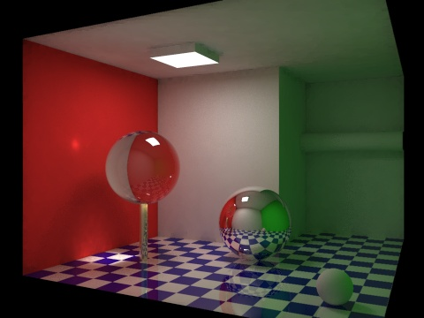
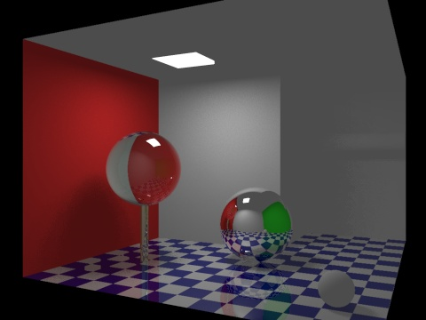
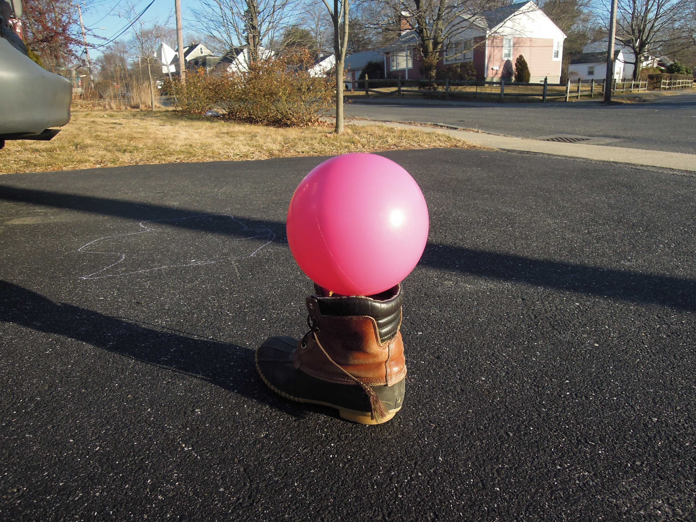

# {{ page.title }}
#### {{ site.author }}

Based on [this CS 307 reading](https://cs.wellesley.edu/~cs307/readings/09-lighting.html) and [this CS 307 lecture](https://cs.wellesley.edu/~cs307/lectures/09a.html) which are copyright &copy; Scott D. Anderson and licensed under a [Creative Commons BY-NC-SA License](http://creativecommons.org/licenses/by-nc-sa/1.0/). 

<p style="display:none">
\(
\newcommand{\Choose}[2]{ { { #1 }\choose{ #2 } } }
\newcommand{\vecII}[2]{\left[\begin{array}{c} #1\\#2 \end{array}\right]}
\newcommand{\vecIII}[3]{\left[\begin{array}{c} #1\\#2\\#3 \end{array}\right]}
\newcommand{\vecIV}[4]{\left[\begin{array}{c} #1\\#2\\#3\\#4 \end{array}\right]}
\newcommand{\matIIxII}[4]{\left[
    \begin{array}{cc}
      #1 & #2 \\ #3 & #4 
    \end{array}\right]}
\newcommand{\matIIIxIII}[9]{\left[
    \begin{array}{ccc}
      #1 & #2 & #3 \\ #4 & #5 & #6 \\ #7 & #8 & #9
    \end{array}\right]}
\)        
</p>


## Plan

  * Midterm info
  * Lighting models
  * Material types
  * Kinds of light and lights
  * Exercise: Pink ball
  * Exercise: Luxo lamp with bulb


## Midterm info

  * Max: 120
  * Median: 96.7
  * Mean: 91.2
  * Min: 52.7




## Lights and materials

<backgroundimage>img/loggingScene.jpg</backgroundimage>
<backgroundimageopacity>0.25</backgroundimageopacity>

  * How does the material an object is made of affect how it looks?
  * How can we make an object look dull or shiny?
  * How do surfaces reflect light?
  * How can we add lights to scenes?


## Lighting models

  * So far we have been coloring objects directly by specifying RGB
    * Not realistic, can't see two faces meeting
  * Lighting models replace with with computed RGB values based on material and light properties
  * In general there are two kinds of lighting
    * Global lighting takes into account all objects in scene in coloring each pixel
    * Local lighting only considers the local material and surface geometry plus all lights
  * Three.js uses mostly local lighting, but has shadows

### Global vs local lighting

--- | ---
 [](https://commons.wikimedia.org/wiki/Category:Cornell_box#/media/File:Global_illumination.JPG) | [](https://commons.wikimedia.org/wiki/Category:Cornell_box#/media/File:Local_illumination.JPG)
Global lighting | Local lighting


### Global lighting

<backgroundimage>https://upload.wikimedia.org/wikipedia/commons/e/ec/Glasses_800_edit.png</backgroundimage>
<backgroundimageopacity>0.25</backgroundimageopacity>

  * _Global_ lighting models take into account interactions of light with objects in the room. For example:
    * light will bounce off one object and onto another, lighting it 
    * objects may block light from a source 
    * shadows may be cast 
    * reflections may be cast 
    * diffraction may occur 
  * Global lighting algorithms fall into two basic categories: ray-tracing and radiosity


### Ray tracing

<backgroundimage>https://upload.wikimedia.org/wikipedia/commons/3/32/Recursive_raytrace_of_a_sphere.png</backgroundimage>
<backgroundimageopacity>0.25</backgroundimageopacity>

  * Ray tracing follows rays from a light source
    * Onto an object where it bounces
    * Potentially onto other objects
    * Eventually into the eye
  * Ray casting reverses this process to cast rays out from the eye into the scene to be more efficient
  * How a bounce occurs depends on the material
    * Could reflect like a mirror
    * Could scatter in a random direction
    * Could go through a transparent material

### Ray tracing

<backgroundimage>https://upload.wikimedia.org/wikipedia/commons/3/32/Recursive_raytrace_of_a_sphere.png</backgroundimage>
<backgroundimageopacity>1.0</backgroundimageopacity>

### Radiosity 

  * All surfaces are treated as light sources
  * The color (including brightness) of light a surface emits is based on the light falling on it
    * From direct lighting, but also from other surfaces
    * Chicken and egg problem solved through iteration



### Radiosity iterations

Visualization of iterations of radiosity rendering




### Global vs local cost

  * Global lighting models are very expensive to compute.
  * According to Tony DeRose, rendering a single frame of the Pixar movie _Finding Nemo_ took _four hours_
  * For _The Incredibles_, the next Pixar movie, rendering each frame took _ten hours_ even on better hardware
  * _Local_ lighting models are perfect for a pipeline like OpenGL
    * very little information is taken into account 
    * Fast, but lower quality
  * Three.js is mostly local, but uses tricks to compute shadows, which are global


## Local lighting in three.js

To determine the color of a polygon, we need the following information:

  * material: what kind of stuff is the object made of? Blue silk is different from blue jeans. Blue jeans are different from black jeans. 
  * surface geometry: is the surface curved? How is it oriented? What direction is it facing? How would we even define the direction that a curved surface is facing? 
  * lights: what lights are in the scene? Are they colored? How bright are they? What directions does the light go? 


### Local lighting demo

<iframe height="600" style="width: 100%;" scrolling="no" title="Lit teddybear" src="https://codepen.io/asterix77/embed/vYOaKEz?height=600&theme-id=default&default-tab=js,result" frameborder="no" allowtransparency="true" allowfullscreen="true">
  See the Pen <a href='https://codepen.io/asterix77/pen/vYOaKEz'>Lit teddybear</a> by Michael Mandel
  (<a href='https://codepen.io/asterix77'>@asterix77</a>) on <a href='https://codepen.io'>CodePen</a>.
</iframe>


## Material Types

  * Local lighting makes many simplifications.
  * There are only three ways light can reflect off a surface
    * Diffuse: rough surfaces, light scatters in many directions
    * Specular: smooth, shiny surfaces, light reflects like a mirror
    * Translucent: light is transmitted as well as reflected, can't handle in local lighting setups




### Diffuse materials

<backgroundimage>img/lambertDummy.jpg</backgroundimage>
<backgroundimageopacity>0.25</backgroundimageopacity>

  * These are rough surfaces, where an incoming ray of light scatters in all directions.
  * The result is that the direction from which the material is viewed doesn't matter much in determining its color and intensity.
  * Examples: carpet, cloth, dirt, rough rock, dry grass 
  * The brown areas on the lit bear are diffuse
    * The direction from which you view a patch of brown doesn't affect the color

[Background image source](https://www.labsphere.com/site/assets/files/3005/cm6page.pdf)

### Specular materials

<backgroundimage>img/arcticVillageLake.jpg</backgroundimage>
<backgroundimageopacity>0.25</backgroundimageopacity>


  * These are smooth, shiny surfaces
  * An incoming ray of light might bounce, mirror-like, and proceed on
  * If the camera is lined up with the reflected rays, we'll see a bright spot caused by that reflection.
    * This is called a specular highlight.
  * Examples: plastic, metal, polished leather 
  * The lit bear's eyes are specular, look for the highlight

### Translucent materials

<backgroundimage>https://upload.wikimedia.org/wikipedia/commons/e/ec/Glasses_800_edit.png</backgroundimage>
<backgroundimageopacity>0.25</backgroundimageopacity>

  * Surfaces that transmit as well as reflect light.
  * Can really only be handled properly using ray tracing.
  * Local lighting can do a kind of transparency
    * We won't talk about it for a while
  * Examples: water, glass, soap bubbles

### Diffuse and specular models

  * Diffuse surfaces can be modeled using _Lambert's cosine law_ and [Lambertian reflectance](http://en.wikipedia.org/wiki/Lambertian_reflectance).
  * Specular surfaces can be modeled by the [Phong reflection model](http://en.wikipedia.org/wiki/Phong_reflection_model).
  * Phong includes Lambertian as a special case.
  * Three.js calls these materials `Lambertian` and `Phong`




## Material and lighting tutor

<iframe height="600" style="width: 100%;" scrolling="no" title="Material parameters" src="https://codepen.io/asterix77/embed/jOPJYgO?height=600&theme-id=default&default-tab=js,result" frameborder="no" allowtransparency="true" allowfullscreen="true">
  See the Pen <a href='https://codepen.io/asterix77/pen/jOPJYgO'>Material parameters</a> by Michael Mandel
  (<a href='https://codepen.io/asterix77'>@asterix77</a>) on <a href='https://codepen.io'>CodePen</a>.
</iframe>


## Kinds of Light

  * We divided materials into diffuse (Lambert) and specular (Phong)
  * Most materials have some of each
    * you get color from the diffuse properties of, say, leather,
    * but a shine of specular highlight at the correct angle
  * A major part of the Phong light model, then, is light interacting with these two properties of material.
  * The model, thus, divides _light_ into different kinds
    * so that _diffuse_ light interacts with the _diffuse_ material property
    * and _specular_ light interacts with the _specular_ material property
  * Seems weird, but mostly bookkeeping

### Ambient light

  * There is a third kind of light that we will model: Ambient light
  * The light all around us.
  * Comes from nowhere in particular, _indirect_, and _non-directional_.
  * Local-lighting equivalent of " radiosity"
  * In the real world, when you turn on a light in a room, the whole room becomes a bit brighter.
  * Thus, each Three.js light source has an ambient component that it can contribute to the scene

### Three components

  * So all lights have three components: ambient, diffuse, specular
  * And all materials have the same three components
  * You can think of each of these as colors, each has RGB components
  * For example, the ambient property of brown leather is brown
    * when white ambient light falls on it, the leather looks brown.
    * Similarly, the diffuse property is brown.
  * The specular property of the leather is probably gray (colorless)
    * because when white specular light reflects off shiny leather, the reflected light is white, not brown.


## Light Sources in three.js

  * In Three.js, you create a light source object and add it to the scene
  * Lights in a scene contribute to the lighting of the objects in it
  * The lights themselves are not visible (but there are [lighting helpers](https://threejs.org/examples/#webgl_lights_spotlights))
  * Lights only manifest themselves by illuminating objects


### Ambient Lights

In Three.js, you can create an [ambient
light](https://threejs.org/docs/index.html#api/lights/AmbientLight) like this;

```javascript    
    var light0 = new THREE.AmbientLight( 0x202020 ); // 10%
```

This light is a very dark gray, contributing just a little brightening to the scene.


### Point Sources

  * A common source of light in Three.js is a "point source."
  * You can think of it as a small light bulb, radiating light in all directions around it.
  * This is somewhat unrealistic, but it's easy to compute with.
  * [Point source demo](https://threejs.org/examples/#webgl_lights_pointlights)
  * To do this in Three.js, we use a [THREE.PointLight](http://threejs.org/docs/#api/lights/PointLight):

```javascript
    // white light, 50% intensity, falling to zero in 80 units:
    var light1 = new THREE.PointLight( TW.WHITE, 0.5, 80 );
    light1.position.set( 0, 10, 10 );
    scene.add(light1);
```

### Points sources have an _intensity_

  * Like many of light types in Three.js, a point light has an _intensity_
  * This is the second argument to the constructor, default 1
  * A factor that the lighting computation is multiplied by
  * So you can use this to make a light brighter or dimmer


### Point lights can _attenuate_ with distance

  * So that the intensity goes down for surfaces that are farther
  * In the real world, light attenuates inversely with distance squared
    * the light energy is spread over the surface of a sphere
  * But years of experience in Computer Graphics has shown that this bit of physics seems to make lights fade too quickly
  * So, instead, a linear attenuation is used.
  * The third argument to the `THREE.PointLight()` constructor is the distance at which this light's
intensity attenuates to zero. 


### Spotlights

  * [Spotlights](https://threejs.org/docs/index.html#api/lights/SpotLight) have more parameters, and can be directed toward a target location

    
```javascript
    var spotLight = new THREE.SpotLight 
                         ( color,      // rgb color of the source, default white
                           intensity,  // multiplication factor, default 1
                           distance,   // distance where light ends, default 0
                           angle,      // width of beam in radians, default Math.PI/2
                           penumbra,   // % spotlight cone attenuated (0-1), default 0
                           decay       // amount light decays with distance, default 1
                          );
    spotLight.position.set(x,y,z);
    var target = new THREE.Object3D();
    target.position.set(xt,yt,zt);
    spotLight.target = target;
    scene.add(spotLight);
    scene.add(spotLight.target);
```

### Spotlight demo

<iframe height="600" style="width: 100%;" scrolling="no" title="Spotlight demo" src="https://codepen.io/asterix77/embed/KKpEQKp?height=600&theme-id=default&default-tab=js,result" frameborder="no" allowtransparency="true" allowfullscreen="true">
  See the Pen <a href='https://codepen.io/asterix77/pen/KKpEQKp'>Spotlight demo</a> by Michael Mandel
  (<a href='https://codepen.io/asterix77'>@asterix77</a>) on <a href='https://codepen.io'>CodePen</a>.
</iframe>


## Exercise: Pink ball

Consider these photos of a pink plastic ball:

 | 

  * Do you see the effects of specularity? If so, where?  
  * Do you see the effects of diffuse reflection? If so, where?  
  * Do you see the effects of ambient light? If so, where?

### Exercise: Imitate the pink ball

  * Using this [starter pen](https://codepen.io/asterix77/pen/dyordym), try to imitate the pink plastic ball.
  * Here's a GUI to help: [pink ball GUI](https://codepen.io/asterix77/pen/mdJoXdz)
  * Your final code might look something like this [pink ball solution](https://codepen.io/asterix77/details/wvaOyvb)
  * Perfection is not required!


## Exercise: Add a light source to the Luxo lamp

Real Luxo lamps have bulbs that emit light, as in this scene with Luxo Mom and
Junior:




### Exercise: Add a light source to the Luxo lamp

Starting with this [starter pen](https://codepen.io/asterix77/pen/yLNwvye), complete these steps to add a spotlight for each Luxo lamp in the scene:

  1. Modify the materials stored in the `colorMaterials` array to be Phong materials instead of basic materials 
  1. Fill in the inputs to the `THREE.SpotLight()` constructor in the function `addLuxoBulb()` that adds a spotlight to the scene for a Luxo lamp (you can mostly use default values here, but think about what `angle` to use in this case, and experiment with the `penumbra` value)


### Exercise: Add a light source to the Luxo lamp

{:start="3"}
  1. Modify the position of `bulbTarget` in the `addLuxoBulb()` function - the target should be on the ground, at a distance `dist` from the origin of the lamp `(posX,0,posZ)` and at an angle `angleY` (these variables are all defined in the code): 



{:start="4"}
  1. Add two calls to the `addLuxoBulb()` function, to add bulbs for Mom and Junior 

Your final code might look something like this: [Luxo bulb solution](https://codepen.io/asterix77/pen/Jjdzpor)


