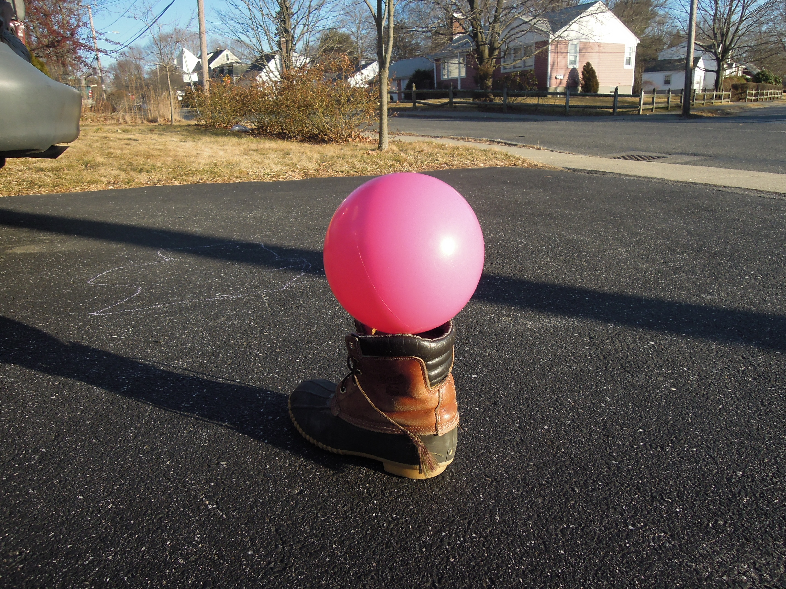

# {{ page.title }}
#### {{ site.author }}

Based on [this CS 307 reading](https://cs.wellesley.edu/~cs307/readings/09-lighting.html) and [this CS 307 lecture](https://cs.wellesley.edu/~cs307/lectures/09a.html) which are copyright &copy; Scott D. Anderson and licensed under a [Creative Commons BY-NC-SA License](http://creativecommons.org/licenses/by-nc-sa/1.0/). 

<p style="display:none">
\(
\newcommand{\Choose}[2]{ { { #1 }\choose{ #2 } } }
\newcommand{\vecII}[2]{\left[\begin{array}{c} #1\\#2 \end{array}\right]}
\newcommand{\vecIII}[3]{\left[\begin{array}{c} #1\\#2\\#3 \end{array}\right]}
\newcommand{\vecIV}[4]{\left[\begin{array}{c} #1\\#2\\#3\\#4 \end{array}\right]}
\newcommand{\matIIxII}[4]{\left[
    \begin{array}{cc}
      #1 & #2 \\ #3 & #4 
    \end{array}\right]}
\newcommand{\matIIIxIII}[9]{\left[
    \begin{array}{ccc}
      #1 & #2 & #3 \\ #4 & #5 & #6 \\ #7 & #8 & #9
    \end{array}\right]}
\)        
</p>


## Plan

  * Lambert model (ambient + diffuse light)
  * Phong model (ambient + diffuse + specular)
  * Flat vs smooth shading
  * Exercise: pink ball
  * Exercise: luxo family with light sources


## Lambert Model

  * The Phong model combines ambient, diffuse, and specular terms
  * The Lambert model combines th ambient and diffuse terms only
    * So we'll start with that

### First, some notation: vectors

  * \\(\vec{n}\\): the normal vector for the surface.
    * the vector that is _perpendicular_ (or _orthogonal_) to the surface.
    * defines "orientation" of a surface
    * usually _normalized_ to be a unit vector (length 1) 
  * \\(\vec{\ell}\\): the vector towards the light source
    * a vector from the point on the surface to the light source
    * For distant lights, constant over triangles



### More notation: colors

  * \\(L\\): the color (and intensity) of light impinging on an object
    * has one component for each primary color: red, green, blue
    * has one set of colors for each type of light: ambient, diffuse, specular
  * \\(R\\): the fraction of light that gets reflected by a material
    * so if \\(R =0.8\\), 80% of the incoming light is reflected.
    * has one component for each primary color: red, green, blue
    * has one set of colors for each type of light: ambient, diffuse, specular

### Material properties in \\(R\\)

In general, \\(R\\) can depend on:

  * material properties: cotton is different from leather 
  * orientation of the surface 
  * direction of the light source 
  * distance to the light source 

### Why does \\(R\\) depend on the light source?

<backgroundimage>http://m.mr-pc.org/t/cisc3620/2020sp/brickWall.jpg</backgroundimage>
<backgroundimageopacity>1.0</backgroundimageopacity>

### Why does \\(R\\) depend on the light source?

<backgroundimage>http://m.mr-pc.org/t/cisc3620/2020sp/brickWall.jpg</backgroundimage>
<backgroundimageopacity>0.25</backgroundimageopacity>

  * That is, why does the reflection fraction depend on which light we're talking about?
  * Because the direction and distance change.
  * Those are the only properties that matter for this calculation (and color)


### General light intensity equation

  * The light that gets reflected from a surface (and ends up on the image plane and the framebuffer) is the product of
    * the incoming light intensity, \\(L\\),
    * and the fraction \\(R\\):

\\[I = L R\\]

## Abstract Lambert model

  * Breaking the equation for \\(I\\) down in the Lambert model
  
\\[ I = L_a R_a + L_d R_d \\]

  * That is, the intensity of the color of an object is
    * the ambient light falling on it, multiplied by the reflection amount for ambient light, plus 
    * the diffuse light falling on it, multiplied by the reflection amount for diffuse light. 
  * How do we compute the two \\(R\\) values?

### Ambient: \\(R_a\\)

  * Reflection of ambient light doesn't depend on direction or distance or orientation
  * It's solely based on the material property
    * is the material dark or light?
    * Note that it can be dark for blue and light for red and green.
  * So, \\(R_a\\) is a simple constant, which we will call \\(k_a\\)

\\[R_a = k_a\\]

  * Note that \\(0 \\le k_a \\le 1\\). Why?
  * This constant is chosen by you the programmer as part of the material properties for an object

### Diffuse/Lambertian: \\(R_d\\)

<backgroundimage>img/lambertDummy.jpg</backgroundimage>
<backgroundimageopacity>0.25</backgroundimageopacity>

  * For Lambertian/diffuse surfaces, we assume that light scatters equally in all (view) directions
  * In lay person's vocabulary, such surfaces are often called "matte"
  * However, the angle of the light does matter
    * because the energy (photons) is spread over a larger area.
  * Consequently, we have (using normalized \\(\vec{\ell}\\) and \\(\vec{n}\\))

\\[R_d = k_d \vec{\ell} \cdot \vec{n}\\]

### Diffuse/Lambertian: \\(R_d\\)

<backgroundimage>img/lambertDummy.jpg</backgroundimage>
<backgroundimageopacity>0.25</backgroundimageopacity>

\\[R_d = k_d \vec{\ell} \cdot \vec{n}\\]

  * Thus the amount of light reflected from a diffuse surface is the product of a constant, chosen by you the programmer
    * multiplied by the cosine of the angle between the light and the normal
    * As before, there are actually 3 such constants, one each for red, green, and blue.


### Final Lambert model

Now, we finally have our finished Lambert Model:

\\[ I = L_a k_a + L_d k_d \vec{\ell} \cdot \vec{n}\\]  




### Lambertian Materials in Three.js

  * In Three.js, you can make a [Lambertian
material](https://threejs.org/docs/index.html#api/materials/MeshLambertMaterial)
like this:
    
```javascript
    var mat = new THREE.MeshLambertMaterial( {color: THREE.ColorKeywords.cyan} );
```

  * You can specify the color in many ways, as we've seen before.
  * The developers of Three.js decided that materials will reflect ambient light the same way they reflect diffuse light: captured with the `color` property.
    * Using color specifications like this is a shorthand for specifying reflection coefficients for the red, green, and blue primaries.

## Phong Model

  * Now, let's build the full Phong Model by adding specular reflections.
  * With specular reflections, the material is (locally) smooth and is acting like a mirror.
  * The incoming light rays bounce off the material and head off at an angle equal to their incoming angle.




### Additional vectors

  * To understand what this means, we first need some more notational building blocks:
    * \\(\vec{v}\\): unit vector towards the eye; i.e., the Center of Projection.
    * \\(\vec{r}\\): unit vector pointing in the direction reflected light would go if the surface at that point were a mirror
  * The following figure illustrates these vectors:



### Additional vectors



  * If the direction of our view, \\(\vec{v}\\) , is "near" the reflection direction,
\\(\vec{r}\\), as in the above diagram, we should see a lot of that reflected light.
    * This is called a "specular highlight".
  * This can be modeled as

\\[R_s = k_s ( \vec{v} \cdot \vec{r} )^\alpha \\]

  * The dot product is large when the two vectors are "lined up."

### Shininess

\\[R_s = k_s ( \vec{v} \cdot \vec{r} )^\alpha \\]

  * The \\(\alpha\\) exponent is a number that gives the "shininess."
  * The higher the shininess, the smaller the reflected "spotlight"
  * because the dot product (which is less than one), is raised to a higher power. 

### The Complete Phong Model

Adding this last part to the Lambert Model gives us the Abstract Phong Model:

\\[I = L_a R_a + L_d R_d + L_s R_s\\]

Filling in the details of the above mathematical models, we get the Concrete Phong Model:

\\[I = L_a k_a + L_d k_d \vec{\ell} \cdot \vec{n} + L_s k_s (\vec{v} \cdot \vec{r} )^\alpha \\]


### Phong Materials in Three.js

  * All that work is to understand the following deceptively simple lines of code
to set up a [Phong
Material](http://threejs.org/docs/#api/materials/MeshPhongMaterial) in
Three.js:

    
```javascript
    var mat = new THREE.MeshPhongMaterial(
        {color: THREE.ColorKeywords.cyan,
         specular: 0xCCCCCC,
         shininess: 30});
```

  * This uses `0xCCCCCC` (silver) as the specular color.
  * Since `0xCC` is 204, and 204/255 is 0.8, this amounts to a specularity coefficient
of 80 percent, equally for red, green, blue.
  * This material will reflect 80% of all specular light falling on it.
  * The dot product of the reflection vector and the eye vector is raised to the 30th power,
    * which makes this a fairly shiny object.


## Flat vs smooth shading

  * `THREE.MeshPhongMaterial` has a parameter `shading`
    * Can be `THREE.SmoothShading` or `THREE.FlatShading`
  * The graphics card can either
    * interpolate the lighting calculations across a face (smooth shading), or 
    * it can use a single value for the entire face (flat shading) 



### Flat vs smooth shading

  * You might think that smooth is always better than flat
  * But what if the geometry is _not_ a polygonal approximation of a smooth object like a ball?
  * What if, in fact, the geometry is accurate, and the object is _faceted_ with flat faces, like a jewel?

<iframe height="400" style="width: 100%;" scrolling="no" title="Ball and Jewel" src="https://codepen.io/asterix77/embed/eYNXVJB?height=400&theme-id=default&default-tab=js,result" frameborder="no" allowtransparency="true" allowfullscreen="true" loading="lazy">
  See the Pen <a href='https://codepen.io/asterix77/pen/eYNXVJB'>Ball and Jewel</a> by Michael Mandel
  (<a href='https://codepen.io/asterix77'>@asterix77</a>) on <a href='https://codepen.io'>CodePen</a>.
</iframe>


## Summary

  * There are three kinds of light: ambient, diffuse and specular 
    * Ambient is constant from all directions 
    * Diffuse depends on the angle between the light and the surface 
    * Specular depends on the angle between the reflected incoming light and the eye, and also depends on a scalar quantity called shininess 
  * In Three.js, the `color` attribute of a material captures how it interacts with diffuse and ambient light
    * and the `specular` and `shininess` properties capture the specular reflection of the surface material 


## Exercise: Pink ball

Consider these photos of a pink plastic ball:

 | 

  * Do you see the effects of specularity? If so, where?  
  * Do you see the effects of diffuse reflection? If so, where?  
  * Do you see the effects of ambient light? If so, where?

### Exercise: Imitate the pink ball

  * Using this [starter pen](https://codepen.io/asterix77/pen/dyordym), try to imitate the pink plastic ball.
  * Here's a GUI to help: [pink ball GUI](https://codepen.io/asterix77/pen/mdJoXdz)
  * Your final code might look something like this [pink ball solution](https://codepen.io/asterix77/details/wvaOyvb)
  * Perfection is not required!


## Exercise: Add a light source to the Luxo lamp

Real Luxo lamps have bulbs that emit light, as in this scene with Luxo Mom and
Junior:




### Exercise: Add a light source to the Luxo lamp

Starting with this [starter pen](https://codepen.io/asterix77/pen/yLNwvye), complete these steps to add a spotlight for each Luxo lamp in the scene:

  1. Modify the materials stored in the `colorMaterials` array to be Phong materials instead of basic materials 
  1. Fill in the inputs to the `THREE.SpotLight()` constructor in the function `addLuxoBulb()` that adds a spotlight to the scene for a Luxo lamp (you can mostly use default values here, but think about what `angle` to use in this case, and experiment with the `penumbra` value)


### Exercise: Add a light source to the Luxo lamp

{:start="3"}
  1. Modify the position of `bulbTarget` in the `addLuxoBulb()` function - the target should be on the ground, at a distance `dist` from the origin of the lamp `(posX,0,posZ)` and at an angle `angleY` (these variables are all defined in the code): 



{:start="4"}
  1. Add two calls to the `addLuxoBulb()` function, to add bulbs for Mom and Junior 

Your final code might look something like this: [Luxo bulb solution](https://codepen.io/asterix77/pen/Jjdzpor)


