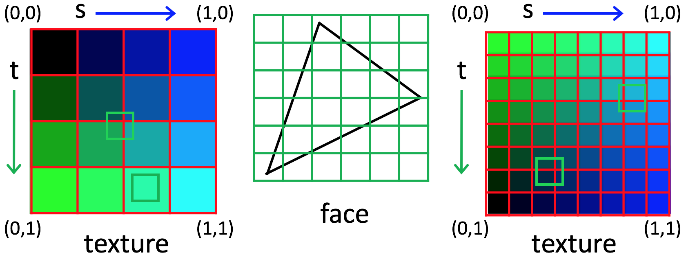

# {{ page.title }}
#### {{ site.author }}

Based on [this CS 307 reading](https://cs.wellesley.edu/~cs307/readings/10-texture-mapping-c.html) and [this CS 307 lecture](https://cs.wellesley.edu/~cs307/lectures/12new.html) which are copyright &copy; Scott D. Anderson and licensed under a [Creative Commons BY-NC-SA License](http://creativecommons.org/licenses/by-nc-sa/1.0/). 

<p style="display:none">
\(
\newcommand{\Choose}[2]{ { { #1 }\choose{ #2 } } }
\newcommand{\vecII}[2]{\left[\begin{array}{c} #1\\#2 \end{array}\right]}
\newcommand{\vecIII}[3]{\left[\begin{array}{c} #1\\#2\\#3 \end{array}\right]}
\newcommand{\vecIV}[4]{\left[\begin{array}{c} #1\\#2\\#3\\#4 \end{array}\right]}
\newcommand{\matIIxII}[4]{\left[
    \begin{array}{cc}
      #1 & #2 \\ #3 & #4 
    \end{array}\right]}
\newcommand{\matIIIxIII}[9]{\left[
    \begin{array}{ccc}
      #1 & #2 & #3 \\ #4 & #5 & #6 \\ #7 & #8 & #9
    \end{array}\right]}
\)        
</p>


## Plan: Texture mapping 3

  * Using multiple textures
  * Texture, surface color, and lights 
  * Nearest & linear filters 
  * Exercise: A room with a view
  * Advanced techniques: bump, normal, and environment maps 

## Using Multiple Textures

  * First, take a look at this demo by Kelsey Reiman

<iframe height="600" style="width: 100%;" scrolling="no" title="Mikey cube" src="https://codepen.io/asterix77/embed/BaoZqqN?height=600&theme-id=default&default-tab=js,result" frameborder="no" allowtransparency="true" allowfullscreen="true" loading="lazy">
  See the Pen <a href='https://codepen.io/asterix77/pen/BaoZqqN'>Mikey cube</a> by Michael Mandel
  (<a href='https://codepen.io/asterix77'>@asterix77</a>) on <a href='https://codepen.io'>CodePen</a>.
</iframe>


### Using Multiple Textures

Now, take a look at the source code that builds the cube:
    
```javascript
    TW.loadTextures(
        [ 'mikey1.jpg', 'mikey2.jpg', 
          'mikey3.jpg', 'mikey4.jpg',        
          'mikey5.jpg', 'mikey6.jpg' ],
        function (textures) {
            // create an array of materials from these textures
            var mats = [];
            for( var i=0; i < textures.length; i++ ) {
                mats.push(new THREE.MeshBasicMaterial( {map: textures[i]} ));
            }
            // create a cube using MeshFaceMaterial, one material for each face
            var cube = new THREE.Mesh( new THREE.BoxGeometry(2,2,2),
                                       new THREE.MeshFaceMaterial( mats ) );
            scene.add(cube);
            TW.render();
        });
```

### Using multiple textures

  * The `TW.loadTextures()` function loads an array of images
    * and invokes the callback once all of them have been loaded.
  * So, it's pretty easy to put a different material on each side of a cube.
  * This is powerful, but only if you want to do what it makes easy
    * You have no control over the texture coordinates for each side.
    * Suppose we want to put repetitions of some image on some side?
    * You either have to modify the texture coordinates or the `materialIndex` of each face

### Face Materials and Texture Parameters

  * With `THREE.MeshFaceMaterial`, each face has a _materialIndex_
    * that indexes into the array of materials, and each material has its own texture.
  * Thus, if we wanted to have a 2x3 pattern of Mikey on the front side `(materialIndex == 4)` of the cube, we could use code from above.
  * Press the 'p' key in the [Mikey Cube](https://codepen.io/asterix77/pen/BaoZqqN)

## Lighting and Textures

  * So far, we've just mapped textures onto plain white surfaces.
  * In fact, the texture is _multiplied_ by the color of the surface (depending on the shader).
  * Consider the following demo:

<iframe height="400" style="width: 100%;" scrolling="no" title="ZEbyqVX" src="https://codepen.io/asterix77/embed/ZEbyqVX?height=400&theme-id=default&default-tab=js,result" frameborder="no" allowtransparency="true" allowfullscreen="true" loading="lazy">
  See the Pen <a href='https://codepen.io/asterix77/pen/ZEbyqVX'>ZEbyqVX</a> by Michael Mandel
  (<a href='https://codepen.io/asterix77'>@asterix77</a>) on <a href='https://codepen.io'>CodePen</a>.
</iframe>

### Lighting and textures

  * If the color of the face isn't direct color (`THREE.MeshBasicMaterial`), but is a function of the material (`THREE.MeshPhongMaterial`) and lighting of the scene,
    * you can easily see how we can combine this lighting information with a texture.
  * One question, though, is what _color_ the material should be.
  * If the material has any _hue_ , it might interact in odd-looking ways with the colors of the texture.
    * Thus, it makes sense for the material to be _gray_.
  * Because we are multiplying by a value less than 1, it will get darker, so should start out pretty light.


### Texture with spotlight

<iframe height="400" style="width: 100%;" scrolling="no" title="MWaoPLE" src="https://codepen.io/asterix77/embed/MWaoPLE?height=400&theme-id=default&default-tab=js,result" frameborder="no" allowtransparency="true" allowfullscreen="true" loading="lazy">
  See the Pen <a href='https://codepen.io/asterix77/pen/MWaoPLE'>MWaoPLE</a> by Michael Mandel
  (<a href='https://codepen.io/asterix77'>@asterix77</a>) on <a href='https://codepen.io'>CodePen</a>.
</iframe>

  * The trick here is to create a Phong material and then to set the `.map` property:

    
```javascript
    var mat = new THREE.PhongMaterial();  // default is white
    mat.map = texture;
```

## Nearest and Linear Filters

  * When mapping texture onto a triangular face during the rendering process, Three.js:
    1. first determines which texture coordinates to use for each pixel touched by the triangular face 
    2. then determines which texture color to use for each pixel, based on the texels around the computed texture coordinates 
  * Pixels in the triangular face could be _larger_ or _smaller_ than the corresponding texels:



### Nearest and linear filters

I find this [demo](https://threejsfundamentals.org/threejs/lessons/threejs-textures.html#filtering-and-mips) helpful.




### minFilter and magFilter

  * The `minFilter` property of a `THREE.Texture` object controls how the texture color is determined for the scenario on the left
    * and the `magFilter` property specifies what to do for the scenario on the right.
  * Two common options for both are `THREE.NearestFilter` (select the color of the nearest texel)
    * and `THREE.LinearFilter` (linearly interpolate between the colors of the four nearest texels).

### Minification and magnification

  * magnification: 1 texel `->` many pixels; 1 pixel `->` part of a texel. Should the pixels all be uniform (nearest) or gradually transition to the next texel (linear)
  * minification: 1 pixel `->` many texels. Should the pixel color be drawn from one texel (nearest) or smoothly interpolate (linear)
    * In practice, `minFilter` rarely matters.


## Exercise: A Room with a View

  * This exercise illustrates how you can use a `THREE.BoxGeometry` to _create a room_ and texture it.

  1. Start from this [room start pen](https://codepen.io/asterix77/pen/jObMQwE?editors=1010)
  2. Change the basic materials for the cube faces to `THREE.MeshLambertMaterial`, and set the `side` property for the material to `THREE.BackSide` (this is all that's needed to convert the box to a room that can be viewed from the inside!) 
  3. Add code to create a white point light source, position this light in the center of the room, and add it to the scene

### Part 2

{:start="4"}
  4. Complete the definition of the `displayView()` function, which should map [this image](https://s3-us-west-2.amazonaws.com/s.cdpn.io/2999896/seaScape.jpg) (stored in the input `THREE.Texture` object) onto a plane that is the same size as the back wall of the room, just in front of it. and render the scene 
  5. Feel free to select a nicer set of colors for the walls of the room! 

  * Your solution might look like [this pen](https://codepen.io/asterix77/pen/GRpjwvw?editors=1010)

### Extensions

  * In the above solution, we cheated a bit, creating something like a poster that was placed at the location of the back wall.
  * We can also _directly map an image texture_ onto one or more sides (faces) of the box.
  * Modify the definition of the `displayView()` function so that it maps the input texture directly onto the back wall of the box


### Hints for extension

  * `THREE.Mesh` objects have a `material` property.
  * In the case of meshes with multiple materials, the value of this property is an object that itself has a
property named `materials` that is an array of materials.
  * In the case of our `THREE.BoxGeometry`, this array contains 6 materials, one for each side of the box (the two triangular faces for each side have the same material).
  * You need to _change one of the materials in this array_ to be a `THREE.MeshLambertMaterial` with appropriate values for the `color`, `side`, and `map` properties.
  * Your solution might look like [this pen](https://codepen.io/asterix77/pen/dyYpQZe?editors=1010)
  * _Why do you think the window appears with its hinge on the left side here, rather than_ _on the right side, as it appeared in the first solution?_


## Advanced Methods

  * Let's look at some texture demos from the Dirksen textbook
  * The sourcecode is available in [his repository](https://github.com/josdirksen/learning-threejs-third)

### [01-basic-texture](http://mr-pc.org/learning-threejs-third/src/chapter-10/js/10-01.js)

 <backgroundiframe>http://mr-pc.org/learning-threejs-third/src/chapter-10/01-basic-texture.html</backgroundiframe>


### [02-basic-texture-dds](http://mr-pc.org/learning-threejs-third/src/chapter-10/js/10-02.js)

 <backgroundiframe>http://mr-pc.org/learning-threejs-third/src/chapter-10/02-basic-texture-dds.html</backgroundiframe>


### [08-bump-map](http://mr-pc.org/learning-threejs-third/src/chapter-10/js/10-08.js)

 <backgroundiframe>http://mr-pc.org/learning-threejs-third/src/chapter-10/08-bump-map.html</backgroundiframe>


### [09-normal-map](http://mr-pc.org/learning-threejs-third/src/chapter-10/js/10-09.js)

 <backgroundiframe>http://mr-pc.org/learning-threejs-third/src/chapter-10/09-normal-map.html</backgroundiframe>


### [10-displacement-map](http://mr-pc.org/learning-threejs-third/src/chapter-10/js/10-10.js)

 <backgroundiframe>http://mr-pc.org/learning-threejs-third/src/chapter-10/10-displacement-map.html</backgroundiframe>


### [14-alpha-map](http://mr-pc.org/learning-threejs-third/src/chapter-10/js/10-14.js)

 <backgroundiframe>http://mr-pc.org/learning-threejs-third/src/chapter-10/14-alpha-map.html</backgroundiframe>


### [15-emissive-map](http://mr-pc.org/learning-threejs-third/src/chapter-10/js/10-15.js)

 <backgroundiframe>http://mr-pc.org/learning-threejs-third/src/chapter-10/15-emissive-map.html</backgroundiframe>


### [16-specular-map](http://mr-pc.org/learning-threejs-third/src/chapter-10/js/10-16.js)

 <backgroundiframe>http://mr-pc.org/learning-threejs-third/src/chapter-10/16-specular-map.html</backgroundiframe>


### [18-env-map-dynami](http://mr-pc.org/learning-threejs-third/src/chapter-10/js/10-18.js)

 <backgroundiframe>http://mr-pc.org/learning-threejs-third/src/chapter-10/18-env-map-dynamic.html</backgroundiframe>


### [24-video-texture](http://mr-pc.org/learning-threejs-third/src/chapter-10/js/10-24.js)

 [Link here so it doesn't autoplay](http://mr-pc.org/learning-threejs-third/src/chapter-10/24-video-texture.html)


## Bump Maps

<backgroundiframe>http://mr-pc.org/learning-threejs-third/src/chapter-10/08-bump-map.html</backgroundiframe>

### Bump maps

  * A [bump map](https://en.wikipedia.org/wiki/Bump_mapping) enables us to simulate bumps and wrinkles on an object surface.
  * Traditionally, bump maps have been incorporated as follows:
    1. the bump map is used to _perturb the normal vector_ at each calculated point 
    2. the perturbed normal vectors are used during lighting calculations (e.g. application of the Phong model) 
  * The underlying surface geometry is not changed in this case.

### Bump maps

  * In Three.js, the bump map is a grayscale image
  * The intensity values in this image are first used to _displace_ each surface point slightly.
  * The modified surface points are then used to calculate the normal vectors for the lighting calculations.
  * Here are the stone texture and bump map:

Stone texture | Stone bump map  
---|---  
 |   

### Bump map code

 * Here's the code:
    
```javascript
    var sphere2 = createMesh(new THREE.CubeGeometry(15, 15, 2),
                             "stone.jpg", "stone-bump.jpg");
```

 * The material includes a bump map:

```javascript
    function createMesh(geom, imageFile, bump) {
        var texture = THREE.ImageUtils.loadTexture("../assets/textures/general/" + imageFile)
        geom.computeVertexNormals();
        var mat = new THREE.MeshPhongMaterial();
        mat.map = texture;
        if (bump) {
            var bump = THREE.ImageUtils.loadTexture("../assets/textures/general/" + bump)
            mat.bumpMap = bump;
            mat.bumpScale = 0.2;
            console.log('d');
        }
        var mesh = new THREE.Mesh(geom, mat);
        return mesh;
    }
```    

## Normal Maps

 <backgroundiframe>http://mr-pc.org/learning-threejs-third/src/chapter-10/09-normal-map.html</backgroundiframe>


### Normal Maps

  * The normal map directly specifies the normal vector to use for the lighting calculations (e.g. in the Phong model) at each location.
  * It can be stored as an RGB image, where the three values at each location represent the `(X,Y,Z)` coordinates of the surface normal.
  * Here are the plaster maps:
  
Plaster texture | Plaster normal map  
---|---  
 |   

### Normal map code

```javascript
    var sphere2 = createMesh(new THREE.CubeGeometry(15, 15, 15),
                             "plaster.jpg", "plaster-normal.jpg");
```

The material includes a normal map:

```javascript 
    function createMesh(geom, imageFile, normal) {
        if (normal) {
            var t = THREE.ImageUtils.loadTexture("../assets/textures/general/" + imageFile);
            var m = THREE.ImageUtils.loadTexture("../assets/textures/general/" + normal);
            var mat2 = new THREE.MeshPhongMaterial({
                map: t,
                normalMap: m
            });
            var mesh = new THREE.Mesh(geom, mat2);
            return mesh;
        } else { ... }
        return mesh;
    }
```
    

## Environment Maps

 <backgroundiframe>http://mr-pc.org/learning-threejs-third/src/chapter-10/17-env-map-static.html</backgroundiframe>

### Environment maps

  * Calculating real reflections of a surrounding environment from a shiny surface is very computationally intensive, usually requiring ray tracing.
  * Environment maps enable us to _fake the creation of these reflections_ with far less computation.
  * To incorporate an environment map, a "Skybox" is first created from six images that represent the scenes that would be viewed in six cardinal directions from the center of the object
  * Then the reflective object is placed within this skybox and renders its own six images to compute reflections

### Skybox images

For the Dirksen demo, these are the six images

Left | Right
---|---
 | 


### Skybox images

For the Dirksen demo, these are the six images

Top | Bottom
---|---
 | 


### Skybox images

For the Dirksen demo, these are the six images

Back | Front
---|---
 | 

### Environment maps

  * A large box is then created with the CubeMap rendered on the inside of the box.
    * This gives the impression of being surrounded by an open scene, when in reality, the six image textures are rendered on the inside of a box and viewed from inside the box.
  * The CubeMap object can can also be applied as a texture, mapped onto the surfaces of a shiny object placed inside the box.
  * This combination of the surrounding box and inner objects gives the (false) impression of objects reflecting the environment!


## Summary

  * Using multiple textures
  * Texture, surface color, and lights 
  * Nearest & linear filters 
  * Exercise: Decorate a cake 
  * Advanced techniques: bump, normal, and environment maps 
