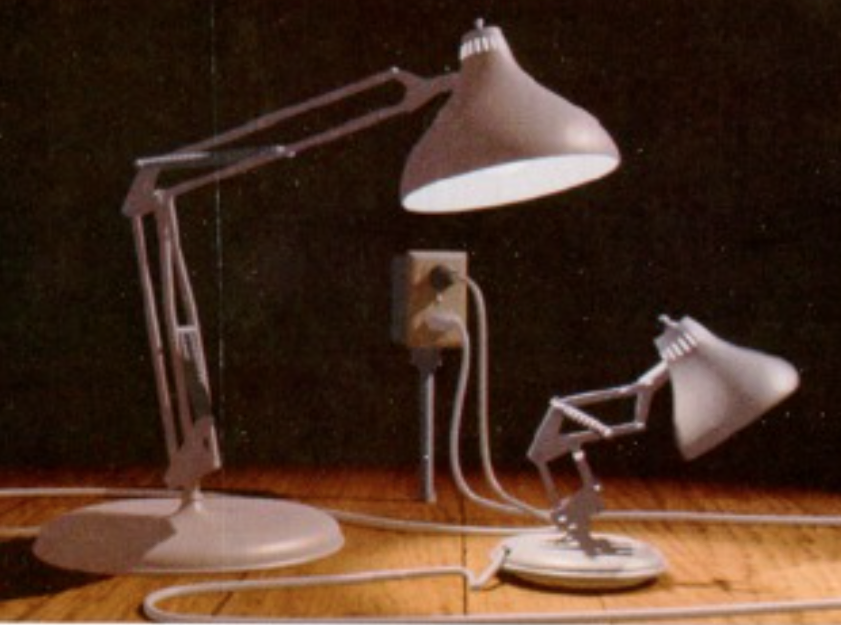
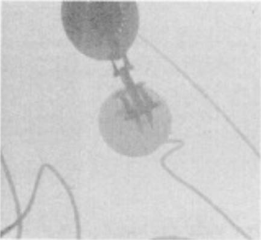
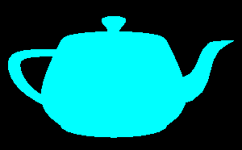
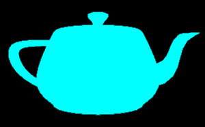

# {{ page.title }}
#### {{ site.author }}

Based on [this CS 307 lecture](https://cs.wellesley.edu/~cs307/lectures/20new.html) which are copyright &copy; Ellen C. Hildreth and licensed under a [Creative Commons BY-NC-SA License](http://creativecommons.org/licenses/by-nc-sa/1.0/). 

<p style="display:none">
\(
\newcommand{\Choose}[2]{ { { #1 }\choose{ #2 } } }
\newcommand{\vecII}[2]{\left[\begin{array}{c} #1\\#2 \end{array}\right]}
\newcommand{\vecIII}[3]{\left[\begin{array}{c} #1\\#2\\#3 \end{array}\right]}
\newcommand{\vecIV}[4]{\left[\begin{array}{c} #1\\#2\\#3\\#4 \end{array}\right]}
\newcommand{\matIIxII}[4]{\left[
    \begin{array}{cc}
      #1 & #2 \\ #3 & #4 
    \end{array}\right]}
\newcommand{\matIIIxIII}[9]{\left[
    \begin{array}{ccc}
      #1 & #2 & #3 \\ #4 & #5 & #6 \\ #7 & #8 & #9
    \end{array}\right]}
\)        
</p>


## Plan

  * Shadow examples
  * Shadow maps
  * Shadows in Three.js
  * Exercise: Town with shadows
  * Anti-aliasing examples
  * Anti-aliased line
  * Anti-aliasing with jitter
  * Anti-aliasing in Three.js

## Why are Shadows Important?

 - Shadows provide important cues to the depth of objects, scene lighting, and contact points between surfaces.
 - Shadows add realism to paintings and to scenes rendered with computer graphics. 

### Depth, lighting, contact




### Depth, lighting, contact




### Realism in painting




### Realism in painting




### Realism in CG




### Realism in CG




## Shadow Maps

  * One common approach to rendering shadows uses a _shadow map_ that captures the points on surfaces in the scene that would be "visible" from the light source.




### Shadow maps

  * You can think of the shadow map as a z-buffer (depth buffer) as seen from the light.
  * Points that are not visible from the light source should appear in shadow from the perspective of the camera.




### Shadow map example

 | 
Scene | Shadow map from luxo mom


### Shadow map example




### Shadow map cost

  * Using a shadow map requires a lot of computation
  * The renderer must make several passes through all of the objects to be rendered
    - one pass for each light to compute the shadow map
    - and a second pass to render the final image, checking the shadow map to see if points are in shadow.

## Adding Shadows with Three.js

Adding shadows to a scene rendered in Three.js involves multiple steps:

  1. The renderer must have the shadow map enabled
  2. Each `THREE.Mesh` object that can cast a shadow onto a background surface must have its `castShadow` property set to `true`
  3. Each `THREE.Mesh` object that can have a shadow cast onto it must have its `receiveShadow` property set to `true`
  4. Finally, the light source also has a `castShadow` property that must be set to `true`. 


### Enable rendered shadow map

```javascript
    var renderer = new THREE.WebGLRenderer();
    renderer.shadowMap.enabled = true;
```

### Enable `Mesh` shadow casting

Each `THREE.Mesh` object that can cast a shadow onto a background surface must have its `castShadow` property set to `true` (it appears that this property doesn't work for the parent `THREE.Object3D` class), for example: 

```javascript
    var ball = new THREE.Mesh(new THREE.SphereGeometry(10),
                              new THREE.MeshBasicMaterial({color: 0xffffff}));
    ball.castShadow = true;
```

### Enable `Mesh` shadow receiving

Each `THREE.Mesh` object that can have a shadow cast onto it must have its `receiveShadow` property set to `true` (surfaces with Lambert and Phong material can receive shadows): 

```javascript
    var plane = new THREE.Mesh(new THREE.PlaneGeometry(100,100),
                               new THREE.MeshPhongMaterial({color: 0xffffff}));
    plane.receiveShadow = true;
```


### Enable light `castShadow`

Finally, the light source also has a `castShadow` property that must be set to `true`. It appears that in our version of Three.js, only `THREE.PointLight` and `THREE.SpotLight` sources can cast shadows, and rendering is not done properly if there are multiple shadow-casting light sources. 

```javascript
    var light = new THREE.SpotLight();
    light.position.set(10,20,50);
    light.castShadow = true;
```


## Exercise: Town with shadows

  * Start from [this codepen](https://codepen.io/asterix77/pen/eYpVKJQ?editors=1010) of a town with a sun, but no shadows
  * Follow steps 1-4 above to add shadows to it (see TODOs in comments)
  * Your final codepen might look like [this](https://codepen.io/asterix77/pen/MWaQXKB)


## Anti-Aliasing

  * _Aliasing_ is the technical term for " jaggies"
  * caused by the imposition of an arbitrary pixelation (rasterization) over a continuous real world.
  * The process of reducing the negative effects of aliasing is referred to as _anti-aliasing_.
  * The following are some examples of the effects of aliasing in graphics and photos, borrowed from Fredo Durand at MIT

### Aliasing example



### Aliasing example



### Aliasing example



### Aliasing example



## Anti-aliased line

  * Suppose we draw a roughly 2-pixel thick blue line at about a 30 degree angle to the horizontal:



  * How do we assign colors to the pixels touched by the line?


### Only color entirely-covered pixels

  * If we only color the pixels that are entirely covered by the line, we get something like this:




### Color at-all covered pixels

  * Similar problem if we color the pixels that are covered by _any_ part of the line:




### Good solution

  * What we want is to color the pixels that are _partially_ covered by the line with a _mixture_ of the line color and the background color
  * proportional to the amount that the line covers the pixel.
  * One way to do this is called "jittering":
    * The scene gets drawn multiple times with slight perturbations ("jittering"), so that 
    * Each pixel is a local average of the images that intersect it. 
  * Generally speaking, you need to jitter by _less than one pixel_.

## Anti-aliasing example

Here are two pictures -- the one on the left lacks anti-aliasing and the one
on the right uses anti-aliasing:

 | 
Not anti-aliased | Anti-aliased

### What to jitter?

  * One problem with anti-aliasing by jittering the objects is that, because of the mathematics of projection,
    * objects that are too far (from the camera) jitter too little 
    * objects that are too close jitter too much 
  * A better technique than jittering the objects is to _jitter the camera_,
    * i.e., to modify the frustum just a little so that the pixels that images fall on are just slightly different.

### Frustum jitter

  * The red and blue cameras differ only by an adjustment to the location of the frustum.
  * The center of projection (the big black dot) hasn't changed
  * So all the rays still project to that point.
  * The projection rays intersect the two frustums at different pixel values, though,
  * So by averaging these images, we can anti-alias these projections.



### Frustum jitter

  * Here's a red teapot, with and without this kind of anti-aliasing
  * This better approach to anti-aliasing works regardless of how far the object is from the center of projection, unlike the object-jitter mentioned earlier.



## Anti-Aliasing in Three.js

  * Modern graphics cards will do a kind of anti-aliasing for you.
  * They typically do [Multi-Sampling Anti-Aliasing](http://alt.3dcenter.org/artikel/multisampling_anti-aliasing/index_e.php).
  * In Three.js, anti-aliasing is a feature of the _renderer:_    

```javascript
    var renderer = new THREE.WebGLRenderer( {antialias: true} );
```

  * Here is our [town with shadows scene with anti-aliasing](https://codepen.io/asterix77/pen/BaoYVYJ?editors=1010)
