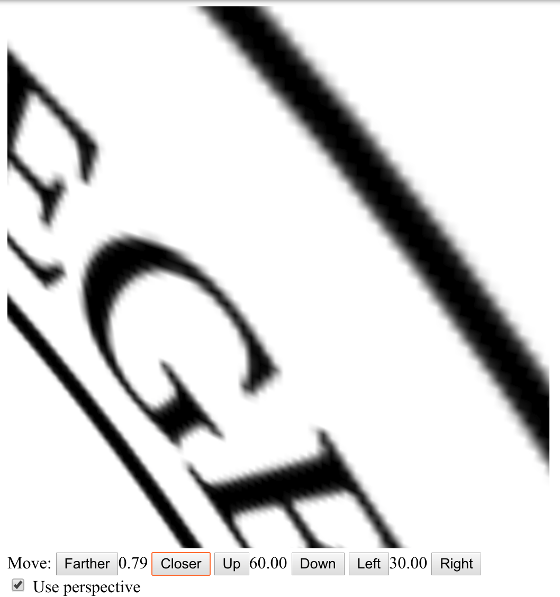

# {{ page.title }}
#### {{ site.author }}

\(
\newcommand{\Choose}[2]{ { { #1 }\choose{ #2 } } }
\newcommand{\vecII}[2]{\left[\begin{array}{c} #1\\#2 \end{array}\right]}
\newcommand{\vecIII}[3]{\left[\begin{array}{c} #1\\#2\\#3 \end{array}\right]}
\newcommand{\vecIV}[4]{\left[\begin{array}{c} #1\\#2\\#3\\#4 \end{array}\right]}
\newcommand{\matIIxII}[4]{\left[
    \begin{array}{cc}
      #1 & #2 \\ #3 & #4 
    \end{array}\right]}
\newcommand{\matIIIxIII}[9]{\left[
    \begin{array}{ccc}
      #1 & #2 & #3 \\ #4 & #5 & #6 \\ #7 & #8 & #9
    \end{array}\right]}
\)        

## Plan

  * Final instructions
  * High-level overview of what we have covered
  * Example problems

## Midterm instructions

  * This is an open-book, open-note exam
  * You may not consult with any other person during the exam
  * The exam will take place on Blackboard
  * You have 24 hours to start the exam and 120 minutes to finish from when you start
  * The exam will be graded out of 100 points, but there are 110 points available, thus there are 10 available bonus points.
  * It is highly recommended that you provide some answer for every question so you can receive partial credit. Unanswered questions will receive 0 points.

## Very high-level course overview 1

  * [JavaScript and canvas drawing](02a-canvas.html)
  * [WebGL Three.js and the Barn](02b-openGlBarn.html)
  * [User controls](03a-controls.html)
  * [Color models](03a-color.html)
  * [Instance transforms](04a-instanceTransform.html)
  * [Nested transforms](04b-nestedTransforms.html)
  * [Geometry and transformations](http://m.mr-pc.org/t/cisc3620/2020sp/lectureGeometry.pdf)
  * [Parametric lines and triangle interpolation](05b-parametric.html)
  * [Cameras](06-camera.html)

### Very high-level course overview 2

  * [Materials and lighting](08-materials.html)
  * [The Phong shading model](08b-materials.html)
  * [Texture mapping 1](10a-textureMapping.html)
  * [Texture mapping 2](10b-textureMapping.html)
  * [Texture mapping 3](10c-textureMapping.html)
  * [Animation, derivative animation](12a-animation.html)
  * [Positional animation](12b-animation.html)
  * [Shadows and anti-aliasing](14-shadows.html)

## Example problems

## Phong lighting

  1. Write down the Phong lighting equation

### Consider this Point

  * Consider a point on the surface of a green object ( \\(k_s = k_d = k_a = [0, 0.5, 0]\\) )
  * with shininess 4
  * illuminated with yellow light (\\(L_s = L_d = L_a = [1, 1, 0]\\) ).
  * The normal vector at this point is [1 1 0 0]
  * the light comes from the direction [0 1 1 0]
  * and the viewer is located at the point [1 1 -1 1].

### Questions

  1. Compute the normalized direction vectors \\(n, \ell, v\\)
  1. Compute the direction the light will be reflected \\(r = 2 (\ell \cdot n) n - \ell \\)
  1. Compute the color contribution from the ambient light
  1. Compute the color contribution from the diffuse light
  1. Compute the color contribution from the specular light
  1. Compute the combined color of this point

## Texture mapping

  What are the texture coordinates for each of the vertices in these shapes?

 | 

## Magnification vs minification

Which of these is magnification and which is minification? How do you know?

 | 

## Global vs local lighting

Which of these scenes shows global lighting and which shows local? Point out 4 cues to global lighting that are not found in the local lighting scene.

 | 

