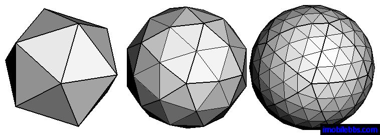
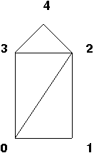

# Introduction to OpenGL/WebGL, Three.js, and the Barn

## Overview

To get started with graphics programming, we need to introduce a number of
important, but somewhat disparate topics. By the end of this reading, you
should be able to understand all of the example code for the barn demo. The
topics we'll cover are:

  * what an API is, and the three APIs we'll use in this class: OpenGL/WebGL, Three.js, and TW 
  * how information is stored and processed in OpenGL 
  * some geometrical objects that we'll want to be able to draw, and how they're defined in OpenGL and Three.js 
  * how to create a simple scene using Three.js and TW  

After all this, we'll finally be ready to read [the code for the
barn.](../demos/Early/barn-tw-documented.shtml)

This reading also contains pointers to additional documentation for Three.js.

## What is an API?

An Application Programmer Interface is a set of programming elements (types,
variables, functions, and methods) that enable some new capability or allow
the programmer to interact with a piece of hardware (such as a robot or a
graphics card).

We have three APIs:

  * **WebGL.** This is a standard graphics API, a subset of the full OpenGL API that is supported by most graphics cards. (I'll use the terms " OpenGL" and "WebGL" interchangeably.) WebGL/OpenGL is about modeling and rendering. The specification is documented in [the online man pages](http://www.khronos.org/registry/webgl/specs/latest/2.0/), but these are difficult to read at best. Fortunately, we will use very little of this directly, because we are using Three.js. 
  * [**Three.js**](http://threejs.org). This is an API built on top of WebGL, doing a lot of the modeling and rendering for you. WebGL is still there, underneath, but we will rarely see it. Three.js is really powerful. It allows you to ignore a lot of detailed technical concepts in Computer Graphics that plain WebGL would force you to know, and the programming is far less work. I think that using Three.js and learning the basic concepts is a good combination for this course. Your JavaScript code might look like this: 
    
        var box_geom = new THREE.BoxGeometry(1,2,3); // width, height, depth
        

  * **TW.** This is Scott Anderson's home-grown API that packages up certain common operations in our Three.js programs. It is layered on top of Three.js  -- a thin layer at that! It does things like setting up a camera for you and allowing you to toggle whether to show the coordinate axes. All of these functions are available in the `TW` object, so your JavaScript code might look like this: 
    
        var box_mesh = TW.createMesh( box_geom );
        TW.cameraSetup( args );
    

Don't worry if you don't yet understand this code. The point is the syntax.

The TW API is written in JavaScript, Three.js and WebGL. You are _always_
welcome and encouraged to read the code in
[libs/tw.js](../libs/tw.js). It may change from time to time,
since it's still under development, but that should be transparent to you.

## The OpenGL Pipeline

The OpenGL API and the graphics card are implemented as a _pipeline_. (Those
of you who have taken a computer architecture course will be familiar with
this term.) What does that mean? It means that your calls to the OpenGL
functions (or to code that eventually calls the OpenGL functions) will often
put data into one end of a pipeline, where they undergo transformations of
various sorts, finally emerging at the other end. The other end of the OpenGL
pipeline is the monitor (or some graphics output device). You can read a lot
more at [Rendering Pipeline
Overview](https://www.khronos.org/opengl/wiki/Rendering_Pipeline_Overview).

**Essentially, we put _vertices_ of objects (and other information about
materials, lights, and the camera) into one end of the pipeline and get image
_pixels_ out the other end.**

Of course, that's not the only thing that happens. Some API functions modify
the pipeline, such as specifying lighting, so that subsequent computations are
modified in different ways.

For efficiency, the pipeline hangs onto some information and other information
just slips through, with only pixels to show for it. That is, some data is
_not_ retained. In particular, _vertices_ are not retained. So, " the barn"
does not exist as far as the rendering pipeline is concerned. If we want to
look at the barn from a different angle, we have to move the camera and render
it again (by "render," I mean send all the vertices down the pipeline again,
converting them to pixels).

In Three.js, we build data structures of vertices and faces, and when the
scene is rendered from a particular viewpoint, the mathematics of the pipeline
is re-executed with these values. The graphics card has memory (called
_buffers_ ) that can be used to retain vertex values and attributes, avoiding
the cost of re-sending the vertices down to the graphics card, which would
otherwise be a performance bottleneck. Three.js does this for us.

## Geometry Data Structures

The simplest things that OpenGL can draw are objects that you're familiar with
from the time you were first able to hold a crayon. However, some of them are
a little different in OpenGL and in Three.js. Also, how they're drawn is,
perhaps, not what you'd think.

  * **Points/Vertices**. These are just _dots_. Mathematically, points have location and nothing else (no area, so no color and so forth). We will use vertices to construct geometrical objects. 
  * **Vectors**. These are _arrows_. Mathematically, vectors have direction and magnitude and nothing else. You can't draw vectors in OpenGL, but they are used a lot. For example, vectors are used to specify the orientation of the camera, the direction of a light ray, and the orientation of a surface that the light is falling on. We won't see any vectors at first, but we'll be getting to them soon. 
  * **Line Segments**. In graphics, we are almost never interested in lines, which are infinite. Instead, we're almost always interested in line _segments_ , defined by their endpoints. A line segment is just a pair of points/vertices. 
  * **Triangles**. For almost any real object, we don't want lines, we want _surfaces_ , and the representation of a surface is often done by breaking it down into triangles (often an enormous number of triangles). One great and important advantage of triangles is that they are _necessarily_ **planar** (flat) and **convex** (no dents), and bad things can happen if you try to draw a polygon that is either non-planar or concave. Those bad things can't happen if you draw triangles. Three.js uses triangles as its universal representation of geometry, even if the API call says that you're building, say, a sphere or a cylinder. The actual representation is a _polygonal approximation_ of the smooth object. You can usually specify the amount of smoothness in the approximation: a sphere built out of 100 tiny triangles will be smoother than one built out of 10 largish triangles, as illustrated in the picture below from the [Programering](http://www.programering.com/) website. Of course, the one with more triangles will take longer to render. Usually, other factors will dominate, though, so be thoughtful, but don't worry too much about performance. In fact, CG experts describe the complexity of a scene in terms of the number of triangles, and graphics cards will sometimes boast about how many triangles they can render per second. 

  * **Polygons**. Just as in graphics, we only draw line segments, not lines, we don't draw planes (which are infinite), we draw _polygons_. Most of the time, though, we'll draw triangles, so we will break up a polygon into some number of triangles. 
  * **Polyhedra**. A polyhedron is a 3D figure made up of vertices, edges and faces. 

## Front and Back of Triangles

Each face, of course, has two sides, just like a coin. One of these is the
_front_ and the other is the _back_. The (default) technical definition of the
front is the side where the specified vertices are in _counter-clockwise_
order. Here, face is defined from the front, and we will use the convention
that the front corresponds to the _outside_ of the barn.

Here's an example from the barn. The front of the barn is a polygon with five
vertices (and, of course, five sides). Here it is, with the vertices numbered
(the numbering is arbitrary; we could have numbered them any way we wanted)
from zero to four:

Because Three.js represents everything as triangles, we break up this polygon
into three triangles. (Again, this is arbitrary -- how many ways can you find
to break up the polygon into triangles?)

We then define a face (a triangle) by listing its vertices, _in counter-
clockwise order from the outside_. So, 4,3,2 is one way to describe the top of
the barn. The triangles 3,2,4 and 2,4,3 are equivalent, but 2,3,4 is _not_ ,
because that would say we are currently looking at the _back_ of the triangle.

This is important because, by default, Three.js only draws the _front_ of
triangles. That is, it skips rendering any back-facing triangles. You can see
how that cuts in half the amount of rendering that has to be done, and at very
little cost. For example, if we're only going to look at the outside of the
barn, there's no reason to ever draw the back side of any of the faces.

Now, as it happens, in this demo I have specified to Three.js that the barn
faces are two-sided, so that Three.js will render both sides. That way, if you
dolly in so that the camera goes inside the barn, you'll be able to see the
"other" side.

If you use the default, efficient setting of one-sided faces and you get your
vertices in the wrong order, those faces will not be drawn -- a strange and
painful problem to debug.

## Normal Vectors

Each face also has an associated vector that is _perpendicular_ to the face,
which mathematicians and computer graphics people call the _normal_ vector.
We'll learn that these are crucial in lighting computations.

The front of the barn lies in the z=0 plane, because all the z coordinates of
its vertices are zero. Therefore, the front of barn has a normal vector that
is parallel to the z axis. (Take a moment to try to visualize this.)

You can also try playing with this [visualization of the coordinate
axes](axisDemo.html) to exercise your intuition.  Check that the following
claims make sense to you:

  1. The red arrow is a vector marking the X axis. 
  2. The green arrow is a vector marking the Y axis. 
  3. The blue arrow is a vector marking the Z axis. (You'll need to move the camera a little to see it -- click and drag to move the camera.) The Z axis initially points towards you, the viewer. 
  4. The axes are all perpendicular to each other. Synonymously, they are all _normal_ to each other. 
  5. The blue vector is the normal vector for the XY plane, which is also the z=0 plane. Similarly, the green vector ("up") is the normal vector for the XZ plane (the "ground"). Finally, the red vector is the normal vector for the YZ plane. 

Fortunately, Three.js can compute normal vectors for us. Eventually, we'll
learn how to do this as well.

## Points and Vectors in Three.js

If we choose a suitable origin and coordinate system (more about origins and
coordinate systems later), we can define a point in 3D space with just three
numbers. We can also define vectors with just three numbers. Consider the
following four objects:

> P = (1, 5, 3)  
>  Q = (4, 2, 8)  
>  v = P-Q = (-3, 3, -5)  
>  w = Q-P = (3, -3, 5)  
>

P and Q are points in space.  A vector can be thought of as an arrow between
two points or even as a movement from one to the other. Therefore, the vector
v from Q to P is just P-Q (subtract the components, respectively). The vector
w, from P to Q, is just the negative of vector v. In 3D, both points and
vectors are represented as a triple of numbers.

How do we specify points and vectors to Three.js? Here's an example:

    
    
      var P = new THREE.Vector3(1,2,3);
    

The authors of Three.js only defined a `Vector3` class, which we'll use for
both points and vectors. However, they are different concepts, so we will
continue to use the term "point" for the locations of vertices and the term
"vector" for directions of rays.

## Drawing in Three.js

How do we draw stuff in Three.js? It's a two-step process: we _represent_
something and then we _render_ it.  So how do we _represent_ stuff in
Three.js? For example, how would we represent the barn that we saw on the
first day of class? To answer that, we need to learn some non-obvious Three.js
terminology:

<dl>
<dt>Geometry</dt>
<dd>is a structure of vertices and faces and associated geometrical information, such as the vectors that specify the orientations of faces.</dd>
<dt>Material</dt>
<dd>is a set of properties that directly or indirectly specify the color of the object. The colors of the faces can be set directly by the material (such as, "this face is red"), or indirectly ("this face interacts with light in the following ways ..."). We'll learn more about materials that interact with light a bit later.</dd>
<dt>Meshes</dt>
<dd>A geometry is combined with a material to yield a _mesh_ , which then has enough information to be rendered. </dd>
</dl>

So, in Three.js, we'll build a _geometry_ object, combine it with some
material, and add it to the scene. Later, we'll learn about how scenes are
rendered. Building a geometry looks like this:

    
    
        var barnGeometry = new THREE.Geometry();
        // add the front
        barnGeometry.vertices.push(new THREE.Vector3(0, 0, 0));
        barnGeometry.vertices.push(new THREE.Vector3(30, 0, 0));
        barnGeometry.vertices.push(new THREE.Vector3(30, 40, 0));
        ...
        // front faces
        barnGeometry.faces.push(new THREE.Face3(0, 1, 2));
        barnGeometry.faces.push(new THREE.Face3(0, 2, 3));
        barnGeometry.faces.push(new THREE.Face3(3, 2, 4));
        ...
    

The above code just shows a snippet of the construction of the barn geometry,
for three of the ten vertices that define the 3D structure of the barn, and
three triangular faces on the front of the barn.

## Coordinates

Because we're using 3D models, all of our vertices will have 3 components: X,
Y, and Z. You can set up your own camera anywhere you want, but initially the
camera is such that X increases to the right and Y increases going up.  The Z
coordinate increases towards you, so things farther from you in the scene have
smaller Z components or even negative ones. When we read the code for the
barn, you'll see that the front of the barn is at Z=0 and the back is at
Z=-len, when len is the length of the barn.

In OpenGL, our coordinates can have (pretty much) any scale we want. For
example, you could have all your X, Y, and Z coordinates be between 0 and 1.
Or you could have them all be between 1 and 100. Or between -1000 and +1000.
Furthermore, these numbers can mean anything you want, so your coordinates can
be in millimeters, kilometers or light years. So if you're imagining a real
barn, perhaps the numbers are in feet or meters.

The TW module can set up the camera for you if you tell it the range of your
coordinates, called the _scene bounding box_. (This camera is often a bit too
far for good realism, but is helpful for debugging.)

## Creating a Simple Scene with Three.js and TW

Our introduction to the barn geometry began with specifying the coordinates of
vertices that define its 3D structure. Fortunately, Three.js has a number of
built-in geometries for common objects such as planes, boxes, spheres, and so
on. To see how a simple webpage can be constructed that contains graphics
created with Three.js and TW, view the source code for this [Scene with a
Box](basicBox.html). The `<head>` section, also shown below, specifies a
canvas style and loads three JavaScript code files. The first JS code file is
version 80 of the Three.js library and the second provides additional
functions to control the camera view with your mouse. (The current (September
2018) version of Three.js that is available online is version 90, but we will
use version 80 of the library for class demos and for your work this fall.)
The third JS code file loaded by this page is the Fall 2016 version of Scott
Anderson's TW module, which we will use this fall.

    
    
    <!doctype html>
    <html>
    <head>
        <meta charset="utf-8">
        <title>Basic Box</title>
        
        
        
        
    </head>
    <body>
      ...
    </body>
    </html>
    

Inside the `<body>` section of the page, you'll see a header and JavaScript
code to create the scene:

    
    
    <h1>Scene with a Box</h1>
    
    
    

The key elements include:

  * a `THREE.Scene` object that is a container used to store all the objects and lights for the scene we want to render 
  * a 3D object in the scene with a _geometry_ that is a built-in `THREE.BoxGeometry` and surface _material_ created by the `TW.createMesh()` function. This object is added to the scene using the `add()` method 
  * a `THREE.WebGLRenderer` object that will use your graphics card to render the scene 
  * a call to `TW.mainInit()` that performs the operations described in the comments 
  * a call to `TW.cameraSetup()` that creates a camera to view the scene. The third argument specifies the _scene bounding box_ , the range of x,y,z coordinates for a virtual box that encompasses the scene to be viewed. 

Note that the box, by default, is centered on the origin of the 3D coordinate
frame, which you can see if you view the axes by typing the 'a' key. The scene
bounding box is slightly larger than the box itself, which you can see by
typing the 'b' key. Drag your mouse over the figure to move the camera view.

You can imagine creating a much more complex scene, by adding more stuff to
the `scene` object.

## The Barn Code

We're now ready to understand the code for [the barn
demo](../demos/Early/barn-tw-documented.shtml). Click on the link to
view a page that includes the rendered barn and the JavaScript code that
created it. Carefully read through the code and comments (both the comments in
the code and the additional text on the webpage). Note that there isn't a lot
of complex JavaScript coding here. Most of the functions are just straightline
code, calling other functions. We don't even (yet) have any loops or
conditionals!

## Learning More Three.js

We'll learn much more Three.js over the semester, and most of what you need to
know will be covered in the online readings and lecture notes for the course.
Other sources include:

  * Book by Jos Dirksen, [ _Learning Three.js: The JavaScript 3D Library for WebGL, Third Edition_](https://www.packtpub.com/web-development/learn-threejs-third-edition). [This github repo](https://github.com/josdirksen/learning-threejs-third) contains Dirksen's code for all the examples in his book, and [this github repo](https://github.com/josdirksen/learning-threejs) contains all of the examples from the second edition of the book. Here are a few examples to give you a taste (do not worry about understanding the code at this point): 
    * [02-first-scene.html](https://github.com/josdirksen/learning-threejs-third/blob/master/src/chapter-01/02-first-scene.html)
    * [03-materials-light.html](https://github.com/josdirksen/learning-threejs-third/blob/master/src/chapter-01/03-materials-light.html)
    * [04-materials-light-animation.html](https://github.com/josdirksen/learning-threejs-third/blob/master/src/chapter-01/04-materials-light-animation.html)
  * [Online Three.js documentation](https://threejs.org/docs/index.html#manual/introduction/Creating-a-scene) -- this is more of a reference source than a tutorial, but includes many code examples and links to the Three.js source code on GitHub. The online course notes contain many links to specific documentation pages. 
  * At times, we may need to resort to posting questions on [StackOverflow](http://stackoverflow.com/tags/three.js/info). 

### Source

This page is based on <https://cs.wellesley.edu/~cs307/readings/02-OpenGL-Barn.html>. Copyright &copy; Scott D. Anderson. This work is licensed under a [Creative Commons License](http://creativecommons.org/licenses/by-nc-sa/1.0/). 
