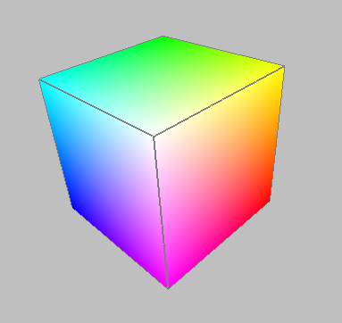

  <script type="text/x-mathjax-config">
    MathJax.Hub.Config({
       tex2jax: {inlineMath: [['$','$'], ['\\(','\\)']]}
    });
  </script>

# Color Models and Parametric Lines

Several color models are common in CG. We'll go over all of these in the
second half of this reading; for this half, we'll focus on RGB.

  * RGB: Red, Green, Blue. This is what OpenGL uses; other color models are translated into it. 
  * CMYK: Cyan, Magenta, Yellow, Black. This is a subtractive color system that is used for color printing, such as inkjets. 
  * HSV: Hue, Saturation, Value. This model is closer to the way humans think about color. For example, "hue" is like the color wheel that we're familiar with from elementary school art. The color wheel is a 2D cross-section of a cone. 
  * HSL: Hue, Saturation, Lightness. This model is very similar to HSV, except that instead of a single-hexcone, colors are represented in a double-hexcone. Three.js has support for HSL, so we'll use it instead of HSV. 

## Color Vision

Our retinas have rod-shaped cells that are sensitive to all light, and cone-
shaped cells that come in three kinds: red-sensitive, green-sensitive, and
blue-sensitive. Analogously, there are three (additive) primary colors: Red,
Green, and Blue, or RGB. All visible colors are seen by exciting these three
types of cone cells in various degrees. (Take a look at the Wikipedia page on
[Trichromacy](http://en.wikipedia.org/wiki/Trichromacy) for a good
introduction.) The consequence is that almost any color can be mimicked by
combining some amount of Red, some amount of Green, and some amount of Blue.

Color monitors and TV sets use RGB to display all their colors, including
yellow, chartreuse, you name it. If we imagine that the amount of a primary
color (Red, Green, or Blue) is measured by a number from 0 to 255 inclusive,
we can represent a color by a triple of numbers, such as (255,0,0), which is
pure Red, and so forth. Here are some more interesting examples:

<UL>
<LI><FONT COLOR="#6495ED">Cornflower = 100 149 237</FONT></LI>
<LI><FONT COLOR="#FFD700">Gold = 255 215 0</FONT></LI>
<LI><FONT COLOR="#1E90FF">DodgerBlue1 = 30, 144, 255</FONT></LI>
</UL>

You can find more examples of these in any of the zillions of color reference
pages on the web.

## Demo: RGB Color Cube<a name="colorCube"></a>

The RGB color system is three-dimensional. That is, you can think of it as a
cube with three perpendicular axes: Red, Green, and Blue. Because of the way
our eyes work, that is sufficient to capture nearly every color.

Here's [ an example of a color cube, built in
Three.js](../demos/Color/colorcube.html). You can rotate it by
dragging with the mouse.

<div id="rgb-cube"></div>

<script>
(function () {
    var scene = new THREE.Scene();
    var colorcube = TW.createColorCube();
    scene.add(colorcube);
    var renderer = new THREE.WebGLRenderer();
    TW.mainInit(renderer,scene, {parentID: 'rgb-cube'});
    TW.cameraSetup(renderer,
               scene,
               {minx: 0, maxx: 1,
                miny: 0, maxy: 1,
                minz: 0, maxz: 1});
    TW.viewFromAboveFrontSide();
})();
</script>

A screenshot from an earlier version:

> 

In the picture above, the red vertex is color (1,0,0): 1 on the red axis and
zeros elsewhere. The green vertex is color (0,1,0) and the blue vertex is
color (0,0,1). These are the _primary_ colors. Often, we **normalize** the RGB
coordinates to [0-1]. You can think of it as a fraction of the maximum
intensity. In the color cubes above, I made the red axis the same as the x
axis, the green axis the same as the y axis, and the blue axis the same as the
z axis.

The magenta vertex at the bottom is color (1,0,1). The cyan vertex is (0,1,1).
The yellow vertex is (1,1,0). These are the _secondary_ colors.

The white vertex in the center is color (1,1,1). The black vertex that we can
see if we drag the WebGL color cube around is color (0,0,0).

Others of the millions of colors correspond to points in the interior of the
cube. For example, Cornflower might be represented as:

> R = 100/255 = 0.39  
>  G = 149/255 = 0.58  
>  B = 237/255 = 0.93  
>

As you may know, integer division in C and in Python yields an integer result,
so all the fractions in the example above evaluate to _zero_ -- hardly useful.
Instead, we need to explicitly use floating point values. One way is to enter
the values with decimal points:

> R = 100.0/255.0 = 0.39  
>  G = 149.0/255.0 = 0.58  
>  B = 237.0/255.0 = 0.93  
>

Fortunately, integer division is not an issue with JavaScript, so you don't
have to worry about it, but this trick of using decimal points is good to
remember.

Thought questions (see answers at the end of this reading):

  * How do we make navy blue? 
  * How do we make pink? 

For more information, consult the [Wikipedia article on
RGB](http://en.wikipedia.org/wiki/RGB_color_model).

## Specifying RGB Colors in Three.js

Three.js has a [Color](http://threejs.org/docs/#api/math/Color) class that
allows you to enter colors in a variety of ways:

    
```javascript
// hexadecimal number, one byte per primary
var red1 = new THREE.Color( 0xff0000 );  

// color cube: 0-1 for each of 3 dimensions
var red2 = new THREE.Color( 1, 0, 0 );   

// CSS string, 0-255 for each of 3 dimensions
var red3 = new THREE.Color( "rgb(255,0,0)" );  

// CSS color name 
var red4 = new THREE.Color( "red" );     

// Three.js keyword
var red5 = new THREE.Color( THREE.ColorKeywords.red ); 

// those are all the same:
alert(red1.equals(red2) && red2.equals(red3)
      && red3.equals(red4) && red4.equals(red5));

// conversions
alert("red5 Numeric value: " + red5.getHex())
alert("red5 Hex String: " + red5.getHexString());
```

The
[THREE.ColorKeywords](https://github.com/mrdoob/three.js/blob/master/src/math/Color.js)
object is a huge table of named color values (142).

## Demo: Red Barn

We can use any of these color specifications to make a [ red
barn](../demos/Early/barn-color1.html), for example.

In a previous reading, you learned that a _Geometry_ is combined with a
_Material_ to yield a _Mesh_ that can then be added to the Scene object to be
rendered. The code for the [original barn](../demos/Early/barn-tw-
documented.shtml) used the `TW.createMesh()` function to construct a Mesh with
differently colored materials for the faces of the barn.

In the JS code for the red barn example, the previous call to
`TW.createMesh()` is replaced with the following code:

    
```javascript
function createBarnMesh (barnGeometry, barnColor) {
    var barnMaterial = new THREE.MeshBasicMaterial( {color: barnColor} );
    // create and return a Mesh using the barnGeometry and barnMaterial
    return new THREE.Mesh( barnGeometry, barnMaterial );
}

var barnMesh = createBarnMesh( barnGeometry, THREE.ColorKeywords.red );
```    

In the `createBarnMesh()` function, a new `THREE.MeshBasicMaterial` is created
for the particular input color. Note the syntax of the input to this
constructor, which is an object that specifies the color as a property. The
Geometry and Material objects for the barn are then used to create a
`THREE.Mesh` object that is returned. In the call to the `createBarnMesh()`,
the color red is specified using `THREE.ColorKeywords`, but any of the
following forms of the color input also work:

    
```javascript
var barnMesh = createBarnMesh( barnGeometry, new THREE.Color( 0xff0000 ) );
var barnMesh = createBarnMesh( barnGeometry, new THREE.Color( 1, 0, 0 ) );
var barnMesh = createBarnMesh( barnGeometry, new THREE.Color( "rgb(255, 0, 0)" ) );
var barnMesh = createBarnMesh( barnGeometry, new THREE.Color( "red" ) );
```    

You'll notice that the red barn lacks "depth cues" because there's no shading.
Later, we'll learn about materials that interact with light to produce nice
shading.

## Demo: Multi-Color Barn

In principle, each _face_ (triangle) of a Three.js Geometry object can have a
different color. Setting it up is a bit more complicated than what we have so
far, because we need to specify a color for each face. There are essentially
two parts to the change:

  * We supply an _array (list) of colors_ for the object. This array is used to create an instance of `THREE.MeshFaceMaterial`. To be precise, each color is used to create a `THREE.MeshBasicMaterial`, and the _array of Materials_ is supplied to `THREE.MeshFaceMaterial`. 
  * Each _face_ of our geometry object has an instance variable that is an _index_ into the array of Materials, specifying which color applies to this face. This index is called the `materialIndex`, and is a property of the `THREE.Face3` object. It can be specified when you create a `Face3` object, or you can set it after the fact, for example: 

    ```javascript
    barnGeometry.faces[0].materialIndex = 1;
    ```    

Here is the [multi-colored barn](../demos/Early/barn-colors.html) in
action. Move the camera to see the different face colors.

Here is the new definition of the `createBarnMesh()` function:

    
```javascript
function createBarnMesh (barnGeometry) {
    // create four colors for the faces of the barn
    var endColor = THREE.ColorKeywords.blue;
    var sideColor = THREE.ColorKeywords.red;
    var roofColor = THREE.ColorKeywords.orange;
    var floorColor = THREE.ColorKeywords.gray;

    // construct THREE.MeshFaceMaterial from array of THREE.MeshBasicMaterial 
    // instances created from the four colors
    var barnMaterials = new THREE.MeshFaceMaterial (
      [ new THREE.MeshBasicMaterial( {color: endColor} ),
        new THREE.MeshBasicMaterial( {color: sideColor} ),
        new THREE.MeshBasicMaterial( {color: roofColor} ),
        new THREE.MeshBasicMaterial( {color: floorColor} )
      ]);

    // set the material index for each of the 16 triangular faces
    var endIndex = 0, sideIndex = 1, roofIndex = 2, floorIndex = 3;
    TW.setMaterialForFaces(barnGeometry, endIndex, 0, 1, 2, 3, 4, 5); // ends
    TW.setMaterialForFaces(barnGeometry, roofIndex, 6, 7, 8, 9); // roof
    TW.setMaterialForFaces(barnGeometry, sideIndex, 10, 11, 12, 13); // sides
    TW.setMaterialForFaces(barnGeometry, floorIndex, 14, 15); // floor

    // create and return a Mesh using the barnGeometry and barnMaterials
    return new THREE.Mesh(barnGeometry, barnMaterials);
}

var barnMesh = createBarnMesh( barnGeometry );
```    

Note the square brackets around the four `THREE.MeshBasicMaterial` objects
that form the input to the `THREE.MeshFaceMaterial` constructor, placing them
in an array. The code also uses a TW function `TW.setMaterialForFaces()` to
set the material index of several faces at once. For example, if faces 0-5 are
all material `m`, our code would be a tedious repetition of assignment
statements like this:

    
```javascript
barnGeometry.faces[0].materialIndex = m;
barnGeometry.faces[1].materialIndex = m;
barnGeometry.faces[2].materialIndex = m;
barnGeometry.faces[3].materialIndex = m;
barnGeometry.faces[4].materialIndex = m;
barnGeometry.faces[5].materialIndex = m;
```

Instead, we can say this:

    
```javascript
TW.setMaterialForFaces(barnGeometry, m, 0, 1, 2, 3, 4, 5);
```    

You may want to look back at the definition of [
`TW.createBarn()`](../demos/Early/barn-tw-documented.shtml) to see how
the faces were set up, or you could trust me that I got the indexes correct in
the above code. Also note that the colors and associated indexes are given
individual variable names, e.g. `endColor` and `endIndex`, but this is not
essential.

If pretty much every face has a different color (material index), you might
just decide to have the array of materials be the same length as the array of
faces (possibly with some repetitions), and match them up one-to-one. If you
decide to do this, you can use the `TW.setMaterialForFaces11()` function,
which does the following:

    
    
    

## Coding Colors

One thing to consider is coding technique and how to name your variables. It
seems intuitive to use a variable like `cornflower` above to hold an instance
of `THREE.Color()` with the values for cornflower, and then use that variable
whenever you want something that color, such as the sky or a barn. But suppose
that later, you want to make the sky a bit darker or the barn green. You could
find all the places in your program where you use the `cornflower` variable
and replace it with a variable name for a different color, _or_ you could
adjust the values in the variable. But then `cornflower` doesn't mean
cornflower any more, which is very weird.

An alternative is to name the variable by what its _purpose_ or _use_ is. Such
as:

    
```javascript
var skyColor = new THREE.Color( 0.39, 0.58, 0.93 ); // use cornflower for the sky
```    

Later, if you decide to change the color of the sky, you can change the
definition of `skyColor` and everything adjusts correctly. This is a powerful
idea.

You can even combine these approaches, by defining some of the colors you will
use and then assigning them to various uses:

    
```javascript
var cornflower = new THREE.Color( 0.39, 0.58, 0.93 );
var skyColor = cornflower;  // use cornflower for the sky
...
```

## Smooth and Flat Shading

There is special software for the graphics card for computing the color of a
"fragment" (such as a triangle). This software is called the _shader_ , and
modern OpenGL programming allows you to write code for the shader.
Fortunately, the Three.js software writes these shaders for us.

When shading a fragment where the vertices are different colors, the shader
has two choices:

  * _flat_ shading: only one color is used, the color of one of the vertices. All the pixels get the same color. 
  * _smooth_ shading: interpolate the color between vertices. Note that only triangles are reliable for smooth shading, because of the hardware support (quads (four-sided facets) can be broken into triangles in different ways, leading to ambiguity in smooth shading), which is another reason why Three.js uses triangles for all its geometry. 

## Parametric Equation for a Line

To learn how WebGL/OpenGL does this linear interpolation, we first have to
understand how OpenGL represents lines. It uses **parametric equations**.
Suppose we want to define a line from point A to point B. (Points A and B
could be in 2D or 3D; everything works the same.) The _vector_ from A to B we
will call **v**. All the following are equivalent:

> P(t) = A + vt  
>  P(t) = A + (B-A)t  
>  P(t) = A(1-t) + B*t  
>

All of these equations generate a point on the line given the value of t. The
parameter t can be any real number. Any value of t generates a point on the
line. Thus, the 3D line is like the number line, with t=0 at A and t=1 at B.

The first equation form, above, defines the line using point A and a _vector_
, v. Thinking visually, A is a dot and v is an arrow: point A is the starting
point and vector v is the direction. For example, A might be "the center of
Boston Common," and v might be "north" or "south by south west." If you start
at A and go in direction v, your path will be a line. If we imagine that you
start at A at time 0 and you move with constant velocity, any point on the
line is defined just by the time. For example, P(4.5) would be your location
4.5 hours after you started.

The second equation uses two points, A and B, and substitutes B-A for the
vector v. This is because one way to define a vector is to subtract two
points. For example, if point B is "Logan Airport," we can define a line from
point A to point B and we only implicitly know the compass heading, but we
know that we're heading directly to the airport (as the crow flies).
Interestingly, because of the way the vector is defined, we know we'll reach
the airport exactly when t=1. As with the first form of the equation, any
value for t generates exactly one point on the line.

The third form of the equation is just a bit of algebraic rearrangement of the
second form. It emphasizes the idea that any point on the line segment from A
to B can be defined as a mixture of A and B in some proportion. The midpoint
is a 50/50 mixture (a parameter value of 0.5), but a 25/75 mixture is a point
three fourths of the way towards B. (The greater the proportion of B, the
closer we are to B.)

We can define lines that go through the same points but that have different
equations. For example, a line from B to A. In that case, the equation looks
like:

> Q(s) = B + (A-B)s

With this line, s=0 is at B and s=1 is at A, so the line starts at B and goes
through A. It generates the same points as P(t), but the interpretation of the
parameter is different. In this case, the parameter goes in the opposite
direction. (Someone driving on route 95 from Boston to New York City drives
the same road as someone driving on route 95 from New York City to Boston, so
it's the same line, but a different journey.)

## Parametric Line Metaphor: Bug Paths



The math above works fine, but might be a little dry. Let's explore some
metaphors for parametric equations. To start with, consider the picture in
Figure 1. The coordinates of the points are:

  * A = (2,2)
  * B = (4,3)
  * C = (8,5)

Suppose we have an ant crawling along the line. The ant starts at point A at
time 0 and proceeds in a determined, steady, ant-like way to the upper right,
arriving at B at time 1. Let's measure time in minutes and position in meters.
We can say that

  1. The ant is moving along the vector V=B-A=(2,1). This means it's moving to the right twice as fast as it's moving up: the slope of the line is 1/2. 
  2. The parametric equation of the line is P(t)=A+V*t. 
  3. The ant's height as a function of time is y(t)=2+t, because it starts at A at time 0, and A's height is 2, and the ant's height increases at 1 meter per minute. 
  4. The ant's horizontal position as a function of time is x(t)=2+2t, because it starts at A at time 0 and A's x coordinate is 2, and the ant's x coordinate increases at 2 meters per minute. 
  5. The points A and B differ by 2 along the x direction and by 1 along the y direction. Their total distance is sqrt(22+12) or sqrt(5). 
  6. The ant's velocity along the line is sqrt(5) meters per minute. Sqrt(5) is the distance between A and B, and also the length of the velocity vector, since the way that we defined the parametric equation means that, by definition, the ant takes 1 time unit to get from A to B. That's because P(0)=A and P(1)=B. 

Suppose we have a different bug, maybe a beetle, that starts at B at time zero
and gets to C at time 1. We can make corresponding observations:

  1. The beetle is moving along the vector W=C-B=(4,2). This means that, like the ant, it's moving to the right twice as fast as it's moving up. The velocity vector of the beetle, W, is exactly twice that of the ant, V, so the beetle is moving twice as fast as the ant. 
  2. The parametric equation of the line is Q(t)=B+W*t. 
  3. The beetle's height as a function of time is y(t)=3+2t, because it starts at B at time 0, and B's height is 3, and the beetle's height increases at 2 meters per minute. 
  4. The beetle's horizontal position as a function of time is x(t)=4+4t, because it starts at B at time 0 and B's x coordinate is 4, and the beetle's x coordinate increases at 4 meters per minute. 
  5. The points B and C differ by 4 along the x direction and by 2 along the y direction. Their total distance is sqrt(42+22) or sqrt(20). Note that sqrt(20)=2*sqrt(5), which isn't too surprising, since C is twice as far from B as A is. 
  6. The beetle's velocity along the line is sqrt(20) meters per minute. Sqrt(20) is the length of the velocity vector and the distance between B and C. Once again Q(0)=B and Q(1)=C. 

But wait, you say. These stories of ants and beetles are all very good, but
_it's the same darn line_. Are there two different equations for this one
line?

Yes. One feature of parametric equations is that there are infinitely many
equations for a particular line. We can choose one that is convenient for the
problem we want to solve and the points we are given. Also, we can ask
questions like:

> Suppose a centipede starts at C at time 0 and gets to A at time 1. At what
time does it meet (and eat) the ant? Where does this gruesome event occur?

Before we answer that question, let's look at another situation, this with two
lines:



We now have two lines, the cyan one and the magenta one. We can see that they
intersect, but where? Do the bugs meet? Convince yourself of the following:

  * The cyan line has an equation like: 

> P(t) = A + (B-A)t  
> P(t) = (2,2)+(2,1)t

  * The magenta line has an equation like: 

> Q(s) = D + (E-D)s  
> Q(s) = (9,1)+(-2,2)s

  * The lines meet at (6,4). You can decide that just by looking at the graph. Later, we'll learn how to solve problems like this. 
  * The parameter on the cyan line is t=2 and, substituting t=2 into the earlier equation for P(t), we see: 

> P(2) = A + (B-A)2  
> P(2) = (2,2)+(2,1)2  
> P(2) = (6,4)

  * Similarly, the parameter on the magenta line is s=1.5 and, substituting s=1.5 into the earlier equation for Q(s), we see: 

> Q(1.5) = D + (E-D)(1.5)  
> Q(1.5) = (9,1)+(-2,2)(1.5)  
> Q(1.5) = (6,4)

  * Because P(2)=Q(1.5), that means the lines do intersect at that point (the value of both the left and right hand sides of the equation). 
  * The parameters are not equal, which means that the bugs arrive at the intersection point at different times, so they don't collide. 

In a way, I find the parameter somewhat reassuring, because a line is,
intuitively, a one-dimensional thing, so a single, one-dimensional number
should be sufficient for specifying a location on the line. That's exactly
what the parameter does: it specifies where on the line a point is.

## Parametric Line Metaphor: Mixtures

Forget about bugs crawling through a 2D Cartesian grid, or even flying through
a 3D Cartesian space. Let's think about parametric lines in a different way,
namely as a _weighted average_ or as a _mixture_.

To start, I'm going to repeat figure 1, now as figure 3:



Let's think about a line from A to C:

> P(t) = A + (C-A)t  
>  P(t) = A + Ct - At  
>  P(t) = A(1-t) + Ct

Intuitively, the point B is 1/3rd of the way from A to C, so we can make the
following observations:

  * B = (4,3) 
  * The parametric equation evaluated at 1/3 gives us B: 

> P(1/3) = A(2/3) + C(1/3)  
>  P(1/3) = (2,2)(2/3) + (8,5)(1/3)  
>  P(1/3) = (4/3,4/3) + (8/3,5/3)  
>  P(1/3) = (12/3,9/3)  
>  P(1/3) = (4,3)  
>

  * We can view the following equation as a weighted sum: there's a weight on A and a weight on C, and we multiply the points by the weights and then add: 

> P(1/3) = A(2/3) + C(1/3)  
>

  * The weight on A is twice the weight on C, and the point B is twice as close to A as it is to C. That's why we used 2/3 as the weight instead of 1/3. 

Thus, points on the line segment from A to C can be viewed as weighted
averages of the two endpoints. For example, if a course's grade depends only
on a midterm and a final, and the final counts twice as much as the midterm,
you'd compute the course grade as:

> grade = midterm*(1/3) + final*(2/3)

That's exactly the kind of equation we have for this line!

We can also think of the points on the line segment as different _mixtures_ of
the endpoints. For example, when cooking rice, we need to get the right
balance of rice and water. If the point A represents 100% water and the point
C represents 100% rice, the parameter of any point on the line segments
represents a ratio of rice to water.

The point B has a parameter of 1/3, so that means it's a mixture of 2/3 of A
(the water) and 1/3 of C (the rice). Remember the parameter and the weights
are inversely related: the parameter tells how far we are from the starting
point, and the weight is proportional to how near we are to an endpoint.

  * Rice made in a 2:1 proportion of water to rice (point B) will be good. 
  * Rice that has too much water (the segment from A to B) will be runny and yucky. 
  * Rice that has too little water (the segment from B to C) will be crunchy and unpalatable. 

Note that the "mixture" metaphor doesn't work so well for points on the line
but outside the line segment (110% rice and -10% water?), but it works very
well for points on the interior of the line segment, and computer graphics is
usually more concerned with line segments than infinite lines. So this is a
useful metaphor.

In particular, if points A and C are different colors and the line segment is
being drawn with interpolated color, the points on the line segment can be
colored using the mixture idea. If A is red (1,0,0) and C is green (0,1,0),
the point B will be:

> B = A(2/3) + C(1/3)  
>  B = (1,0,0)(2/3) + (0,1,0)(1/3)  
>  B = (2/3,1/3,0)

## 3D Parametric Line Example

Suppose we want a line from A through B, with:

> A = (1,2,3)  
>  B = (2,5,1)

We can write down the following equations:

> P(t) = A+(B-A)t  
>  P(t) = (1,2,3)+(1,3,-2)t  
>  P(t) = (1+t, 2+3t, 3-2t)  
>

The last equation gives another way to think about parametric equations: by
introducing a parameter (in this case, "t"), we write an equation that
generates each coordinate independently. The equations in this example are:

> x(t) = 1+t  
>  y(t) = 2+3t  
>  z(t) = 3-2t  
>

This makes it easy to see why parametric equations work so well in 3D: each
spatial coordinate (x, y, and z) is generated by a simple linear function of
just a single parameter, namely t. None of this y=mx+b stuff that doesn't work
in 3D.

## Features of Parametric Equations of Lines

Why are parametric equations so cool???

  * No special cases! Unlike "y=mx+b," which we all learned in high school, parametric equations work just fine for all lines. (Where does "y=mx+b" fail?) 
  * They work in 3D! Each coordinate gets its own equation! 
  * Lines and segments have **direction** , because vectors do. This is useful for rays of light, for example. 
  * Special values of t: 0, 1, between 0 and 1. For example, if you know that the parameter of a point on line from A to B is t=0.3, you know that the point is _between_ A and B, and is closer to A. 
  * We can think of this as a mixture (that is, as a _convex sum_ or a _weighted average_ ) of the endpoints. So, if one vertex is red and the other is yellow, all the points on the line segment connecting them are mixtures of red and yellow in different proportions. 

## Example: Finding a Point on a Parametric Line

Problem: Find the coordinates of a point 2/3 of the way from A=(2,3,4) to
B=(5,9,1)

Solution: Since the point is 2/3 of the way from A to B, our parameter is 2/3
and our starting point is A. Our vector v is (B-A).

> v = B-A = (5-2, 9-3, 1-4) = (3,6,-3)  
>

Now, we can substitute into our equation and solve

P(2/3)| = A+v(2/3)  
---|---  
 | = (2,3,4) + (3,6,-3)(2/3)  
 | = (2,3,4) + (2,4,-2)  
 | = (4,7,2)  
  
So, the point 2/3 of the way from A to B has coordinates (4,7,2). Done!

Note that we could have solved this problem slightly differently, using the
mixture equation. We compute a mixture of two parts B to one part A:

P(2/3)| = A(1/3)+B(2/3)  
---|---  
 | = (2,3,4)(1/3) + (5,9,1)(2/3)  
 | = (2/3,1,4/3) + (10/3,6,2/3)  
 | = (4,7,2)  
  
This may seem weird at first, because we're using a weight of 1/3 on A and a
weight of 2/3 on B, but the point is closer to B, so the weight on B has to be
greater.

Problem: Suppose that vertex A is red (1,0,0) and vertex B is magenta (1,1,0).
What is the color of the point that is 2/3 of the way from A to B?

Solution: We can use the same mixture equation that we just used to find
coordinates:

> P(2/3) = A(1/3) + B(2/3)  
>  P(2/3) = (1,0,0)(1/3) + (1,1,0)(2/3)  
>  P(2/3) = (1,2/3,0)  
>

**Note** if a problem calls for more than one line, each line gets its own
parameter, such as r, s, or u. This makes sense because the parameters have
meaning: t=0 means the initial point of the line, so s=0 would be the initial
point of the other line.

## Summary

These are the main points from the reading:

  * Color in computer graphics is almost always done in RGB. Other systems convert to RGB. 
  * It's straightforward in Three.js to combine a geometry with a material that is a single color, namely `THREE.MeshBasicMaterial`
  * It's a bit trickier, but you can also use Three.js to combine a geometry with a material where each face gets its own color, indexing into an array (list) of colors in the `THREE.MeshFaceMaterial`. 
  * Colors can be _interpolated_ across faces, if vertices have different colors. 
  * To start understanding how this interpolation works, we looked at parametric equations for lines. Parametric equations are very cool and are used all the time in computer graphics. 
  * A parametric equation of a line either uses two points on the line, or a point on the line and a vector. These are easily interconverted, since you can get the vector by subtracting the two points, or get a point by adding the vector to the given point: 

> P(t) = A + (B-A) t  
>  P(t) = A + v t

## Answers

  * How do we make navy blue? If we were mixing paints, we might mix some black with the blue to darken it. Since we're working with light, we can just turn down the blue. Since blue is (0,0,1), navy might be (0,0,0.5). 
  * How do we make pink? If we were mixing paints, we'd mix red and white. A similar idea works with RGB color. Red = (1,0,0) and White = (1,1,1). If we compute the color that is halfway between these two, we'd get (1,0.5,0.5). If that's not light enough, we can add some more white and go to, say (1,0.75,0.75). This might not be quite right, but it's a good starting point. 

The purpose of these thought problems is to start thinking about color
interpolation. As it turns out, the cone cells are not equally sensitive to
light. In particular, the blue cells are less sensitive than the red and green
cells. Consequently, many colors have more blue in them than you'd think. For
example, (1,0.75,0.8) turns out to be a decent pink.


### Source

This page is based on <https://cs.wellesley.edu/~cs307/readings/03a-color.html>. Copyright &copy; Scott D. Anderson. This work is licensed under a [Creative Commons License](http://creativecommons.org/licenses/by-nc-sa/1.0/). 


<script>
window.addEventListener("load", function(event) {
  addScriptElements();
  addExecuteButtons();    // has to be done before pretty-printing
  handle_code_jsfunction(); // also before pretty-printing
  handle_codefrom();
  handle_codeurl();
  // ready for pretty-printing
  checkPreElements();
  trimPreElements();
  addPrettyPrintClass();
  addPreExamples();
  prettyPrint();
  hideFromStudent();
  // do we still want this?
  // sh_highlightDocument();
});
</script>
