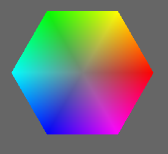
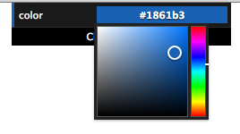
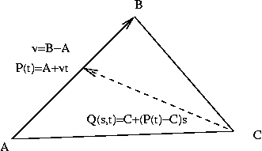
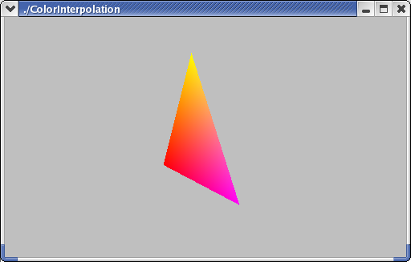

  

# Color, Part b

This reading picks up where the previous reading left off, presenting some
different color models and talking about the mathematics of interpolation
across triangles. Here are the new color models that we'll learn about here:

  * HSV: Hue, Saturation, and Value. This model is closer to the way humans think about color. For example, "hue" is like the color wheel that we're familiar with from elementary school art. The color wheel is a 2D cross-section of a cone, and the color wheel gives us hue (angle around the wheel, such as the difference between red and 180 degrees from red, which is green) and saturation (which is the distance from the center, which is _white_ or, more precisely, a shade of gray). The third dimension is value, which is how light/dark the colors are. More on this below. 
  * HSL: Hue, Saturation, and Lightness. This is very similar to HSV, except that instead of a cone, colors are represented within a double-cone. Cross-sections are still color wheels with just hue and saturation, but the third dimension is lightness. The cone expands as lightness increases, peaking in the middle, but then decreases as lightness tops out at 1.0. Again, more on this below. Three.js has support for HSL, so we'll use it instead of HSV. 
  * CMYK: Cyan, Magenta, Yellow, and Black. This is a subtractive color system that is used for color printing, such as ink-jets. 

## HSL

Psychologically, humans don't think in terms of light and RGB. For example,
it's weird to think of yellow as red+green. Most people find it more intuitive
to think of

  * **hue** : what _color_ is something. Think of the rainbow or the color wheel. This is what most of us learn when we're about 2 years old and we're learning the names for colors. Have you heard of " Roy G. Biv"? 
  * **saturation** : the "purity" of the color. Saturation is the opposite of _pastel_ , which is how "washed out" it is. So a pastel blue (baby blue) is said to be "unsaturated," but an intense pure blue is "saturated." Or think about the difference between pink and fuschia -- the fuschia is much more _saturated_. Technically, saturation is the distance from white or gray: colors close to gray are unsaturated, and colors far from gray are saturated. 
  * **lightness** : the "brightness" or "intensity" of the color, or how far it is from black. 

These three dimensions can be defined in terms of RGB, and we can convert back
and forth with some complicated math.

How do the HSL dimensions relate to the RGB dimensions? First, imagine a line
starting at the black vertex of the [color cube](03a-color.html#colorCube) and
going through the center of the cube and ending at the white vertex. That is,
the line goes directly from (0,0,0) to (1,1,1) in RGB space.

Now, realize that the coordinates of every point on that line are all equal;
that is, every point is (a,a,a) for some value of "a" between 0 and 1\.
Because the coordinates are all the same, that means every point on the line
is _gray_. The line starts at black, goes through dark grays, becoming
lighter, until it ends at white. This axis is **lightness**. The farther a
point is from black, the greater its value. (This is an approximate
definition; the math is a bit complicated, and I'm only trying to give some
intuition.)

If we choose a particular number for the lightness, say 0.5, we get a two-
dimensional surface going through the RGB cube. Let's press that surface out
flat on a piece of paper, so we can think in two dimensions instead of three.
One way to do so results in a hexagon, like this:

>  

This is a hexagon rather than a wheel, with the six corners being named, well-
known colors: red, yellow, green, cyan, blue, magenta, and back to red. This
is a slice through a 3D figure sometimes called a _hexcone._ We'll have some
visualizations later.

In the center of that region is the place where the gray axis (the axis from
pure black to pure white) pierces the region. Let's call that the **gray
point**. In the second figure above, the gray point is where the two black
lines meet.

Imagine asking how far a point in the region is from the gray point. If the
point is near the gray point, the point is similar to that value of gray, and
the color is called "unsaturated." If the point is far from the line, the
color is called "saturated," so distance from the gray point is
**saturation**. (Again, this is an intuitive definition, not a mathematical
one.) Looking at the figure above, you'll notice that the colors are more
intense (saturated) near the perimeter.

Finally, pick the reddest point on the edge of the region, and connect the
gray point in the center with the red point on the edge. Now, any point in the
region can be described not only by its distance from the gray point, but also
by the **angle** with respect to this reference line. The _hue_ is defined as
this angle. The color with hue of zero (at 3 o'clock if you image the color
wheel like a clock) is red. Any saturation of red will have an angle of zero,
greens will be at about 120 degrees (11 o'clock), and blues will be about
about 240 degrees (7 o'clock). Yellows will be between red and green, so
angles of about 60 degrees (2 o'clock), and so forth.

Here's a nice [ interactive color wheel](http://www.sessions.edu/color-
calculator). It shows you _value/lightness_ (hard to tell which) in a 1D strip
and hue and saturation in a 2D circle. (You can close the chat window when it
pops up.)

The [Wikipedia article on HSL and
HSV](http://en.wikipedia.org/wiki/HSV_color_space) is good. I particularly
like this picture of the [double hexcone
model](http://en.wikipedia.org/wiki/HSV_color_space#mediaviewer/File:Hsl-and-
hsv.svg).

Color perception is a fascinating topic that we won't be able to explore
entirely. However, just to whet your appetite, here's an amusing optical
illusion in color perception: [color
perception](http://www.echalk.co.uk/amusements/OpticalIllusions/colourPerception/colourPerception.html).
_The colors we perceive are not always what the visual image portrays!_

HSL and HSV both use the same intuition above. The difference is that the
breadth of the pyramid is largest at a value=1 for HSV, and for HSL, the
breadth is maximized at lightness=0.5. For lightness from 0.5 to 1, we get a
second pyramid, shrinking down to an apex of pure white. So, HSL is like HSV
except that it's a double hexcone (two hexcones with their "color wheel" faces
stuck together). This reflects the fact that as you get closer to white, there
is less "room" for hue and saturation information. The double hexcone is a
better approximation for the RGB color cube, but both are nonlinear
transformations. HSV is more commonly used in computer graphics, while HSL is
more commonly used by artists. Nevertheless, Three.js has support for
converting from HSL to RGB and back, so we'll use that.

## HSL and Color Pickers

There are a zillion color pickers on the web and in various graphics
applications, such as Photoshop. Consider the color picker in `dat.GUI()`,
which you can play with using this page: [dat.GUI() color picker](color-
picker.html). Here's a screenshot:

The color picker allows you to specify three dimensions of color using a 1D
vertical rainbow strip and a 2D square next to it.

  1. Hue is arranged on the right as the vertical rainbow strip, going from red (zero degrees) on the bottom through yellow (at 60 degrees) up to red again (at 360 degrees) at the top. 
  2. lightness goes vertically from black (zero) at the bottom edge of the square to the maximum (one) along the top edge of the square. 
  3. saturation goes horizontally from gray (zero) anywhere along the left edge to the hue (one) on the right edge. 

Since both lightness and saturation are shown in the square, we can look at
the edges of the square to get more insight:

  * The left edge of the square is zero saturation (shades of gray), and so that edge goes from black to white, regardless of hue. 
  * The top edge of the square is maximum value, so it goes from white to the hue. 
  * The bottom edge, being a lightness of zero, is always black, regardless of saturation or hue. 
  * The right edge, being maximum saturation, goes from black up to the hue. 

## HSL in Three.js

If you want to use HSL in your Three.js programs, you certainly can. The
`THREE.Color()` object has a method to convert from and to HSL values.

For example, suppose you want to use a less-saturated red. Red happens to have
a hue angle of zero, and we'll use 0.5 for the lightness (through the fat part
of the double hexcone, see below), and then we'll turn down the saturation.
Here's some code:

    
    
    var red = new THREE.Color("red");
    alert("red is " + red.getHexString());
    var redHSL = red.getHSL();
    alert("red is hue of " + redHSL.h + ", lightness of " + redHSL.l + ", and saturation of " + redHSL.s);
    var less_red = new THREE.Color();
    less_red.setHSL(redHSL.h, redHSL.l, 0.5*redHSL.s );
    alert("less_red is " + less_red.getHexString());
    

The background color of this paragraph is the half-saturated red, or #bf3f3f,
that we just computed using Three.js's Color object.

Note that _hue_ is considered an angle, but the API in Three.js has it go from
zero to one, rather than using degrees (zero to 360) or radians (zero to 2*
π).

## Demo: Color Cone

When we press the region flat into a hexagon, this means that the full 3D
space is a pair of "hexcones," as demonstrated by the following Three.js
program. The first hexcone has a lightness value that goes from 0 (completely
black) at the apex to 0.5. The second hexcode has a lightness value that goes
from 0.5 to 1 (completely white) at the apex.

Either click through to the [color cones
demo](../demos/Color/colorcones.html) or use this small version
here:

Be sure to look at it from the side (+X direction) by using the "x" key or
dragging with the mouse.

The demo has some additional keyboard callbacks:

  * The + and - keys adjust the number of wedges in the color pyramids. 
  * The 1 and 2 keys display either both color pyramids or just the first one (with black at the apex). 

If you're interested, you can view the source code for the above demo, which
calls functions defined in [tw.js](../libs/tw.js) to construct the pyramids.

In this color cone demo, we see triangles that smoothly change from one color
to another across them. Next, we'll look at how this is done. We'll build on
what we learned last time about parametric equations of lines, so you should
refresh your memory if necessary. A parametric equation for a line from A to B
is:

> P(t) = A + (B-A) t

## Parametric Equation for a Triangle

Since a triangle is a 2D thing, the parametric equation for a triangle will
have _two_ parameters. One way to think about these two parameters is that the
first parameter, say t, moves you along one side of the triangle, from vertex
A to vertex B. Let P(t) be that point along the AB edge of the triangle. The
second parameter, say s, is the parameter of a line from vertex C to P(t).
That is, the endpoint of the second line is a moving target. The point Q(s,t)
is a point in the triangle, on a line between C and P(t).

The following figure sketches these ideas:

> Q(s,t) = C + (P(t) -C)s  
>  Q(s,t) = C + (P(t)s - Cs)  
>  Q(s,t) = [A(1-t)+B(t)]s + C(1-s)  
>  Q(s,t) = A(1-t)s+Bts + C(1-s)  
>

Notice that we have several choices: the line from A to B could instead go
from B to A. Similarly, the line from C to P(t) could go from P(t) to C. These
yield equivalent equations, just as the equation of a line from A to B is
equivalent to the equation of a line from B to A.

The last line of the math for Q(s,t) above shows a three-way mixture of the
vertices. That is, a triangle is all points in the _convex sum_ of the
vertices. A _convex sum_ is a weighted sum of N things, where the weights all
add up to 1.0:

> w1*A+w2*B+w3*C  
>  w1+w2+w3 = 1

Compare this to the weighted sum formula for Q(s,t). The last equation is
perhaps a little surprising, but you can check that the weights sum to one:

> (1-t)s+ts+(1-s)=1

Incidentally, the center of the triangle is where all the weights are equal:
one-third.

## Example: Finding the Equation of a Triangle from Three Points

Suppose we have a triangle ABC whose vertices are:

> A = (1,2,3)  
>  B = (2,4,1)  
>  C = (3,1,5)

We could write down the following equation for the triangle:

> Q(s,t) = A(1-t)s + B(t)s + C(1-s)  
>  Q(s,t) = (1,2,3)(1-t)s + (2,4,1)ts + (3,1,5)(1-s)  
>

So, doing each coordinate separately, we have:

> x(s,t) = (1-t)s + 2ts + 3(1-s)  
>  y(s,t) = 2(1-t)s + 4ts + (1-s)  
>  z(s,t) = 3(1-t)s + ts + 5(1-s)  
>

Which we can simplify algebraically to

> x(s,t) | = (1-t)s + 2ts + 3(1-s)  
> ---|---  
> | = s-ts+2ts+3-3s  
> | = ts-2s+3  
>  
>  y(s,t) | = 2(1-t)s + 4ts + (1-s)  
> ---|---  
> | = 2s -2ts + 4ts + 1-s  
> | = 2ts + s + 1  
>  
>  z(s,t) | = 3(1-t)s + ts + 5(1-s)  
> ---|---  
> | = 3s -3ts + ts + 5 - 5s  
> | = -2ts -2s + 5  
>  
>

Suppose we have a point whose parameters with respect to that triangle are
(0.5,0.5). What does that mean? It means that the point is halfway between C
and the midpoint of AB. The coordinates are:

> x(0.5,0.5) = (0.5)(0.5)-2(0.5)+3 = 2.25  
>  y(0.5,0.5) = 2(1-0.5)0.5 + 4(0.5)(0.5) + (1-0.5) = 2  
>  z(0.5,0.5) = 3(1-0.5)0.5 + (0.5)(0.5) + 5(1-0.5) = 3.25  
>

So the coordinates of Q(0.5,0.5) are (2.25,2,3.25).

Equivalently, we can think of computing Q(s,t) as a weighted sum of the
triangles' vertices:

> Q(s,t) = A(1-t)s + B(t)s + C(1-s)  
>  Q(0.5,0.5) = A(1-0.5)(0.5) + B(0.5)(0.5) + C(1-0.5)  
>  Q(0.5,0.5) = A(0.25) + B(0.25) + C(0.5)  
>

Then, to find the coordinates of Q(0.5,0.5), we just substitute the
coordinates of ABC and calculate the weighted sum.

### Color Interpolation in a Triangle

If the colors of the vertices are different, OpenGL interpolates them, using
the same equations that we used for calculating coordinates. Suppose A is red
(1,0,0), B is magenta (1,0,1), and C is yellow (1,1,0). We can compute the
color of the middle point, Q(0.5,0.5), as:

> Q(0.5,0.5) = A(0.25) + B(0.25) + C(0.5)  
>  Q(0.5,0.5) = (1,0,0)(0.25) + (1,0,1)(0.25) + (1,1,0)(0.5)  
>  Q(0.5,0.5) = (1,0.5,0.75)  
>

The triangle as a whole looks like this:

> 

## Color Interpolation in Three.js

The following FAQ is a little out of date, but it does explain how to do
[color interpolation in Three.js](http://soledadpenades.com/2012/04/17/simple-
yet-frequently-asked-questions-on-three-js-sfaq/).

The key elements are:

  1. The `THREE.Geometry()` object has a `vertexColors` property that is an _array_ of colors. 
  2. Each `THREE.Face3()` object (an array of these is in the Geometry object) has a three-element array of colors, each of which is the color of the corresponding vertex of the face. 
  3. Using `THREE.MeshBasicMaterial`, we set the `vertexColors` property to `THREE.VertexColors`. The value of this property alerts Three.js that the vertices of a face (a triangle) could have different colors. 

Here's a demo that creates an RGB triangle:

> [triangleInterpolation.shtml](../demos/Color/triangleInterpolation.shtml)

Please take the time to read that code. It's not too long.

There's a function call there to `TW.computeFaceColors(triGeom);`. This is a
function to iterate over all the triangles of a geometry, setting a property
of each that is a three-element array of indices into the array of colors. The
function essentially says that vertex i has color i for all i.

Here's an example with two triangles:

> [triangleInterpolation2.shtml](../demos/Color/triangleInterpolation2.shtml)

But what about a slightly different example, where we have two adjoining
triangles, both of which have color interpolation, but where the same vertex
has a different color. Here's the demo:

> [triangleInterpolation2b.shtml](../demos/Color/triangleInterpolation2b.shtml)

Notice that at the lower right we have:

  * vertex B, coordinates (1,0,0), color THREE.ColorKeywords.lime 
  * vertex B2, coordinates (1,0,0), color THREE.ColorKeywords.blue 

Everything else in the code is the same. That is, don't think of the vertex in
the lower corner as a single thing that is green for the purpose of the lower
triangle and blue for the purpose of the upper triangle. Instead, simply think
of it as two different vertices that happen to have the same spatial
coordinates.

## Subtractive Color and CMYK

Finally, we briefly consider a couple other important color models. We'll have
little practical use for them this semester, but you should have some
familiarity with them and the concepts. The most important concept is
_additive_ versus _subtractive_ color.

Additive color mixes **light** : the more, the brighter. As most people
remember from kindergarten, mixing fingerpaints makes things **darker**.
That's because paint (and ink) works by **subtracting** light.

Subtractive color is used in the printing industry. The primaries are:

<ul>
<li> Cyan or Aqua (light blue/green)</li>
<li> Magenta or Fuchsia (bright pinkish/red)</li>
<li> Yellow (umm, yellow)</li>
</ul>

>  C = 1 - R  
>  M = 1 - G  
>  Y = 1 - B  
>

The 1 in the preceding equations is a vector of all 1s, so cyan = (1,1,1) -
(1,0,0) = (0,1,1), which is a mixture of Green and Blue (the other two
primaries). These are the _additive secondaries_.

Theoretically, you can mix all three subtractive primaries to get black, but
if you do you usually get a dark, muddy brown, so we introduce a fourth
primary: black, abbreviated K.

These are collectively called CMYK. Think of the four cartridges on a color
ink-jet printer.

## YIQ

Color TV is broadcast in YIQ, which has intensity (luminance or brightness) as
one signal (Y) and two others encode chromaticity (hue and saturation, but not
respectively). So it's similar to HSL and HSV in that the black/white signal
is one channel (Y), just like L and V.

## Summary

  * The HSV and HSL color models are often used in computer graphics because they can be a bit more intuitive and easier to work with. If you want to lighten a color but keep its hue the same, HSV and HSL make that obvious, while in RGB it's mysterious at best. 
  * We learned about modeling a cone as a pyramid with many faces. 
  * The triangular faces of the color cone interpolate color across them. We looked at the mathematics of parametric equations for triangles. 

### Source

This page is based on <https://cs.wellesley.edu/~cs307/readings/03b-color.html>. Copyright &copy; Scott D. Anderson. This work is licensed under a [Creative Commons License](http://creativecommons.org/licenses/by-nc-sa/1.0/). 

