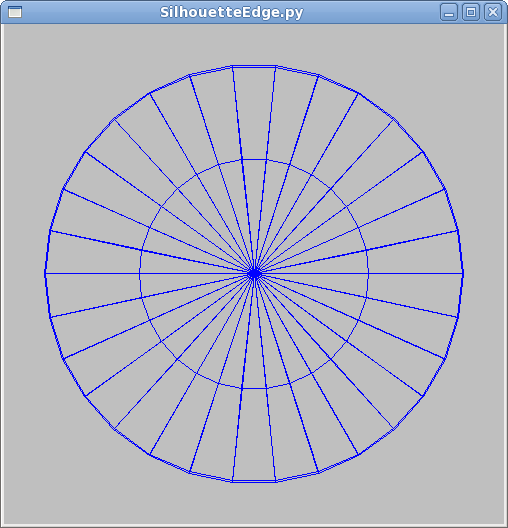
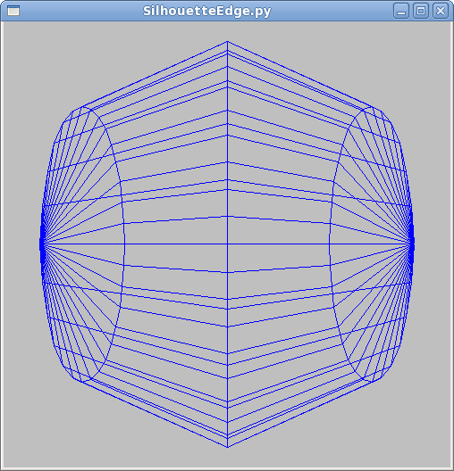
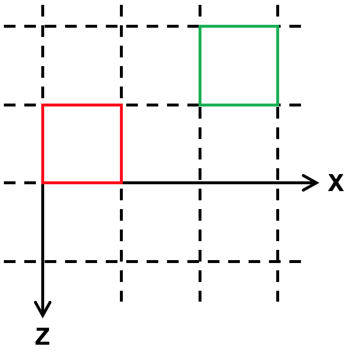
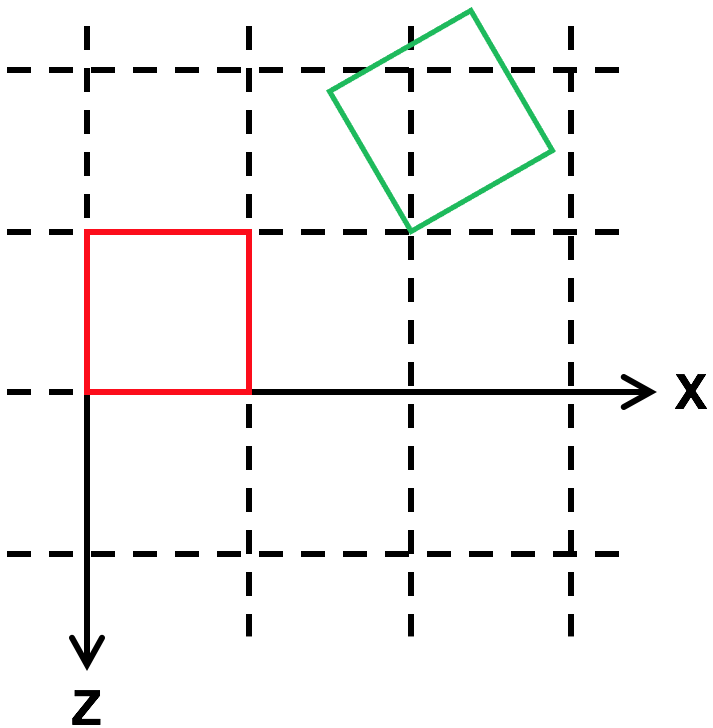
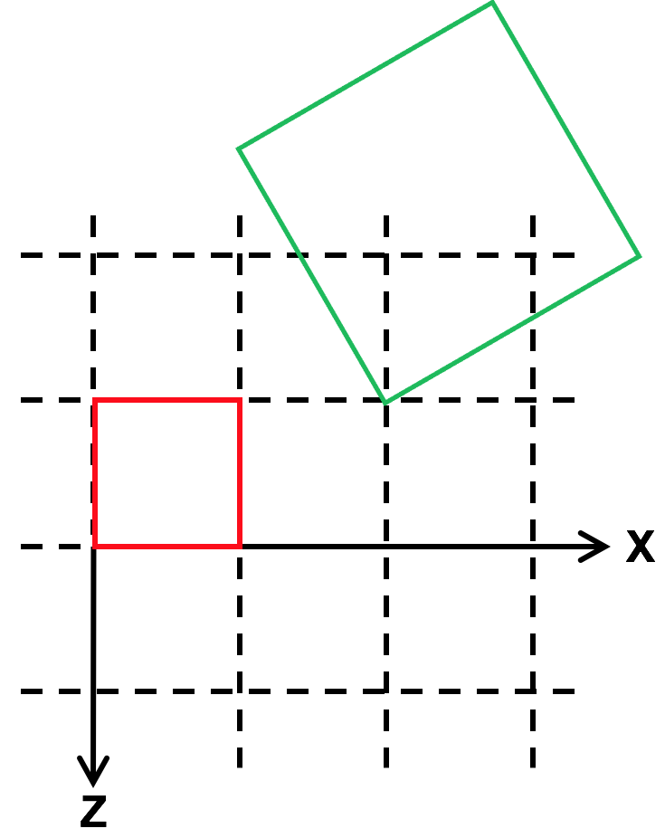

  

# The Instance Transform

So far, we've been building objects out of vertices and triangles.  Effective,
but slow and painful. Even getting two copies of something is a bit of work.
In this reading, we'll learn about the instance transform, which will make it
much easier to work with higher-level objects, from teapots to teddy bears.

## Scene Bounding Box

We learned this earlier, but just to re-cap:

The `TW.cameraSetup()` function is a handy way to tell TW the information it
needs to set up a camera. Its third argument is a JavaScript object with six
properties, which are the minimum and maximum x, y and z coordinates, for the
_entire scene_ (all the objects you want to display):

    
    
    var scene_bounding_box = { minx: -50, maxx: +100,
                               miny: 0, maxy: 50,
                               minz: -25, maxz: 100 };
    
    TW.cameraSetup(renderer, scene, scene_bounding_box);
    

The purpose of this is to give TW the information it needs to set up the
camera. If you want to see the bounding box for any of our TW demos, just
press the "b" key, which toggles showing the bounding box.

## Built-in Three.js Objects

Three.js comes with a large number of classes to create different kinds of
Geometry objects. (Remember, a geometry is a structure with vertices, faces,
and so forth.) You can see a list by scrolling down to the Geometries section
of the [documentation](http://threejs.org/docs).

We'll be working a lot with:

  * [BoxGeometry](http://threejs.org/docs/#api/geometries/BoxGeometry)
  * [SphereGeometry](http://threejs.org/docs/#api/geometries/SphereGeometry)
  * [PlaneGeometry](http://threejs.org/docs/#api/geometries/PlaneGeometry)
  * [CylinderGeometry](http://threejs.org/docs/#api/geometries/CylinderGeometry)
  * [ConeGeometry](http://threejs.org/docs/#api/geometries/ConeGeometry) 

## Demo: Plane, Box, and Sphere

Here is an example of a [scene using a plane, a box, and a
sphere](../demos/BasicModeling/PlaneBoxSphere.html). (Enter "b"
to see the yellow wireframe bounding box.)

Here is the code:

<pre data-code-jsfunction="scenePlaneBoxSphere" class="prettyprint lang-js">
</pre>
    

The arguments to `THREE.BoxGeometry()` are just the width, height and depth.
Similarly, the arguments to `THREE.PlaneGeometry()` are the width and height;
it has zero depth. The argument to `THREE.SphereGeometry()` is the radius.

What the documentation doesn't tell you, _and it should_ , is the location of
the origin and the arrangement of the axes. However, it's easy to see from
this example that the origin is in the center of the objects. Thus, a plane of
width 6 goes from x=-3 to x=+3, and so on.

This is okay, but very limited. We next need to create instances of these
classes and arrange them in the scene. We'll get to that soon.

## Demo: Polygonal Approximation

Spheres have two more arguments (at least!) called `widthSegments` and
`heightSegments`. They come about because these curved surfaces are in fact
rendered with **polygonal approximations**. Consider a circle. If you cut the
perimeter into N parts, and use an N-sided polygon instead of a circle, you
can approximate a circle. The larger N is, the smoother the circle is.  For
example, with N=3, you're approximating a circle with an equilateral triangle.
With N=4, you're approximating it with a square.

You can play with the two arguments to the sphere constructor using the
[polygonal sphere](../demos/BasicModeling/polygonalSphere.html)
demo.

The version above has 8 `widthSegments`, which you can see is the number of
segments around the poles, so essentially like _longitude_. The version above
has 3 `heightSegments`, which is like _latitude_.

Polygonal approximations can be pretty good, particularly in the interior of a
solid object if you use smooth shading. (The mesh that the demo uses draws
wireframe lines, which visually detracts from the approximation.) However, the
polygonal approximation can be apparent at the edges of the object; more
precisely, in the _silhouette_. This problem is known as the **silhouette
edge** problem. If your object will be silhouetted, you'll have to use
segments. This can make rendering slower. (An example of the general speed
versus quality tradeoff.)

Look at the two pictures below, taken from an earlier demo. The program gives
you a rendering of a wire sphere. These pictures are actually the _same_
sphere, from the front (+Z axis) on the left and from the right (+X axis) on
the right. The sphere is rendered with 30 slices but only 4 stacks, so it
looks very good from +Z and terrible from +X.

 

## Disadvantages of Built-in Objects

Is there any disadvantage to using these Three.js objects? Why did we not use
`THREE.BoxGeometry` for the color cube? In that case, it was convenient to
have the vertices be zeros and ones, but the `THREE.BoxGeometry` object of
width 2 will have x coordinates of +1 and -1. It was easier to custom build
the color cube. However, the Three.js objects are generally very good and very
flexible.

## Bounding Boxes, Reference Points

In order to use one of these built-in objects, we need a "handle" on it: a way
to pick it up and put it where we want. But, _where_ is the object? After all,
an object occupies a collection of points, but for simplicity, we want to have
a single point as the location of the object. For this course, we will call
that the **reference point** of the object or the object's **origin**. That
is, the _position_ of an object is the origin of the coordinate system it's
built in. For example, the handle for the barn is its lower left front corner,
since that vertex is the origin. For the `THREE.BoxGeometry` object, the
handle is the center of the box.

Finally, it's very useful to know how "big" the object is, say if you want to
stack two on top of each other, or place them next to each other.
Consequently, it's convenient to talk about a "bounding box" for each object.
This is like the scene bounding box we discussed above, except focused on a
single object. (If there is only one object in your scene, they are the same.)

Note that the definitions of the bounding box for an object and for the scene
are the same (the min/max coordinates in X, Y and Z), but the _purpose_ is
different. The bounding box for the scene is used by TW to set up the camera
for you. (If you're setting up your own camera, you don't need to bother with
a scene bounding box at all.) The bounding box for an object is used by the
programmer to help place objects in the scene without having them intersect
each other.

Let's look again at our example of how to use a Three.js box:

<pre data-code-jsfunction="sceneOneBox" class="prettyprint lang-js">
</pre>

    
    

Where is the cube? In this case, we know that the coordinates are +/- 3, 2,
and 1. The bounding box is the same.

## Placing Instances

Please take some time to play with the

[barn instance transform](../demos/BasicModeling/barn-instance-transform-dat.html)

The barn instance has three kinds of state:

  * _position_ : this is a `THREE.Vector3` object with x, y, and z components that place the _origin_ of the barn at that location in the scene. 
  * _rotation_ : this is a `THREE.Euler` object that first rotates the object by some angle about _its_ X axis, then by some angle about _its_ Y axis, and then by some angle about _its_ Z axis. (You can also change the order of the rotations if you wish; I've rarely found that necessary.) 
  * _scale_ : this is a `THREE.Vector3` object that indicates the scaling of the barn along its X, Y, and Z axes. 

Note the _order_ of these operations. The positioning is done in the scene's
coordinate system, before the barn rotates around any of its axes. The scaling
is done last, so the units of the positioning don't depend on the scaling.
(Imagine we move the barn by two units, but scale things so that each unit is
now ten times as big: do we move by two (original) units or twenty?)

Let's look at each of these geometric transformations in more detail.

## Demo: Positioning/Translation

You can think of positioning an instance as drawing it in a coordinate system
where the _origin_ has moved (been _translated_ ) relative to the scene
origin. Thus, none of the vertices needs to be changed, they are just
_transformed_. We'll look more at the mathematics of this in a future reading.

> 

Here is a demo that positions two barns, one translated relative to the other,
as shown in the birds' eye view (along the Y axis) above:

The code that produced this demo is shown below. The
`TW.createBarnSolidColor()` function creates and returns a `THREE.Mesh`
object, whose position is set with `position.set()`.

<pre data-code-jsfunction="sceneTwoBarns" class="prettyprint lang-js">
</pre>  

    
    
    

The red barn is drawn at the origin; its origin coincides with the scene
origin. The green barn is drawn such that its origin (its front left corner)
is at the specified position.

## Demo: Rotation

Rotation works similarly to positioning, except that you set the three angles
that you want to rotate the object by.

Note that the rotations are in _radians_. So, if you want to rotate something
by a quarter turn around the x axis, use one of the following:

  * `obj.rotation.x = Math.PI/2`
  * `obj.rotation.x = THREE.Math.degToRad(90)`
  * `obj.rotation.x = TW.degrees2radians(90)` 

Also, the direction of rotations is crucial. If you imagine that the Z axis is
pointing directly at your nose and you are looking at the XY plane, +90
degrees is _counter-clockwise_ and -90 is _clockwise_. Similarly, the
rotations described in the above list are all counter-clockwise around the X
axis.

In the demo below, the green barn is drawn in a coordinate system that is
rotated by 30 degrees around the Y axis of the barn.  The result, in wireframe
from above, might look like:

> 

The code that produced this demo is shown below. The rotation angle for the
`THREE.Mesh` object returned by `TW.createBarnSolidColor()` is set with
`rotation.set()`.

<pre data-code-jsfunction="sceneTwoBarnsRotated" class="prettyprint lang-js">
</pre>  

    
    

## Demo: Scaling

Finally, we can scale the geometry system. Typically, this is just a positive
multiple, but by multiplying by a negative value, you can flip something
around.

Here, we translate, rotate, and then double the size of the green barn:

> 

The code that produced this demo is shown below, with the scale of the
`greenbarn` mesh object set with `scale.set()`:

<pre data-code-jsfunction="sceneTwoBarnsRotatedScaled" class="prettyprint lang-js">
</pre>  

    

## Demo: Blocks

Now, look at the demo for this jumble of blocks. Look at it from different
angles to get a better sense of their relative positioning, rotation and
scaling. (Enter "a" to see the scene axes.)

Below is the code that produced this demo. Compare the code and the rendering,
to make sure you understand. The `TW.wireCube()` function creates a `new
THREE.BoxGeometry(1,1,1)`.

<pre data-code-jsfunction="sceneManyBlocks" class="prettyprint lang-js">
</pre>  
    
    
    

## Absolute versus Relative

Note that the three properties we've been looking at are "absolute", in the
sense that we specify the value we currently want, regardless of the current
value. Suppose we wanted to "modify" the current value. For example, to move a
block over by a bit, we could do the following:

    
    
      box.position.x += 2;
    

The `position` property is a `THREE.Vector3`, which has properties x, y, and z
that we can look at and modify.

The above code is equivalent to the following method:

    
    
      box.translateX(2);
    

The `translateX()` method "translates" ("moves" or, equivalently, "modifies
the position of") by some amount.

There is an even more general method:

    
    
    var dir = new THREE.Vector3(3,4,5);
    dir.normalize();
    box.translateOnAxis(dir,dist);
    

This moves the box by some distance in the specified direction. This can be
very useful when animating a scene.

Similarly, you can change the rotation of an object:

    
    
    var axis = new THREE.Vector3(3,4,5);
    axis.normalize();
    box.rotateOnAxis(axis,radians);
    

This rotates the object around the given axis by some number of radians.
Again, this can be very useful for animations, where you want to rotate the
box by some amount every frame, say because it's tumbling as it falls.

As far as I know, there is no relative version of scaling.

## Coordinate Systems

It's important to remember that the initial coordinate system has the Z axis
coming out of the screen. You can, of course, modify this by setting the
position, rotation, and scaling of the `Scene` object.

When you translate, rotate, or scale, you change the coordinate system for all
subsequent operations within that object. That is, you change the
interpretation or meaning of coordinates. The vertex (2,3,4) means something
different as a result. We haven't looked at _nested_ objects yet, but will
soon. Keep this in mind.

_However,_ translation, rotation and scale are **affine** transformations,
which means that lines stay lines and planes stay planes. Therefore, to
transform a line, you transform the endpoints and draw the line between the
transformed endpoints.

So, one take-home message of this reading is:

> Define your object in a coordinate system that is _convenient,_ then use
affine transformations to place it in the scene.

In simple cases, we can usually place the object we want by setting the
`position`, `rotation` and `scale`.

### Source

This page is based on <https://cs.wellesley.edu/~cs307/readings/04-instance-transform.html>. Copyright &copy; Scott D. Anderson. This work is licensed under a [Creative Commons License](http://creativecommons.org/licenses/by-nc-sa/1.0/). 

