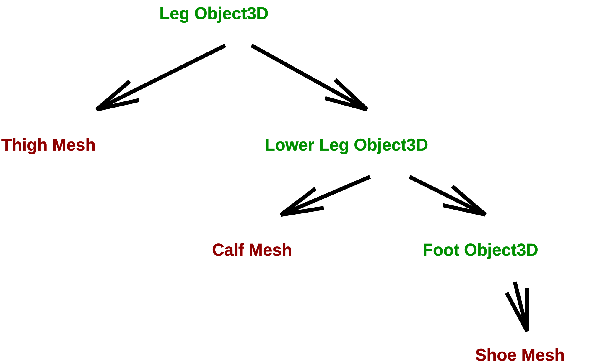
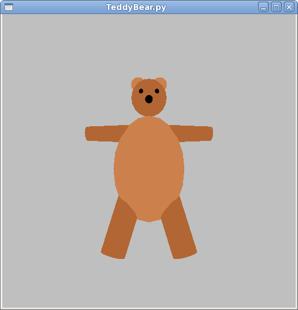

  

# Nested Transforms

Previously, we looked at the instance transformation: translate, rotate and
scale, to place on object in the scene. The following discussion is about more
complex sequences and nested transformations.

## Composite Objects

When building a complex object (like a bicycle or a teddy bear) or a complex
scene, we rarely want to build it out of low-level vertices and faces.
Instead, we'd like to build it out of high-level components, maybe cubes,
spheres and cylinders, or even higher-level things, like wheels, trees,
snowpeople, and so forth. In this reading, we'll learn about building out of
components.

Let's take a snowperson as our basic example. A snowperson is a composite
object comprised of three or four components: three white spheres and an
optional orange cone for the nose. (No, we're not doing anything as
complicated as Olaf.)

Our basic strategy will be to:

  * Create a "container" object that will be the representation of our snowperson. The spheres and such that make up the snowperson are put in this container. 
  * The container will be an instance of `THREE.Object3D`, which is the parent class of `THREE.Mesh`. The parent class has the attributes and methods we need for the instance transform (so we can place our snowperson in the scene), but doesn't need vertices and faces and such, like a `THREE.Geometry` object. 
  * The container has methods to add components, using the same `.add()` method we know from adding things to the scene. It also has properties that include the list of components (`.children`) and methods to find a particular component. 
  * We can use the instance transform to place our components into the container. That is, we decide where the origin and axes will be for our container (snowperson) and arrange the components within that structure. 

Technically, a _coordinate system_ is the directions that the x, y, and z axes
point, and a _frame_ is a coordinate system plus a location for the origin.
Thus, a snowperson can have its own _frame_ and we position the components in
that frame.

You should usually choose frames for your composite objects that make it easy
to position them within your scene (or a larger composite object that they are
components of).

## Demo: A Snowperson

Consider the following simple [three-ball snowperson](../demos/BasicModeling/SnowPerson-composite.shtml):

  

Here is the function that makes the snowperson:

<pre data-code-jsfunction="createSnowPerson" class="prettyprint lang-js linenums">
</pre>
    

Focus first on the local function `addSphere()`. It creates a sphere geometry
of a given radius, a mesh, positions the sphere at a given height above the
origin (at least these snowballs don't fall apart like the ones made of real
snow), and adds it to the container, `frosty`. We've done stuff like this
before, adding things to a scene. Frosty is just a `THREE.Object3D` that was
created a few lines earlier.

Notice that we have to set the position of the bottom sphere up by its radius,
if we want the "position" (origin) of the snowperson to be at its base and not
in the center of any of its spheres. It's _convenient_ for positioning the
snowperson to have the origin there, so we go to the extra effort of
positioning its spheres relative to the desired origin for the snowperson.
That is, the spheres are positioned in the " snowperson's frame."

Now read over the whole function, to make sure you understand all the parts.

Next, here is the function that adds that snowperson to the scene. Notice that
adding a snowperson isn't really much different from adding a box. Note also,
as you play with the GUI, that the instance transform applies to the whole
snowperson, not just one part. That's very powerful.

<pre data-code-jsfunction="addSnowPersonGUI" class="prettyprint lang-js">
</pre>

    
    

## Demo: Rotating a Cone

Positioning something is pretty straightforward (though we did see some
trickiness with positioning the spheres in the snowperson's frame), but
rotating is a bit more complicated. If we create a `THREE.ConeGeometry`, say
with a length of 10, it is constructed in a frame with the Y axis running
through the center of the cone, with the top at 5 (half the height) and the
bottom at -5.

Rotations, for mathematical reasons that we'll see soon, are always performed
around the origin. That's fine for certain kinds of rotations, but not so
great for others. However, we can use composite objects to rotate around
whatever location we want.

Consider the following demo:

[Cone Rotation](../demos/BasicModeling/ConeRotation.shtml)

Try to use the GUI to swing the cone like a bell from the top.

Here is the code that makes that scene:

    
    
    function makeConeScene(scene,parameters) {
        var rb = parameters.radiusBottom;
        var height = parameters.height;
        // using globals for these objects, to allow updates from GUI.
        inner = TW.createMesh(new THREE.ConeGeometry(rb, height));
        inner.name = "inner";
        inner.position.y = parameters.positionOffset;
        inner.rotation.z = parameters.innerRotation;
    
        outer = new THREE.Object3D();
        outer.name = "outer";
        outer.add(inner);
        outer.rotation.z = parameters.outerRotation;
        scene.add(outer);
    }
    

The code just creates a cone, which is the _inner_ object, and the _outer_
object is just a `THREE.Object3D`. The inner one is placed inside the outer at
an offset. If we rotate the inner one, the cone rotates around its center, as
we expected. If we rotate the outer one, the displaced cone rotates around the
origin of the container.

If you offset the cone downward by half its height and set the inner rotation
to zero, the point of the cone is at the origin of the outer frame, and we can
rotate the cone around its apex. Very cool!

## Demo: A Leg

Rotating around something other than the center of an object is very useful.
Here's how we might model [a jointed leg](../demos/BasicModeling/Leg1.shtml):

    

  

Here is the code that makes that leg:

<pre data-code-jsfunction="makeLeg" class="prettyprint lang-js linenums">
</pre>

    

It's longer and more complicated than the earlier code, but not conceptually
harder. Still, it can help to visualize the various parts. Here's an annotated
screen shot:

The yellow highlighting indicates the higher-level components:

  * foot: the object containing the "shoe". Yes, this seems backwards, but I wanted the foot component to have the "ankle" joint, and, to avoid confusion, I wanted to give a different name for the component. The origin is the ankle. 
  * lower leg: the object containing the calf and the foot. The origin is the knee. 
  * leg: the object containing the thigh and the lower leg. The origin is the hip. 

## Kinematics and Inverse Kinematics

Programming with nested frames is not necessarily easy, but it is amazingly
easier than if we did not have nested frames. Imagine trying to position a
soccer ball near the end of the foot: You need to know the (x,y,z) coordinates
of the end of the foot, so that you can position the soccer ball there. So,
all you have to do is calculate the end point of the foot, given the lengths
of the limbs and the joint angles. An hour or so of trigonometry should do the
trick.... The problem of figuring out where the endpoint is given a set of
limb lengths and joint angles is called a _kinematics_ problem.

Aside: Note that your body/mind is amazingly good at calculating the joint
angles necessary to put your feet and hands where they need to be. Roboticists
call that the [inverse
kinematics](http://en.wikipedia.org/wiki/Inverse_kinematics) problem, and it's
not easy! It also comes up in 3D Graphics and Animation, as we try to have
graphical objects interact with each other.

## Sequences of Transformations

How is the barn like a picket of a fence? They're certainly different in size,
and of course a picket is tall and skinny, while a barn is relatively squat.
But these are just scalings. In other words, given a scale transformation, the
barn is the same as a picket. So, we can make a picket fence by drawing the
barn many times!

Here's a demo that creates a fence:
    

Here is the code that makes that scene:

<pre data-code-jsfunction="makeFence" class="prettyprint lang-js">
</pre>

    

Notice the transformations in the code. By the time we get to the end of the
fence, that picket has been translated `numPickets` times (set to 30 in the
code that calls the `makeFence()` function).

Here's a slightly more complex example, a curved fence:

Here is the code that makes that scene:

<pre data-code-jsfunction="makeFenceCurved" class="prettyprint lang-js">
</pre>

All these rotations and translations _accumulate_ in the object (the picket),
yet the object has finite representational space. (Okay, it _could_ keep a
list of all the modifications that have happened to it, but that would be ugly
and, as we'll see, unnecessary.)

## Cloning

In the code above, you'll note a new method `clone()` that we used to create
each new picket. The clone method is defined for all descendants of
[`THREE.Object3D`](http://threejs.org/docs/#api/core/Object3D), and is a
convenient way to make another instance of something you've built.

The `clone()` method takes two optional arguments, which are rarely supplied.
The first is the object to put the copied stuff into; the default is to create
a new `THREE.Object3D`. The second argument is boolean: true means a recursive
copy, and false is just a copy of this object, but constituent objects are
shared. By "constituent objects" I mean the parts of a composite object, like
the spheres of a snowperson. The default is recursive copying.

## Scene Graphs

The data structure we are building here eventually is added to the
`THREE.Scene` object (itself an instance of `THREE.Object3D`), along with
other graphical objects. The entire scene, then, is a _graph_ of objects. (A
_directed, acyclic graph_ or DAG.) It is therefore called the _scene graph_.
The scene graph for the leg example looks like this:

## Representing an Affine Transformation

The preceding sections have shown you how to model complex objects as the
composition of one or more components, and sets of _affine transformations_ on
the underlying geometries. Remember that an affine transformation transforms a
line into a line and a triangle into a triangle, and it includes the
translation (position), rotation, and scaling transformations we've used.

We've seen that many transformations might be applied to some geometry as it
is being drawn. Think about the transformations for the vertices of the foot,
which are affected by at least three rotations, translations, and so forth.

How does the graphics system represent an affine transformation? When it's
rendering the last picket of a fence, is it remembering each transformation
call, or is it somehow able to remember just the aggregate? It's the latter,
but we need to do some work first to see why.

Because there's a fair amount of math, the next part of the reading is written
in LaTeX, so please read the following PDF file:

> [affine math](04-affine-math.pdf)

Even though we won't typically be working directly with matrices in our
programs, there are still good reasons to learn this math:

  * If you don't understand the concepts behind the math, you won't understand the terminology that OpenGL uses (matrices? CTM? homogeneous coordinates?) 
  * Seeing how the major operations are defined as matrix multiplications is pretty cool. 
  * Homogeneous coordinates are a neat trick. 

## The Teddy Bear

Here's a screenshot from an old Python program, TeddyBear.py:

[ TeddyBear with tons of modifiable parameters](../demos/BasicModeling/TeddyBear-composite.shtml) -- play with this a bit, and look at the code.

Here's the code for the `TW.createTeddyBear()` function. Note the use of
nested frames:
    
<pre data-code-jsfunction="TW.createTeddyBear" class="prettyprint lang-js">
</pre>  
    

There are lots of tricks in this code. Look for the following:

  * Positions are _calculated_ as much as possible, so that, for example, if you make the body bigger (either changing `bodyRadius` or `bodyScale`), the head still ends up in the right place. 
  * Looking at `addNose()`, you can place the nose right on the surface of the head by positioning it using the head radius, and you can move it up and down on the head in an extra frame that you can rotate around the center of the head. 
  * Similarly, in `addEar()`, the ears are placed on the surface of the head, symmetrically, by multiplying the x position by -1 for the left ear and +1 for the right ear. We can move them up and down the head by rotating this earframe around the Z axis. 
  * The ear itself is a flattened sphere, done by scaling in the Z axis direction. 
  * Eyes are just spheres, like the nose, and placed similarly, except there are two of them, so we use the -1/+1 trick for symmetry, and we have an angle around the Y axis (eye separation) and another angle around the X axis (high or low eye location). 
  * Arms are cylinders, but the placement is a bit tougher, because if we put them right on the surface of the body, the joint will stick out. So, we do some approximating here. 
  * We use non-uniform scaling on the body, to make the sphere into an ellipse. 

## Summary

The key ideas from this reading are:

  * Build complex items out of components that are higher level than vertices and faces, such as boxes, spheres, cylinders, and of course, other complex components built out of them. 
  * We can build up our scene out of a hierarchy of components. This is called the _scene graph_. 
  * The embedded frames make it possible to use the instance transform on higher-level components: whole legs and teddy bears, instead of just a box. 
  * The embedded frames also make it possible to put the reference point (origin of the object) and axes wherever you like, so that you can position, rotate and scale however you like. 
  * The mathematics of a frame is captured by a _transformation matrix_ , which uses _homogeneous coordinates_. 
  * Homogeneous coordinates allow all of our _affine transformations_ to be represented as a matrix multiplication in four-dimensional space. 
  * Because every affine transformation is a matrix multiplication, we can represent a sequence of transformations by a single matrix, just by multiplying the transformation matrices. 
  * In fact, each Three.js `Object3D` keeps track of the collection of transformations on it using a matrix. (Actually, Three.js uses [_quaternions_](http://en.wikipedia.org/wiki/Quaternions_and_spatial_rotation), which is a somewhat different representation, with similar properties and some advantages. We won't be discussing them. Three.js has a method, `updateMatrix()` to convert its quaternion representation to a 4x4 matrix.) 
  * Graphics cards are really good at matrix multiplication. 

## Questions about Affine Transformation Matrices

Some thought questions about affine transformations.

  * Give an example of two rotations that are commutative. Give an example of two rotations that are not commutative. 
  * Are translations commutative? 
  * Do translations commute with scaling? With rotation? 

## Why Math?

In the past, some students have wondered why we're learning the matrix stuff
and how that connects with the Graphics stuff. It's a legitimate question. It
doesn't seem to be necessary to using the Three.js functions. Here are some
reasons:

  * Practical: While it may not be strictly necessary, it can be helpful to have an intuition of what goes on behind the scenes. It can help to explain why certain Three.js properties and methods exist, such as `_modelViewMatrix` and `updateMatrix()`, and help you to understand the terminology of the reference books, such as the OpenGL function, `glTranslatef()`, which "multiplies the current matrix by a translation matrix." It will make you better graphics programmers. 
  * Conceptual: OpenGL has been the standard in graphics APIs for about 20 years. Will it still be the standard in another 20 years? Maybe. Probably not. However, whatever the new standard, it will probably still use homogeneous coordinates and affine transformations, defined as matrices or quaternions. We try to teach you concepts that will last. 
  * Standard: As much as this course has been redesigned so that we can get to more fun things faster, there's still an expectation about what a computer graphics course is about, and the math is an important component. Some of you may go on in this field, go to grad school or work for Pixar, and I want you to have the solid ground that will take you there. 
  * Rigor: Learning the math can be hard, but undertaking intellectually demanding tasks is part of what college is about. So, even if this is the last experience you have with computer graphics, it's still good for you to have grappled with difficult concepts. (This is the "eat your broccoli" reason.) 

### Source

This page is based on <https://cs.wellesley.edu/~cs307/readings/05-nested-transforms.html>. Copyright &copy; Scott D. Anderson. This work is licensed under a [Creative Commons License](http://creativecommons.org/licenses/by-nc-sa/1.0/). 

