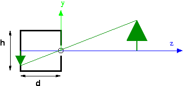

# Cameras

There are two aspects to the camera API: the placement of the camera, and the
_shape_ of the camera. To understand the latter, we need to understand how
cameras work.

<p style="display:none">
\(
\newcommand{\vecIII}[3]{\left[\begin{array}{c} #1\\#2\\#3 \end{array}\right]}
\newcommand{\vecIV}[4]{\left[\begin{array}{c} #1\\#2\\#3\\#4 \end{array}\right]}
\newcommand{\Choose}[2]{ { { #1 }\choose{ #2 } } }

\newcommand{\vecII}[2]{\left[\begin{array}{c} #1\\#2 \end{array}\right]}
\newcommand{\vecIII}[3]{\left[\begin{array}{c} #1\\#2\\#3 \end{array}\right]}
\newcommand{\vecIV}[4]{\left[\begin{array}{c} #1\\#2\\#3\\#4 \end{array}\right]}
\newcommand{\matIIxII}[4]{\left[
    \begin{array}{cc}
      #1 & #2 \\ #3 & #4 
    \end{array}\right]}

\newcommand{\matIIIxIII}[9]{\left[
    \begin{array}{ccc}
      #1 & #2 & #3 \\ #4 & #5 & #6 \\ #7 & #8 & #9
    \end{array}\right]}
\)        
</p>

## The Pinhole Camera


This is a cutaway side view of a pinhole camera (in Latin, the "camera
obscura," which means "dark room"). The z axis is imaginary, but the box on
the left part of the picture is a real box: solid on all six sides. There is a
tiny pinhole in the front of the box, where the circle is on the picture. The
origin is placed at the pinhole, the y axis goes straight up through the front
of the box, and the z axis points out into the scene. The location of the
pinhole is also referred to as the _focal point_. The depth of the box is d,
and the height of the box is h. We also might care about the width of the box,
but that's not visible in this picture, since we've eliminated that dimension.



Rays of light from the outside go through the hole and land on the image
plane, which is the entire back of the box. For example, a ray of light from
the top of the tree lands on the back of the box as shown. Because the hole is
so tiny, only light from along a single ray can land on any spot on the back
of the camera. So, in this example, only light from the top of the tree can
land at that spot. This is why pinhole camera pictures are so sharp.
Theoretically, they can provide infinite clarity, though in practice other
issues arise (diffraction of light rays and the lack of enough photons).
However in computer graphics, we only need the theoretical camera.

Pinhole cameras are simple and work really well. They're standard equipment
for viewing solar eclipses. We only use lenses so that we can gather more
light. A perfect pinhole camera only really allows one ray of light from each
place in the scene, and that would make for a really dark image, or require
very sensitive film (or retinas). Since the need to gather enough light is not
important in computer graphics, the OpenGL model is of a pinhole camera.

Points to notice:

  * The **projection** of an image (such as the tree) can be computed using similar triangles, as described in the next section. 
  * The effects of perspective are manifest, such as objects getting smaller in the image with distance from the camera. 
  * Parallel lines seem to converge at a "vanishing point" (imagine looking down railroad tracks). 
  * One disadvantage of a pinhole camera is that the image is _upside down_ on the film. (Your SLR camera has "through the lens" viewing, but uses additional lenses to flip the image right side up.) We'll see how to address this soon. 

## Computing Projection by Similar Triangles

Suppose we want to compute the projection of the top of the tree. Let the
coordinates of the top of the tree be $$(X,Y,Z)$$. We want to know the
coordinates of the projection, let them be $$(x,y,z)$$. We can do this by
similar triangles, using the two yellow triangles in the following figure:


The height and base of the big triangle are just $$Y$$ and $$Z$$. The height and
base of the little triangle are $$y$$ and $$z$$. The base of the little triangle
is **known** , because that's determined by the shape and size of our pinhole
camera. In the figure, it's notated as "d." By similar triangles, we know: \\[
y/d = Y/Z \\\ y = d*Y/Z \\\ y = Y/(Z/d) \\]

Everything on the right hand side is known, so we can compute the projection
of any point simply by knowing the depth of our pinhole camera and the
location of the point.

By the way, the reason we do this last algebraic step of dividing by $$Z/d$$ is
because of the way we will use this in our projection matrix.

Projecting the $$X$$ coordinate works the same way.

## The Synthetic Camera

There's a hassle with signs in the pinhole camera, such as whether the $$z$$
value for the tree is negative. Also, the image ends up being upside down. In
CG, since we're really only interested in the mathematics of projection, we
use a **synthetic** camera, in which the image plane is placed on the same
side of the origin as the scene.


  * In CG, we can put the image plane _in front_ of the focal point. This means the image is right side up. 
  * Mathematically, we'll make the origin be the focal point, with the camera pointing down the negative z axis. 
  * The image plane is the top of a **frustum** (a truncated pyramid). See the demo below. 
  * The frustum is also our **view volume**. Anything outside the view volume is "clipped" away and not visible in the rendered image. 
  * Note that this also means that the CG system can't see infinitely far. That's because it needs to calculate relative depth, and it can't make infinitely fine distinctions. 
  * The projection is computed using a **projection matrix**. 
  * Note that there is also an option of doing **parallel projection** rather than **perspective projection**. In parallel projection, the rays of light from the scene to the image are drawn in parallel, rather than converging at a focal point. Parallel projection is useful in architectural drawings and the like. We will rarely use it. 

## Demo: Frustum

The "view volume" of the synthetic (perspective) camera is a _frustum_ : a
truncated rectangular pyramid. Follow this link to a demo that illustrates the
frustum and some associated parameters and terminology:

<iframe height="600" style="width: 100%;" scrolling="no" title="Frustum demo" src="https://codepen.io/asterix77/embed/xxGpBzw?height=600&theme-id=default&default-tab=js,result" frameborder="no" allowtransparency="true" allowfullscreen="true">
  See the Pen <a href='https://codepen.io/asterix77/pen/xxGpBzw'>Frustum demo</a> by Michael Mandel
  (<a href='https://codepen.io/asterix77'>@asterix77</a>) on <a href='https://codepen.io'>CodePen</a>.
</iframe>


## Demo: Camera

It's easier to understand the power of the camera parameters when we can
compare the geometry of the frustum with the resulting rendering of the scene.
In the following demo, we see a scene with a teddy bear and a camera, and the
rendered result:

<iframe height="599" style="width: 100%;" scrolling="no" title="Camera helper demo" src="https://codepen.io/asterix77/embed/dyoJrxR?height=599&theme-id=default&default-tab=js,result" frameborder="no" allowtransparency="true" allowfullscreen="true">
  See the Pen <a href='https://codepen.io/asterix77/pen/dyoJrxR'>Camera helper demo</a> by Michael Mandel
  (<a href='https://codepen.io/asterix77'>@asterix77</a>) on <a href='https://codepen.io'>CodePen</a>.
</iframe>

## Perspective Matrices and Perspective Division

For the same reason that we want to perform all of our affine transformations
using matrix multiplication, we want to perform projection using matrix
multiplication.

There are two kinds of projection available in OpenGL and Three.js,
orthographic and perspective:

  * **Orthographic (Parallel)**. With this kind of projection, the view volume is a rectangular box, and we project just by squeezing out one dimension. As we mentioned earlier, this kind of projection is useful for architectural drawings and situations where there really isn't any perspective. If we align the direction of projection (DOP) with the Z axis, this kind of projection amounts to setting the Z coordinate of all points to zero. If we again let the scene coordinates be $$(X,Y,Z)$$ and projected coordinates be $$(x,y,z)$$, here's how orthographic projection can be expressed as multiplication by a projection matrix: \\[ \vecIV{x}{y}{z}{1} = \left[ \begin{array}{rrrr} 1  & 0 & 0 & 0 \\\ 0 & 1 & 0 & 0 \\\ 0 & 0 & 0 & 0 \\\ 0 & 0 & 0 & 1 \end{array} \right] \vecIV{X}{Y}{Z}{1} \\] 

In this case, $$x=X$$, $$y=Y$$, and the $$z$$ coordinate is $$0$$ for all points.

  * **Perspective**. With this kind of projection, if we set up a frame where the origin is the center of projection (COP) and the image plane is parallel to the Z $$=0$$ plane (the XY plane), we can compute the projection of each point using the similar triangles calculation, dividing each $$Y$$ and $$X$$ coordinate by $$Z/d$$. 

The matrix for perspective projection isn't obvious. It involves using
homogeneous coordinates and leaving part of the calculation undone.

The part of the calculation that is left undone is called **perspective
division**. The idea is that the homogeneous coordinate $$(x, y, z, w)$$ is the
same as $$(x/w, y/w, z/w, 1)$$, that is, we divide through by $$w$$. If $$w=1$$,
this is a null operation that doesn't change our ordinary vertices. If,
however, $$w$$ has the value $$Z/d$$, this perspective division accomplishes what
we did earlier in our similar triangles, namely: \\[ y = Y/(Z/d) \\]

Therefore the perspective matrix is a matrix that accomplishes setting $$w=Z/d$$
and leaves the other coordinates unchanged. Since the last row of the matrix
computes $$w$$, all we need to do is put $$1/d$$ in the Z column of the last row.
The perspective projection matrix, then, is just the following matrix: \\[
\left[ \begin{array}{rrrr} 1 & 0 & 0 & 0 \\\ 0 & 1 & 0 & 0 \\\ 0 & 0 & 1 & 0
\\\ 0 & 0 & 1/d & 0 \end{array} \right] \\]

Let's consider how this matrix transforms an arbitrary point, $$(X,Y,Z)$$: \\[
\vecIV{x}{y}{z}{w} = \left[ \begin{array}{rrrr} 1 & 0 & 0 & 0 \\\ 0 & 1 & 0 &
0 \\\ 0 & 0 & 1 & 0 \\\ 0 & 0 & 1/d & 0 \end{array} \right] \vecIV{X}{Y}{Z}{1}
\\]

In this case, $$x=X$$, $$y=Y$$, $$z=Z$$, and $$w=Z/d$$. To transform the result into a
vector with \\( w=1 \\), we do the perspective division step, namely we divide
all the components by \\( Z/d \\), yielding: \\[
\vecIV{x/(Z/d)}{y/(Z/d)}{z/(Z/d)}{1} = \frac{1}{Z/d} \vecIV{x}{y}{z}{Z/d} \\]

This is exactly the point we want, namely the projection of the original point
onto an image plane at a distance of \\( d \\).

Here's a PDF document that gives [the math for projection](06-projection-
math.pdf).

## Perspective Cameras in Three.js

As illustrated in the earlier [frustum](https://codepen.io/asterix77/pen/xxGpBzw) and [Camera API](https://codepen.io/asterix77/pen/dyoJrxR?editors=1010) demos, in Three.js, we can
set up a perspective camera like this:

    
```javascript
      var camera = new THREE.PerspectiveCamera(fov,aspect_ratio,near,far);
```

We'll think of this API as setting up the camera _shape_ (the geometry of the
frustum).

As we saw above, the perspective and orthographic projections work when the
axis is aligned with the Z axis. This is actually the same as the initial
coordinate system in OpenGL. But what if we don't want our scene/camera set up
this way?

The earlier demos also illustrated how we can _locate_ and _point_ the camera.
The fustrum demo, for example, included the following `setupCamera()`
function:

    
```javascript
    function setupCamera() {
        var cp = cameraParams;      // just a shorthand for this function
        frustumCamera = new THREE.PerspectiveCamera(cp.fov,
                                                    cp.aspectRatio,
                                                    cp.near,
                                                    cp.far);
        // set location
        frustumCamera.position.set(cp.eyeX, cp.eyeY, cp.eyeZ);
        // Cameras inherit an "up" vector from Object3D.
        frustumCamera.up.set(cp.upX, cp.upY, cp.upZ);
        // The lookAt method computes the camera direction and orientation
        // from its position and up parameters, and the input arguments
        // specifying the location of the 'at' point
        frustumCamera.lookAt(cp.atX, cp.atY, cp.atZ);
    }
```

This function sets up three additional components of the camera projection
geometry:

  * The "eye" point is the location of the focal point (also known as the "center of projection" or COP), as a point in space. Yet another standard term for this is the VRP: view reference point. 
  * The "at" point is the location of some point in the direction we want the camera to face. It doesn't even need to be in the view volume. It's only used to figure out where the camera is pointed. A standard term for the direction the camera is pointed is the VPN: view plane normal (a vector in OpenGL). This point is actually a very convenient concept, because it makes it easy to aim our camera at some location that should project to the center of the picture. For example, if we want to take a picture of a person, the "at" point might be the tip of their nose, or between their eyes. 
  * The "up" vector indicates which direction, projected onto the image plane, is the same as the vertical direction on the monitor (parallel with the left edge of the canvas). Note that it is a **vector,** not a point. It captures, for example, landscape versus portrait. A standard term for this is the VUP: view up. 

In other words, the camera is positioned at a point called the _eye_ ,
`(eyeX,eyeY,eyeZ)`, facing a point called _at_ , `(atX,atY,atZ)`, and oriented
in a direction defined by the _up_ vector, `(upX,upY,upZ)`.

In Three.js, a `Camera` is just a subclass of `Object3D`, so its position can
be set with `position.set()` (or with other means of positioning objects that
we learned about earlier), and it can be rotated as well. (I have yet to need
to scale a camera.)

All instances of `Object3D()` also have an `up` attribute that can be set for
a camera as well, as shown in `setupCamera()` above.

Finally, there's a useful _method_ called `lookAt()`, which points an object
to face a particular point specified by its arguments. This method also uses
the `up` vector to orient the object appropriately. You should use this method
_last_ , after setting the location and up vector for the camera.

## Rendering

There's a bit more work we need to do to create a canvas and to have Three.js
render our scene on that canvas using our camera. We'll look at two ways to do
this, using TW and without using TW. It's your choice whether to use TW when
setting up your own camera.

### Renderer

We will always need a `THREE.Renderer` object. This object has a method,
called `render()`, that takes a scene and a camera and renders the scene using
the camera. Any time you adjust your scene or your camera, you'll want to re-
invoke this function. If you have globals holding your camera and your scene,
you might just define a simpler wrapper function to do the rendering:

    
```javascript
    function render() {
            renderer.render( scene, camera );
    }
```

Creating a renderer object causes an HTML `canvas` object to be created with a
default size of 300 x 150, which is quite small. However, the canvas is _not_
added to the document; you need to do this yourself, or get TW to do this for
you.

First, because the default canvas is so small, we'll use CSS to set up a
policy for the size of the canvas. Here, I'll use 800 x 500, and so I'll use
800/500 for the aspect ratio of my camera (the top of the frustum). You can
also consider using a canvas of size 100% x 100%, covering the whole browser.
If you do that, use `canvasElt.clientWidth/canvasElt.clientHeight` as the
camera's aspect ratio, where `canvasElt` is a variable defined below.

    
```css
    canvas {
        display: block;
        width: 800px;
        height: 500px;
        margin: 10px auto;
    }
```

### Without TW

Let's put all these ideas together, without using TW. Next, we'll see how TW
simplifies this a little. Here's the JavaScript:

    
```javascript
    var scene = new THREE.Scene();
    var renderer = new THREE.WebGLRenderer();
    var canvasElt = renderer.domElement;
    document.body.appendChild(canvasElt);
    renderer.setSize(canvasElt.clientWidth,canvasElt.clientHeight);
    renderer.setClearColor( 0xdddddd, 1);
```    

You can see the whole code in action in this demo of a Simple Camera Without TW:

<iframe height="599" style="width: 100%;" scrolling="no" title="Simple camera not using TW" src="https://codepen.io/asterix77/embed/WNvdWGB?height=599&theme-id=default&default-tab=js,result" frameborder="no" allowtransparency="true" allowfullscreen="true">
  See the Pen <a href='https://codepen.io/asterix77/pen/WNvdWGB'>Simple camera not using TW</a> by Michael Mandel
  (<a href='https://codepen.io/asterix77'>@asterix77</a>) on <a href='https://codepen.io'>CodePen</a>.
</iframe>

### Using TW

TW's `mainInit()` function takes a renderer and a scene as its arguments,
extracts the HTML canvas element from the renderer, and adds it to the
document. It also sets its size and clears it to light gray.

Here is the JavaScript code:

    
    
    var scene = new THREE.Scene();
    var renderer = new THREE.WebGLRenderer();
    TW.mainInit(renderer,scene);
    

You can see the whole code in action in this demo of a Simple Camera With TW:

<iframe height="598" style="width: 100%;" scrolling="no" title="Simple camera using TW" src="https://codepen.io/asterix77/embed/xxGpeVg?height=598&theme-id=default&default-tab=js,result" frameborder="no" allowtransparency="true" allowfullscreen="true">
  See the Pen <a href='https://codepen.io/asterix77/pen/xxGpeVg'>Simple camera using TW</a> by Michael Mandel
  (<a href='https://codepen.io/asterix77'>@asterix77</a>) on <a href='https://codepen.io'>CodePen</a>.
</iframe>

## Other Terminology

The following terms are commonly used for different kinds of motions for
cameras and such.

  * pan: rotating a fixed camera around a vertical axis 
  * tilt: rotating a fixed camera around a horizontal axis 
  * zoom: adjusting the lens to zoom in or out (this adjusts the frustum) 
  * roll: rotating a camera or a ship around a longitudinal axis 
  * pitch: same as tilt, but for ships and airplanes 
  * yaw: same as pan, but for ships and airplanes 
  * strafe: moving a camera along a horizontal axis; this terminology is used in video games I believe. 


### Source

This page is based on <https://cs.wellesley.edu/~cs307/readings/06-camera.html>. Copyright &copy; Scott D. Anderson. This work is licensed under a [Creative Commons License](http://creativecommons.org/licenses/by-nc-sa/1.0/). 

