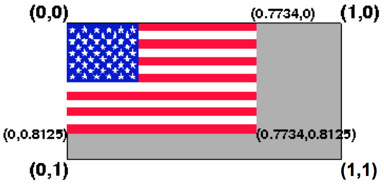

# Texture mapping

<p style="display:none">
\(
\newcommand{\Choose}[2]{ { { #1 }\choose{ #2 } } }
\newcommand{\vecII}[2]{\left[\begin{array}{c} #1\\#2 \end{array}\right]}
\newcommand{\vecIII}[3]{\left[\begin{array}{c} #1\\#2\\#3 \end{array}\right]}
\newcommand{\vecIV}[4]{\left[\begin{array}{c} #1\\#2\\#3\\#4 \end{array}\right]}
\newcommand{\matIIxII}[4]{\left[
    \begin{array}{cc}
      #1 & #2 \\ #3 & #4 
    \end{array}\right]}

\newcommand{\matIIIxIII}[9]{\left[
    \begin{array}{ccc}
      #1 & #2 & #3 \\ #4 & #5 & #6 \\ #7 & #8 & #9
    \end{array}\right]}
\)        
</p>

Texture mapping was one of the major innovations in CG in the 1990s. It allows
us to add a lot of surface detail without adding a lot of geometric primitives
(lines, vertices, faces). Think of how interesting Caroline's "loadedDemo" is
with all the texture-mapping.





In this reading, we'll start with a conceptual overview, quickly look at some
practical examples, and then tour through the many settings, parameters, and
situations there are to consider.

## Conceptual View

Texture mapping paints a picture onto a polygon. Although the name is
_texture_-mapping, the general approach simply takes an array of pixels and
paints them onto the surface. An array of pixels is just a picture, which
might be a texture like cloth or brick or grass, or it could be a picture of
Homer Simpson. It might be something your program computes and uses. More
likely, it will be something that you load from an ordinary image file, such
as a JPEG.

[plane flags](../demos/TextureMapping/plane-flags.html)  
These are textures that are simple arrays computed in JavaScript, which are
mapped onto a plane:

  * grayscale (black and white) checkerboards 
  * RGB checkerboards (black and red) 
  * grayscale US Flag 
  * red, white and blue US Flag 

[Buffy on a Plane](../demos/TextureMapping/PlaneBuffy.html)  
These are textures that are loaded from separate image files.

Conceptually, to use textures, you must do the following:

  1. define a texture: a rectangular array of pixels -- _texels_ , short for _texture elements_. (We'll use the terms almost interchangeably, where a texel is a pixel in an array being using for texture mapping.) 
  2. specify a pair of texture coordinates `(s,t)` for each vertex of your geometry. 

The graphics system "paints" the texture onto the polygon.

## How it Works

Texture mapping is a _raster_ operation, unlike any of the other things we've
looked at. Nevertheless, we apply textures to 2D surfaces in our 3D model, and
the graphics system has to figure out how to modify the _pixels_ during
_rasterizing_ (AKA _scan conversion_).

Texture-mapping happens as part of the rasterizing process, so we'll start
there.

## Rasterizing

When the graphics card renders a polygon, it (conceptually)

  * determines the pixel coordinates of each corner 
  * determines the edge pixels of the polygon, using a line-drawing program (an important one is Bresenham's algorithm, which we won't have time to study) 
  * determines the color of the edge pixels on a single row, by linear interpolation from the vertex colors 
  * walks down the row coloring each pixel, by linear interpolation from the two edge pixels 

Note: standard terminology is that the polygon is called a _fragment_, since
it might be a fragment of a Bezier surface or some such polygonal
approximation to something. Thus, the graphics card applies a texture to a
fragment.

This all happens either in the _framebuffer_ (the video memory that holds the
pixels that are displayed on your screen) or an array just like it.

## Implementing Texture Mapping

To do texture mapping, the graphics card must

  * compute a texture coordinate for each pixel during the rasterizing process, using bi-linear interpolation 
  * look up the texture coordinates in the array of texels, either using the nearest texel or a linear interpolation of the four nearest texels 
  * and either 
    * use the color of the texture as the color of the pixel, or 
    * combine the color of the texture with the color of the pixel  

## Texture Space

We can have 1D or 2D textures, though almost always 2D. The texture parameters
will be in the range [0,1] in each dimension. Note that if your texture array
is not square and your polygon is not square, you may have to deal with
changes in _aspect ratio_.

Your texture is _always_ an array and therefore is always a rectangle. Mapping
a texture to rectangles  is fairly easy; mapping it to other shapes is likely
to cause distortion. We'll need to be careful in those cases.

Associate each vertex of our polygon with a texture parameter, just like we
associate it with a normal, a color, and so forth. Three.js has properties of
a Geometry object devoted to representing the texture coordinates for each
vertex of a triangular face.



How do the texture coordinates relate to the 2D array of texels? This is
easiest to explain with a picture such as this one:



This is an array of 260 pixels, numbered from 0 to 259, arranged in a
rectangular array that is 13 by 20 pixels. (Note, this is illegal in OpenGL
and Three.js, because neither dimension is a power of two, but let's use it
anyway.)

  * As you'd expect, the first element of the texel array, that is, element `[0][0]` is the same as texture coordinates `(0,0)`. 
  * As we go down the first row of the array, until we get to element `[0][RowLength]` (`[0][19]`, which is element 19), we get to texture coordinates `(1,0)`. This may seem odd, but it's true. 
  * As we go down the first column of the array, until we get to element `[ColLength][0]` (`[12][0]`, which is element 240), we get to texture coordinates `(0,1)`. Again, this may seem odd, but it's true. 
  * Unsurprisingly, the last element of the texel array is the corner opposite the first element, so array element `[ColLength][RowLength]` (`[12][19]`, which is element 259) corresponds to texture coordinates `(1,1)`. 

Conventionally, the texture coordinates are called `(s,t)`, just as spatial
coordinates are called `(x,y,z)`. Thus, we can say that `s` goes along the
_rows_ of the texture (along the "fly" of the flag). The `t` coordinate goes
along the _columns_ of the texture (along the "hoist" of the flag).

Although you will _often_ use the entire texture, so that all your texture
coordinates are from 0 to 1, that is not _necessary_. In fact, because the
dimensions of texture arrays are required to be powers of two, the actual
image that you want is often only a portion of the whole array.

The computed US flag array has that property. The array is 256 pixels wide by
128 pixels high, but the flag itself is 198 pixels wide by 104 pixels high.
Thus, the maximum texture coordinates (if you just want the flag and none of
the gray area) are:

 fly |  = 198/256 = 0.7734  
 ---|---  
 hoist |  = 104/128 = 0.8125  
  
 Texture coordinates inside an image

The result might look like the image above. The flag image only spans texture
coordinates `(s,t)` from `(0,0)` to `(0.7734,0.8125)`.

Of course, we also need to ensure that the rectangle we are putting the flag
on has the same aspect ratio as the US flag, namely: 1.9. See [the official US
flag specification](flagspec.htm).

The texture parameters can also be _greater_ than 1, in which case, we can use
parameter settings to get _repetitions_ of the texture. If `s` is some
parameter where `0 < s < 1`, specifying some part of the texture partway
along, then `1+s`, `2+s`, and so on, are the same location in the texture. We
can experiment with different values of `s` and `t` using the tutor in the
next section.

## Texture Tutor

Here is a basic tutor for texture mapping as we know it so far, based on a
tutor by Nate Robins -- experiment with the GUI controls to understand the
basic concepts:

[texture tutor](../demos/TextureMapping/tutor-r80.html)

## Code using Computed Textures

Let's start with texture-mapping with computed textures. Because they're
computed, they'll be very simple, but we use them for two reasons:

  * It reinforces the concept that a texture is just an array, and 
  * it avoids issues of loading an additional file and having to use an event handler 

It's now time to look at the code for our first basic demo.

Here's the [plane flags](../demos/TextureMapping/plane-flags.html)
demo again. It's not important what's inside the code for creating
checkerboards and such, but just realize that each returns an array of pixels.
The most important lines of code are at the end.

The essential part of the code is shown below. Look particularly at the
implementation of `makeFlag()`.  The code below is just for

  * setting up the texture 
  * creating the mesh 

Notice that the texture is a property of the material, not the geometry. The
geometry, however, defines (default) texture parameters for each vertex.
(Texture parameters of individual pixels of a face are done by interpolation
from the texture parameters of the face's three vertices.)

Everything else is similar to what we've seen before. View the source of the
demo to get the complete program. The Three.js documentation provides more
information about the [
`THREE.DataTexture()`](https://threejs.org/docs/index.html#api/textures/DataTexture)
constructor that creates the texture from the image array.

## Setting Texture Coordinates

Geometry objects define texture coordinates for each vertex. Earlier, we saw
that we don't always want to use the default `(0,1)` texture coordinates. We
might want to use `(0.77,0.81)` as the maximum texture coordinates with the US
Flag. So, how can you change the default texture coordinates (or set them on
your own geometry objects)?

In Three.js, they put the texture coordinates in a property of the
`THREE.Geometry` called `faceVertexUvs` (instead of using S and T, some people
use U and V; both appear in the Three.js code). This property is an array of
one element,  and that element is an array of "face uvs", where a face UV is a
three-element array, corresponding to the three vertices of the face, and each
element of _that_ is a `THREE.Vector2` that captures the U and V values.

Let's try to understand this using a specific example. We'll consider the
geometry object that we used to map Buffy's face onto, earlier. It's a simple
2D plane (a rectangle):

    
```javascript
    planeGeom = new THREE.PlaneGeometry(4, 4);
```

Let's look inside that data structure. First, the vertices:

    
```javascript
    JSON.stringify(planeGeom.vertices)
    [{"x":-2,"y":2,"z":0},   // 0
     {"x":2,"y":2,"z":0},    // 1
     {"x":-2,"y":-2,"z":0},  // 2
     {"x":2,"y":-2,"z":0}    // 3
    ]
```

Nothing too surprising there. There are four vertices, all with `z=0`, and the
x and y values are +2 or -2. Now let's look at the two faces, with their
vertices defined as indices into the array above.

    
```javascript
    > planeGeom.faces[0]
    THREE.Face3 {a: 0, b: 2, c: 1, normal: THREE.Vector3, vertexNormals: Array[3]…}
    > planeGeom.faces[1]
    THREE.Face3 {a: 2, b: 3, c: 1, normal: THREE.Vector3, vertexNormals: Array[3]…}
```    

So, the two triangular faces are the upper left triangle and the lower right
triangle. Finally, let's look at the UV values for each of the 6 vertices
(three for each of the two faces):

    
```javascript
    > JSON.stringify(planeGeom.faceVertexUvs)
    [
      // array of two elements
      [
       [{"x":0,"y":1},{"x":0,"y":0},{"x":1,"y":1}],  // for face 0
       [{"x":0,"y":0},{"x":1,"y":0},{"x":1,"y":1}]   // for face 1
      ]
    ]
```

Weirdly, the two coordinates are named "x" and "y" in these objects, rather
than "u" and "v" as you might expect (or even "s" and "t").

Here's a picture that might help:




## Modifying the faceVertexUvs

Consider the following function, which updates the S and T values for a
`THREE.PlaneGeometry` like we have:

```javascript
    function updateTextureParams(quad, sMin, sMax, tMin, tMax) {
        // I dunno why they have this 1-elt array
        var elt = quad.faceVertexUvs[0]; 
        var face0 = elt[0];
        face0[0] = new THREE.Vector2(sMin,tMax);
        face0[1] = new THREE.Vector2(sMin,tMin);
        face0[2] = new THREE.Vector2(sMax,tMax);
        var face1 = elt[1];
        face1[0] = new THREE.Vector2(sMin,tMin);
        face1[1] = new THREE.Vector2(sMax,tMin);
        face1[2] = new THREE.Vector2(sMax,tMax);
        quad.uvsNeedUpdate = true;
    }
```
    
    

Using this function, we can map our US flag onto the plane with no gray areas:

However, the code for doing this is unintuitive, because the default Three.js
behavior is to _flip_ the vertical texture parameter. This is called `.flipY`.
So, instead of wanting the T parameter to go

  * from 0 in the upper left, 
  * to 0.8 in the lower left 

We actually set it to go

  * from 0.2 = 1-0.8 in the lower left, 
  * to 1 in the upper left 

That is, with a flipped Y, the upper left corner has coordinates of (0,1) and
the lower left has coordinates of (0,0.2). To pull out just that piece, here's
how we have to set the texture parameters:

    
```javascript
      updateTextureParams(flagGeom,0,0.75,1-0.81,1);
```

Here's the [complete demo](../demos/TextureMapping/plane-flags-v2.html).

## Loading Images

Here's a demo showing an image file being loaded and texture-mapped onto the
same plane we've used before:

[Plane Buffy](../demos/TextureMapping/PlaneBuffy.html)

The code has one very tricky part, though. When we computed an array and used
it as a texture, the array was already available for rendering. With an
external image, there's going to be some delay before the data arrives from
some network source. This delay might run to a few hundred milliseconds, but
even a few milliseconds is an enormous amount of time compared to the speed
that code is running in JavaScript.

Consequently, if the only rendering we did was right after the image was
referenced, the code would not work at all. Here's pseudo-code for the
situation I'm describing:

    
```javascript
    var buffyTexture = new THREE.ImageUtils.loadTexture( "../../images/buffy.gif" );
    var buffyMat = new THREE.MeshBasicMaterial(
        {color: THREE.ColorKeywords.white,
         map: buffyTexture});
        
    var buffyMesh = new THREE.Mesh( planeGeom, buffyMat );
    scene.add(buffyMesh);
    TW.render();
```

There simply isn't time for the image to load between that first line, when a
request for the image is sent to the server, and the last line, when the scene
is rendered. If you try this, the plane will be blank white.

The solution is to use an _event handler_. Event handlers are general-purpose
solutions to code that you want to run after some event has happened. In this
case, the event is that the image data has finally arrived from the server.
The event handler can then invoke the renderer.

The way that Three.js does this is also very standard: a callback function is
passed in, and the callback will be invoked when the event occurs. Here's the
improved code:

    
```javascript
    // these should be local, but we use globals so that
    // you can poke around
    var planeGeom, planeTex, planeMat, planeMesh;
    var imageLoaded = false;
    
    var loader = new THREE.TextureLoader();
    
    function loadPlaneBuffy() {
        loader.load("../../images/buffy.gif",
                    function (texture) {
                        console.log("buffy image is loaded");
                        imageLoaded = true;
                        planeGeom = new THREE.PlaneGeometry( 4, 4);
                        planeMat = new THREE.MeshBasicMaterial(
                               {color: THREE.ColorKeywords.white,
                                map: texture});
                        planeMesh = new THREE.Mesh( planeGeom, planeMat );
                        scene.add(planeMesh);
                        TW.render();
                    });
    }
```

In the code above, we pass in an _anonymous_ function to be the event handler.
It gets invoked when the image finishes loading, and does all the work of
building the object, including its material with the texture, and finally it
renders the scene. (Rendering is optional; maybe you have other objects to
load first.) Nothing it does is new to you; just the packaging and timing.

That's it! Later, we will get into more complex situations where you want to
use umpteen images as textures: how do you figure out that they've all,
finally, loaded, and the scene can be rendered?

## Coming Up

In the rest of the texture-mapping reading, we'll discuss:

  * Mapping image textures onto a `BoxGeometry` and other shapes 
  * Combining texture-mapping with material and lighting. This will be very cool, allowing us to get very nice shading effects on our texture-mapped surfaces. 
  * Looking at using _nearest_ versus _interpolated_ texture values. 
  * The representation of textures as arrays, and the representation of images in RGB, including the concept of accessing an array in row major order. 
  * Bump mappings and environment mappings. 

## Summary

Here's what we learned

  * At its most basic, a texture is an array of pixels. So is an image. 
  * Each vertex of a triangular face can have texture parameters 
  * Texture parameters are 2D and each lives in the [0,1] interval, with {0,1} being the edges of the 2D texture. 
  * Texture parameters outside the [0,1] interval can be 
    * clamped to the edge 
    * repeated 
    * mirrored 
  * When loading textures from an image, we need to consider that it takes a non-negligible amount of time for the image to load, and so we will need to write _event handlers_ for the _after load_ event. 


### Source

This page is based on <https://cs.wellesley.edu/~cs307/readings/10-texture-mapping-a.html>. Copyright &copy; Scott D. Anderson. This work is licensed under a [Creative Commons License](http://creativecommons.org/licenses/by-nc-sa/1.0/). 

