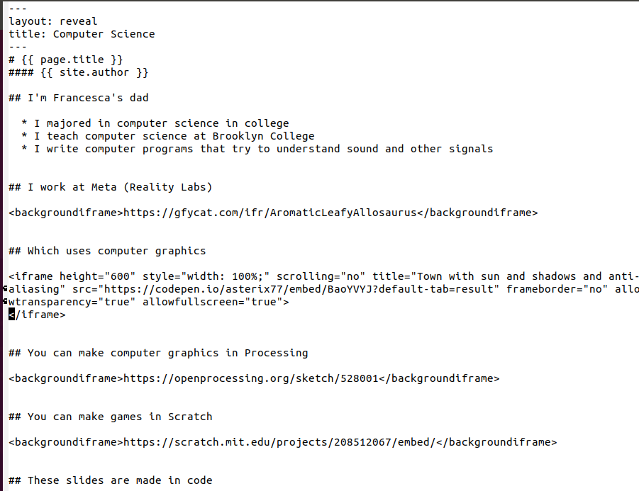

# {{ page.title }}
#### {{ site.author }}

## I'm Francesca's dad

  * I majored in computer science in college
  * I sometimes teach computer science at Brooklyn College
  * I write computer programs that try to understand sound
    * And other signals
  * I like coding because it lets me express myself
    * It's fun to create whatever I want

## I work at Meta (Reality Labs)

<backgroundiframe>https://gfycat.com/ifr/AromaticLeafyAllosaurus</backgroundiframe>

## Which uses computer graphics

<iframe height="600" style="width: 100%;" scrolling="no" title="Town with sun and shadows and anti-aliasing" src="https://codepen.io/asterix77/embed/BaoYVYJ?default-tab=result" frameborder="no" allowtransparency="true" allowfullscreen="true">
</iframe>

## You can make computer graphics in Processing

<backgroundiframe>https://openprocessing.org/sketch/528001</backgroundiframe>

## You can make games in Scratch

<backgroundiframe>https://scratch.mit.edu/projects/208512067/embed/</backgroundiframe>

## These slides are made from code

